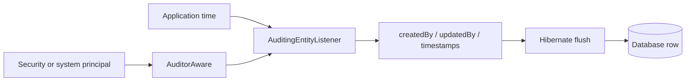

# Spring Data Auditing And Delete Semantics

<DocLabels items={[
  {label: 'Intermediate', tone: 'intermediate'},
  {label: 'Auditing', tone: 'foundation'},
  {label: 'Retention and deletion', tone: 'production'},
  {label: 'Shopverse current state', tone: 'shopverse'},
]} />

Auditing answers who created or changed the current row. Deletion policy answers
whether a row should be removed, archived, anonymized, or retained. Neither is a
substitute for a durable domain-event or compliance audit history.



## Spring Data Auditing

```java
@Configuration
@EnableJpaAuditing
class JpaAuditConfiguration {}

@MappedSuperclass
@EntityListeners(AuditingEntityListener.class)
abstract class AuditedEntity {
    @CreatedDate
    @Column(nullable = false, updatable = false)
    private Instant createdAt;

    @LastModifiedDate
    @Column(nullable = false)
    private Instant updatedAt;

    @CreatedBy
    private String createdBy;
}
```

Provide an `AuditorAware<String>` that uses an authenticated stable identifier and
a named system identity for scheduled, migration, or message-driven work. Never
silently turn a missing security context into the last request's user.

<DocCallout type="shopverse" title="Current implementation">

Order, Inventory, Payment, and User applications enable JPA auditing, and their
base entity types carry audit fields. This is current row metadata. A complete
business history still comes from explicit timeline, outbox, or audit records.

</DocCallout>

## Delete Paths Have Different Semantics

| Path | Loads entities? | Callbacks/cascades? | Persistence context risk |
|---|---:|---:|---|
| `delete(entity)` | yes | entity lifecycle and mapped cascades apply | managed instance becomes removed |
| derived delete returning entities | often | depends on generated execution path | inspect generated SQL and lifecycle |
| bulk JPQL/SQL delete | no per row | bypasses entity callbacks and ORM cascades | managed copies become stale |
| database cascade | database-owned | ORM callbacks do not run for cascaded rows | application must understand DB ownership |

```java
@Modifying(clearAutomatically = true, flushAutomatically = true)
@Query("delete from ExpiredReservation r where r.expiresAt < :cutoff")
int deleteExpired(@Param("cutoff") Instant cutoff);
```

Use bulk deletion only when database constraints and cleanup rules cover every
dependent record. The affected-row count is operational evidence and should be
bounded or reconciled for sensitive cleanup.

<DocCallout type="mistake" title="Soft delete is not one annotation">

Soft deletion changes uniqueness, indexes, joins, administrative access, caches,
retention, and every query that could reveal deleted data. Prefer it only when a
real recovery or retention requirement justifies that permanent complexity.

</DocCallout>

## Retention Decision

Choose among:

- hard delete for data with no retention requirement;
- anonymization when business history must remain without personal data;
- archive tables or object storage for infrequent retained access;
- append-only audit/domain events for decisions that require history;
- soft delete when undelete and query semantics are explicitly designed.

## Schema Rollout

Adding non-null audit columns to a populated table requires an expand-and-contract
sequence: add nullable columns, deploy writers, backfill with an attributable
system identity, verify coverage, then apply constraints. A rollback must not make
old code fail on columns or values introduced by the new version.

<DocCallout type="code" title="Proposed production control">

For high-volume retention cleanup, add a bounded batch size, stable ordering,
duration and affected-row metrics, a dry-run query, and a stop condition. This is a
recommended operating pattern, not a claim that every Shopverse cleanup job
currently implements it.

</DocCallout>

## Testing Route

Repository and auditing tests belong in the
[Spring MVC, Repository And Security Tests](../testing/SPRING-MVC-REPOSITORY-SECURITY-TESTS.md)
track. Use Testcontainers when callbacks, constraints, bulk DML, generated values,
or dialect behavior matters.

## Interview Questions

<ExpandableAnswer title="Why can a bulk delete leave a managed entity visible in the same transaction?">

Bulk DML bypasses persistence-context tracking. Clear or refresh deliberately, or
run the bulk operation in a boundary where no stale managed instances are reused.

</ExpandableAnswer>

<ExpandableAnswer title="Why is createdBy not a complete audit trail?">

It records current-row metadata, not every previous value, decision, actor change,
or deletion. A durable audit history requires append-only records with retention
and access controls.

</ExpandableAnswer>

<ExpandableAnswer title="What identity should a scheduled job expose through AuditorAware?">

A stable, explicit system principal that identifies the owning workload. Returning
an arbitrary request user or an unexplained null destroys attribution.

</ExpandableAnswer>

<ExpandableAnswer title="What must be checked before replacing entity deletes with bulk JPQL?">

Check callbacks, ORM and database cascades, foreign keys, cache invalidation,
managed-state staleness, affected-row observability, and the retention contract.

</ExpandableAnswer>

## Official References

- [Spring Data JPA auditing](https://docs.spring.io/spring-data/jpa/reference/auditing.html)
- [Spring Data JPA modifying queries](https://docs.spring.io/spring-data/jpa/reference/jpa/query-methods.html)
- [Hibernate ORM user guide](https://docs.hibernate.org/orm/current/userguide/html_single/)

## Recommended Next

Continue with [Persistence Runtime For Architects](../SPRING-JPA-HIBERNATE-ARCHITECT.md).
