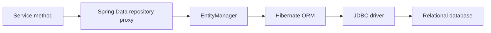

---
title: JPA Basics And Entity Mapping
---

# JPA Basics And Entity Mapping

Core flow, dependencies, entity lifecycle, identifiers, embedded values, composite keys, and enums.

Back to [Spring Data JPA](../SPRING-DATA-JPA.md).

## Core Flow



Spring Data reduces repository boilerplate. It does not remove the need to
understand SQL, indexes, transaction boundaries, fetching, locking, and
database constraints.


## Dependencies

```gradle
implementation 'org.springframework.boot:spring-boot-starter-data-jpa'
runtimeOnly 'com.mysql:mysql-connector-j'
testImplementation 'org.springframework.boot:spring-boot-starter-test'
```

Use Liquibase or Flyway to own production schema changes. Avoid relying on
Hibernate schema generation outside disposable development and test databases:

```yaml
spring:
  jpa:
    hibernate:
      ddl-auto: validate
    open-in-view: false
```

`validate` checks that mappings are compatible with the existing schema.
`open-in-view=false` keeps database access inside explicit service transaction
boundaries instead of allowing controllers or serializers to trigger queries.


## Entity Lifecycle And Persistence Context

An entity can be:

| State | Meaning |
|---|---|
| Transient | normal object not associated with persistence |
| Managed | tracked by the current persistence context |
| Detached | previously managed, but no longer tracked |
| Removed | scheduled for deletion |

Hibernate performs dirty checking on managed entities:

```java
@Transactional
public void renameProduct(Long id, String name) {
    ProductEntity product = repository.findById(id).orElseThrow();
    product.rename(name);
}
```

An explicit `save(product)` is not required for this managed entity. Hibernate
detects the change and normally issues an `UPDATE` during flush.

Flush synchronizes pending SQL with the database connection. It is not the same
as commit; the transaction can still roll back.


## Basic Entity Mapping

```java
@Entity
@Table(
        name = "products",
        uniqueConstraints = @UniqueConstraint(
                name = "uk_products_sku",
                columnNames = "sku"
        ),
        indexes = {
                @Index(
                        name = "idx_products_status_created",
                        columnList = "status, created_at"
                )
        }
)
public class ProductEntity {

    @Id
    @GeneratedValue(strategy = GenerationType.IDENTITY)
    private Long id;

    @Column(name = "sku", nullable = false, length = 64)
    private String sku;

    @Column(name = "name", nullable = false, length = 120)
    private String name;

    @Column(name = "price", nullable = false, precision = 19, scale = 2)
    private BigDecimal price;

    @Enumerated(EnumType.STRING)
    @Column(name = "status", nullable = false, length = 30)
    private ProductStatus status;

    @Version
    private long version;
}
```

### Important Entity Annotations

| Annotation | Purpose |
|---|---|
| `@Entity` | marks a persistent JPA entity |
| `@Table` | configures table, indexes, and unique constraints |
| `@Id` | marks the primary key |
| `@GeneratedValue` | configures generated-key strategy |
| `@Column` | configures column name, length, nullability, precision, and scale |
| `@Transient` | excludes a field from persistence |
| `@Version` | enables optimistic concurrency control |
| `@Enumerated` | controls enum storage |
| `@Embedded` | embeds a reusable value object |
| `@EmbeddedId` | uses an embeddable composite primary key |
| `@Convert` | applies an `AttributeConverter` |

Entity classes should:

- have a protected or public no-argument constructor;
- use stable equality semantics;
- avoid mutable IDs in `equals` and `hashCode`;
- avoid generated `toString` methods traversing relationships;
- keep domain invariants in methods rather than exposing every setter;
- avoid Lombok `@Data`, which can generate unsafe relationship-aware equality
  and string methods.


## Primary Key Strategies

### Generated Numeric ID

```java
@Id
@GeneratedValue(strategy = GenerationType.IDENTITY)
private Long id;
```

`IDENTITY` uses database-generated values and can restrict insert batching
because Hibernate may need each generated key immediately.

Sequences are often more batching-friendly on databases that support them:

```java
@Id
@GeneratedValue(
        strategy = GenerationType.SEQUENCE,
        generator = "order_sequence"
)
@SequenceGenerator(
        name = "order_sequence",
        sequenceName = "order_sequence",
        allocationSize = 50
)
private Long id;
```

MySQL commonly uses identity columns because traditional MySQL deployments do
not provide database sequences.

### Natural And External IDs

Business identifiers such as order number can be unique without being the JPA
primary key:

```java
@Column(name = "order_number", nullable = false, updatable = false)
private String orderNumber;
```

Back the invariant with a database unique constraint. An application-side
existence check alone cannot prevent concurrent duplicates.


## Embedded Value Objects

Use `@Embeddable` for a value object stored in the owning table:

```java
@Embeddable
public record Address(
        @Column(name = "address_line_1", nullable = false)
        String line1,
        @Column(name = "city", nullable = false)
        String city,
        @Column(name = "postal_code", nullable = false)
        String postalCode
) {
}
```

```java
@Embedded
private Address shippingAddress;
```

Generated table columns remain part of the owner:

```sql
select id, address_line_1, city, postal_code
from orders
where id = ?
```

Use `@AttributeOverride` when the same embeddable appears more than once:

```java
@Embedded
@AttributeOverrides({
        @AttributeOverride(
                name = "line1",
                column = @Column(name = "billing_line_1")
        ),
        @AttributeOverride(
                name = "city",
                column = @Column(name = "billing_city")
        ),
        @AttributeOverride(
                name = "postalCode",
                column = @Column(name = "billing_postal_code")
        )
})
private Address billingAddress;
```


## Composite Primary Keys

Prefer a simple surrogate primary key unless the domain and access patterns
clearly require a composite identity.

### `@EmbeddedId`

```java
@Embeddable
public record OrderItemId(
        Long orderId,
        Long productId
) implements Serializable {
}
```

```java
@Entity
@Table(name = "order_items")
public class OrderItemEntity {

    @EmbeddedId
    private OrderItemId id;

    @Column(nullable = false)
    private int quantity;
}
```

Repository:

```java
interface OrderItemRepository
        extends JpaRepository<OrderItemEntity, OrderItemId> {
}
```

### `@IdClass`

`@IdClass` keeps key fields directly on the entity:

```java
@Entity
@IdClass(OrderItemIdClass.class)
class OrderItemEntity {

    @Id
    private Long orderId;

    @Id
    private Long productId;
}
```

`@EmbeddedId` groups identity into one value object and is generally easier to
pass around. `@IdClass` can make JPQL paths simpler but duplicates key fields
between entity and ID class. Both key classes must implement stable
`equals`, `hashCode`, and `Serializable`.


## Enum Mapping

```java
@Enumerated(EnumType.STRING)
@Column(nullable = false, length = 30)
private PaymentStatus status;
```

Prefer `EnumType.STRING`. `ORDINAL` stores numeric positions, so reordering or
inserting enum constants silently changes meaning.

For an external database code, use a converter:

```java
@Converter(autoApply = true)
public class PaymentStatusConverter
        implements AttributeConverter<PaymentStatus, String> {

    @Override
    public String convertToDatabaseColumn(PaymentStatus status) {
        return status == null ? null : status.code();
    }

    @Override
    public PaymentStatus convertToEntityAttribute(String code) {
        return code == null ? null : PaymentStatus.fromCode(code);
    }
}
```


