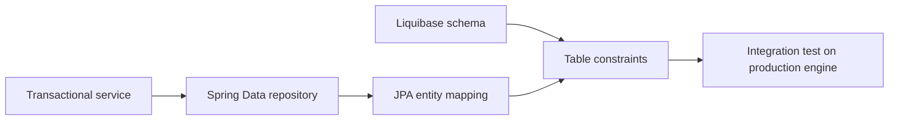

# JPA Basics And Entity Mapping

<DocLabels items={[
  {label: 'Intermediate', tone: 'intermediate'},
  {label: 'Entity integration', tone: 'foundation'},
  {label: 'Schema safety', tone: 'production'},
  {label: 'Shopverse example', tone: 'shopverse'},
]} />

This page covers the Spring Data boundary around an entity. For transient,
managed, detached, removed, `persist`, `merge`, and flush mechanics, use the
canonical [Hibernate Basics And Lifecycle](../../data/hibernate/HIBERNATE-BASICS-LIFECYCLE.md)
guide. Annotation-by-annotation mapping detail belongs in
[Hibernate Annotations And Mapping](../../data/hibernate/HIBERNATE-ANNOTATIONS-MAPPING.md).



## Repository Identity Contract

```java
@Entity
@Table(name = "orders")
class OrderEntity {
    @Id
    @GeneratedValue(strategy = GenerationType.IDENTITY)
    private Long id;

    @Column(nullable = false, unique = true, length = 40)
    private String orderNumber;

    @Enumerated(EnumType.STRING)
    @Column(nullable = false, length = 40)
    private OrderStatus status;
}
```

Spring Data uses entity metadata to decide whether `save` should persist a new
instance or merge an existing one. Generated nullable IDs usually make that
decision straightforward. Assigned identifiers, composite keys, and manually
populated versions need an explicit newness strategy such as `Persistable` when
the default detection is not valid.

<DocCallout type="mistake" title="save is not a universal update command">

A managed entity is dirty-checked without another `save` call. Calling `save` on a
detached graph can invoke merge semantics and copy stale state. Define where the
entity becomes managed and update it inside that transaction.

</DocCallout>

## Mapping And Database Must Agree

| Java mapping | Database contract to verify |
|---|---|
| `nullable = false` | `NOT NULL` exists after safe backfill |
| `unique = true` | explicit unique constraint/index has the intended scope |
| `length = 40` | column length and validation agree |
| `EnumType.STRING` | stored values, column size, and rename plan are compatible |
| `BigDecimal` precision/scale | database precision and rounding rule match money policy |
| generated identifier | engine strategy permits required batching and insert behavior |

Mappings are documentation to the ORM; migrations are the durable schema change.
Do not rely on automatic schema generation in production.

## Value Objects And Composite Keys

Use `@Embeddable` for a value whose columns live with its owner. Use `@EmbeddedId`
or `@IdClass` only when the database really has a composite identity. Key classes
must be serializable and implement stable equality.

```java
@Embeddable
record InventoryKey(Long warehouseId, Long productId)
        implements Serializable {}
```

<DocCallout type="code" title="Proposed pattern, not current Shopverse mapping">

Shopverse currently gives Inventory items a generated database ID and a separate
product identifier. The composite warehouse/product key above illustrates a future
multi-warehouse design; adopting it would require migration and repository API
changes.

</DocCallout>

## Shopverse Current Entity Boundary

<DocCallout type="shopverse" title="Current implementation">

`OrderEntity` stores an immutable order number, correlation ID, and idempotency key
under unique constraints. Inventory uses a generated ID plus `@Version`. These
mappings are implemented today and align identity, duplicate-request protection,
and optimistic concurrency with database constraints.

</DocCallout>

The application still needs integration tests that prove Liquibase created the
same constraints expected by the entities. A unit test of an entity class cannot
prove collation, index selection, generated-key behavior, or dialect-specific SQL.

## Expand-And-Contract Rollout

For a new required column:

1. **Expand:** add a nullable column or safe server-side default.
2. Deploy code that writes both old and new representations.
3. Backfill in bounded batches with progress and failure metrics.
4. Verify no nulls and compare old/new values.
5. **Contract:** add `NOT NULL`, remove compatibility writes, then remove obsolete
   columns in a later deployment.

<DocCallout type="production" title="Rollback must survive mixed versions">

Changing the entity annotation and schema in one release can break old replicas,
rolling restarts, and rollback. The database must accept both versions throughout
the overlap window.

</DocCallout>

## Evidence Checklist

- start the application with migrations from an empty database and from the last
  production schema;
- inspect generated DDL only as a comparison, never as the rollout mechanism;
- verify unique, nullability, precision, foreign-key, and enum behavior;
- test generated IDs and batched inserts on the production engine;
- capture the SQL and affected-row count for representative repository writes.

## Interview Questions

<ExpandableAnswer title="Why can repository.save(entity) call merge instead of persist?">

Spring Data determines whether the entity is new from its ID, version, or an
explicit `Persistable` contract. If it considers the entity existing, the JPA path
uses merge semantics and returns the managed copy.

</ExpandableAnswer>

<ExpandableAnswer title="Why is changing an enum constant a database migration concern?">

`EnumType.STRING` stores the constant name. Renaming it makes existing rows
unreadable unless old and new values are supported during a data migration.

</ExpandableAnswer>

<ExpandableAnswer title="Why can nullable = false in an entity still fail only in production?">

The annotation does not prove the deployed schema matches it. Drift, migration
ordering, old replicas, and existing null data can violate the assumed contract.

</ExpandableAnswer>

<ExpandableAnswer title="When is a composite key preferable to a surrogate ID?">

When the database identity is genuinely composite and the full key is stable,
compact, and used consistently. Otherwise a surrogate ID plus an explicit unique
business constraint is usually easier to evolve and reference.

</ExpandableAnswer>

## Official References

- [Spring Data JPA entity persistence](https://docs.spring.io/spring-data/jpa/reference/jpa/entity-persistence.html)
- [Hibernate ORM user guide](https://docs.hibernate.org/orm/current/userguide/html_single/)
- [Jakarta Persistence specification](https://jakarta.ee/specifications/persistence/)

## Recommended Next

Continue with [JPA Associations And Ownership](./JPA-RELATIONSHIPS-JSON.md).
