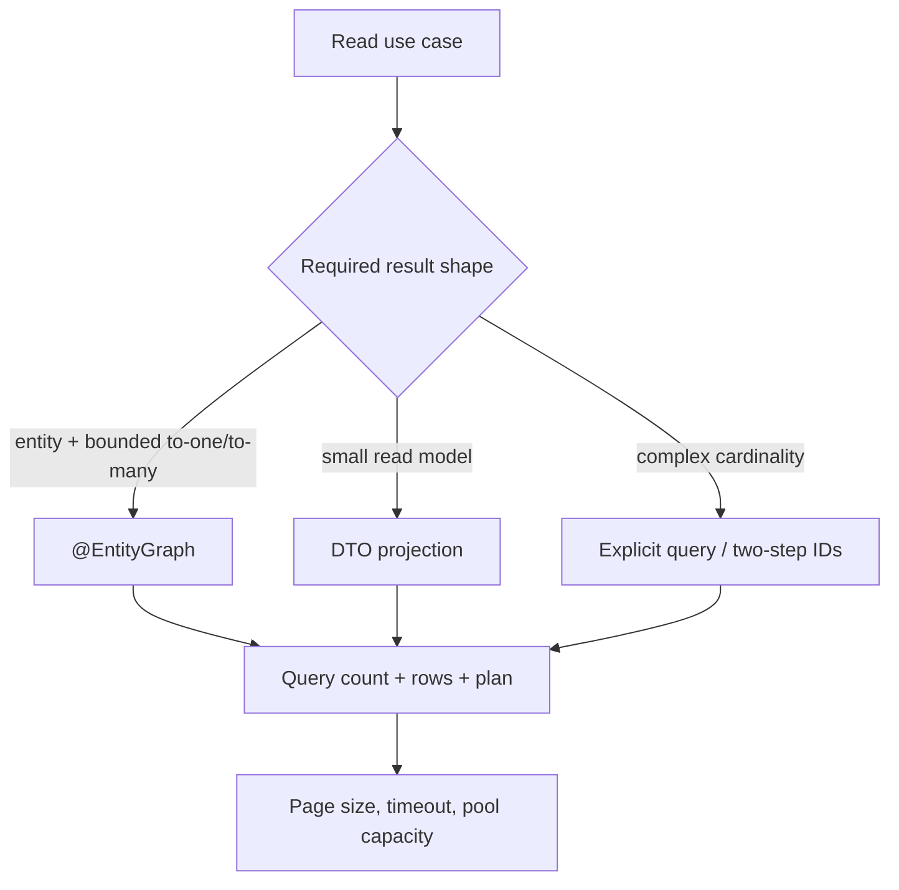

# JPA Fetching Performance And N Plus One

<DocLabels items={[
  {label: 'Advanced', tone: 'advanced'},
  {label: 'Fetch plans', tone: 'foundation'},
  {label: 'Performance evidence', tone: 'production'},
  {label: 'Shopverse current state', tone: 'shopverse'},
]} />

Spring Data makes fetch-plan choices visible at the repository boundary through
entity graphs, projections, and explicit queries. The canonical provider-level
explanation of lazy proxies, batch fetching, and Hibernate internals remains in
[Hibernate Fetching And Performance](../../data/hibernate/HIBERNATE-FETCHING-PERFORMANCE.md).



## Recognize N Plus One

One query loads parent rows, then association access produces one query per parent:

```text
select ... from orders where customer_username = ?
select ... from order_items where order_id = ?  -- repeated
```

The failure is a missing use-case fetch plan, not simply the presence of `LAZY`.
Making every association eager can still issue secondary selects and can make
unrelated reads load too much data.

## Spring Data Fetch Options

### Entity Graph

```java
@EntityGraph(attributePaths = "items")
Optional<OrderEntity> findWithItemsByOrderNumber(String orderNumber);
```

Use an entity graph when the service needs managed entities and the joined
cardinality is bounded. Graph names or dedicated method names make fetch intent
reviewable.

Keep associations lazy in the mapping unless they are part of almost every use
case. The entity mapping supplies the default; an entity graph is a query-specific
fetch plan that overrides that default for one repository method.

```java
@ManyToMany(fetch = FetchType.LAZY)
private Set<Role> roles;

@EntityGraph(attributePaths = {"roles", "roles.permissions"})
Optional<User> findForAuthenticationByUsername(String username);
```

The dotted path is a nested graph: `roles` is an attribute node on `User`, and
`permissions` is an attribute node in the `Role` subgraph. It is semantically
equivalent to building a graph through the Jakarta Persistence API:

```java
EntityGraph<User> graph = entityManager.createEntityGraph(User.class);
Subgraph<Role> roles = graph.addSubgraph("roles");
roles.addAttributeNodes("permissions");
```

#### Fetch Graph Versus Load Graph

Spring Data exposes both Jakarta Persistence graph interpretations:

| Spring Data type | Query hint | Attributes in the graph | Attributes not in the graph |
|---|---|---|---|
| `EntityGraphType.FETCH` | `jakarta.persistence.fetchgraph` | treated as eager for this operation | treated as lazy for this operation |
| `EntityGraphType.LOAD` | `jakarta.persistence.loadgraph` | treated as eager for this operation | retain their mapping/default fetch type |

`@EntityGraph` defaults to `EntityGraphType.FETCH`. Primary-key and version state
is always available, and the persistence provider is allowed to fetch additional
state. Treat graph membership as the minimum required fetch plan, not a promise
that no other column or association can be read.

```java
@EntityGraph(
    type = EntityGraph.EntityGraphType.LOAD,
    attributePaths = {"roles", "roles.permissions"}
)
Optional<User> findWithMappedDefaultsByUsername(String username);
```

#### A Graph Does Not Specify SQL Join Shape

An entity graph says **what must be fetched**, not whether Hibernate must use one
`LEFT JOIN`, an inner join, a secondary select, batch loading, or another provider
strategy. A nested graph may often produce SQL resembling this, but the SQL is
illustrative rather than contractual:

```sql
select u.*, r.*, p.*
from users u
left join user_roles ur on ur.user_id = u.id
left join roles r on r.id = ur.role_id
left join role_permissions rp on rp.role_id = r.id
left join permissions p on p.id = rp.permission_id
where u.username = ?
```

If the query contract requires explicit join semantics, express them in JPQL and
verify the generated SQL and plan:

```java
@Query("""
       select distinct u
         from User u
         join fetch u.roles r
         left join fetch r.permissions
        where u.username = :username
       """)
Optional<User> findWithExplicitJoins(String username);
```

`join fetch` expresses an inner join; `left join fetch` preserves a root whose
association is absent. Neither form makes an unbounded multi-collection graph
safe. Measure row count and cardinality.

### DTO Projection

```java
@Query("""
       select new com.example.OrderSummary(
           o.orderNumber, o.status, o.totalAmount, o.createdAt)
         from OrderEntity o
        where o.customerUsername = :username
        order by o.createdAt desc, o.id desc
       """)
Page<OrderSummary> findSummaries(String username, Pageable pageable);
```

Use a projection when no entity mutation is required. It reduces selected columns
and prevents accidental traversal of a persistence graph.

### Two-Step Pagination

Collection fetch joins can multiply rows and conflict with entity-level pagination.
For a page with children, first select ordered parent IDs, then fetch details for
those IDs. Preserve the original order explicitly.

<DocCallout type="mistake" title="distinct does not remove the database cost">

JPQL `distinct` can deduplicate entity references after a join, but the database
still processes the multiplied rows. Measure rows returned and memory, not only the
number of Java objects.

</DocCallout>

## N Plus One Solution Matrix

There is no universal “avoid joins” setting. Choose the result shape and query
count deliberately:

| Situation | Preferred starting point | SQL shape and trade-off |
|---|---|---|
| one aggregate with a small bounded graph | entity graph or JPQL fetch join | commonly one joined query; watch row multiplication |
| exact inner/outer join behavior or predicates on joined data | JPQL fetch join | query owns join semantics; still risky for pagination and multiple collections |
| many parents whose lazy children are needed | Hibernate batch fetching | parent query plus bounded `IN (...)` child queries; provider-specific tuning |
| one parent result set followed by one collection load | Hibernate subselect fetching | parent query plus a child query that reuses the parent selection; provider-specific and context-sensitive |
| read-only list, report, or API summary | DTO projection | only required columns; may still join, but avoids managed graph traversal |
| very large or differently filtered relationships | explicit separate/two-step queries | more round trips but bounded row shapes and no giant Cartesian result |
| paged parents with children | page IDs/DTOs, then fetch details | preserves entity-level pagination and bounds the second query |
| simple CRUD that does not need associations | keep associations lazy | no extra association query unless the relationship is traversed |

Batch fetching and subselect fetching mitigate repeated secondary selects without
one wide join, but they remain Hibernate-specific fetch behavior. See
[Hibernate Fetching And Performance](../../data/hibernate/HIBERNATE-FETCHING-PERFORMANCE.md#association-batch-fetching)
for configuration, SQL shapes, and limitations.

<DocCallout type="production" title="Join cost is cardinality dependent">
A join is not inherently too expensive. Cost grows with scanned rows, missing
indexes, skew, selected width, and multiplication across collections. For one
authenticated user with a few roles and permissions, a joined graph can be a good
bounded plan. Applying the same deep graph to a user listing can create a large
result and break pagination assumptions.
</DocCallout>

## Shopverse Current Fetch Plans

<DocCallout type="shopverse" title="Current implementation and current gap">

Order repository methods use `@EntityGraph(attributePaths = "items")`. The User
repository applies `@EntityGraph(attributePaths = {"roles", "roles.permissions"})`
to both `findByUsername` and the overridden `findById`. This is broader than an
authentication-only fetch method: callers in profile, cart, address, and other
paths can receive the same deep graph when they use those repository methods.
Role mappings themselves remain lazy.

Dedicated methods such as `findForAuthenticationByUsername` and an ungraphed
`findByUsername` would make the use-case exception explicit. That split is a
proposed hardening, not current Shopverse behavior. Some Order history methods
also return unpaged lists with items; replacing those with bounded pages or
summaries is proposed rather than implemented.

</DocCallout>

## Batching And Write Throughput

Spring Data `saveAll` does not prove JDBC batching. Identifier generation,
statement ordering, SQL shape, flushes, and driver configuration determine the
actual round trips. For large bounded imports, flush and clear periodically so the
persistence context does not grow without limit.

<DocCallout type="production" title="Measure the wire behavior">

Enable bounded SQL/statistics diagnostics in a safe environment and compare
prepared-statement count, batch execution, rows written, transaction duration, and
connection occupancy. A configuration property alone is not evidence.

</DocCallout>

## Pagination, Timeouts, And Indexes

- cap page size at the API boundary;
- use a deterministic order with a unique tiebreaker;
- prefer a `Slice` when an exact total count is unnecessary;
- consider keyset pagination for very large append-oriented histories;
- set query timeouts below the request deadline;
- align predicates and ordering with a measured index.

Introduce a new index before the query that depends on it. Keep the old index
during mixed-version deployment and rollback; remove it only after query traffic no
longer uses it.

## Executable Evidence Pattern

```java
@DataJpaTest
class OrderFetchPlanTest {
    @Test
    void customerPageUsesABoundedQueryPlan() {
        // Seed several orders and items in a production-engine container.
        // Reset Hibernate statistics, invoke the repository, and assert:
        // - bounded result size;
        // - expected query count;
        // - initialized fields required by the DTO mapping.
    }
}
```

Pair query-count assertions with a production-engine execution plan. A test with
ten uniform rows cannot prove behavior at production cardinality or skew.

## Incident Workflow

1. correlate endpoint latency with datasource pending/acquisition time;
2. capture the slow query and the request path that triggered it;
3. count statements and rows, including serialization-time queries;
4. inspect the database plan, estimates, locks, and buffer reads;
5. reproduce with realistic cardinality;
6. change one fetch/index decision and compare p95/p99 plus database load;
7. retain a rollback for both query code and schema objects.

## Interview Questions

<ExpandableAnswer title="Why is FetchType.EAGER not a reliable N plus one solution?">

It changes the default loading requirement, not the use-case query plan. Hibernate
may still issue secondary selects, while unrelated repository methods load more
data than required.

</ExpandableAnswer>

<ExpandableAnswer title="When should a repository use an entity graph instead of a DTO projection?">

Use an entity graph when the transaction needs managed entities and a bounded
association graph. Use a DTO when the path is read-only and should expose only a
small stable result shape.

</ExpandableAnswer>

<ExpandableAnswer title="Why can a collection fetch join break pagination?">

The database paginates joined rows while the application expects parent entities.
One parent can occupy several rows, causing missing parents, unstable pages, or
in-memory pagination.

</ExpandableAnswer>

<ExpandableAnswer title="How do you prove that saveAll is batching inserts?">

Observe prepared statements and batch executions with the deployed identifier
strategy and driver. Compare round trips and throughput; do not infer batching from
the repository method name.

</ExpandableAnswer>

## Official References

- [Spring Data JPA entity graphs](https://docs.spring.io/spring-data/jpa/reference/jpa/query-methods.html)
- [Spring Data `@EntityGraph` API](https://docs.spring.io/spring-data/data-jpa/docs/current/api/org/springframework/data/jpa/repository/EntityGraph.html)
- [Jakarta Persistence entity-graph semantics](https://jakarta.ee/specifications/persistence/3.2/jakarta-persistence-spec-3.2)
- [Spring Data repository projections](https://docs.spring.io/spring-data/jpa/reference/repositories/projections.html)
- [Hibernate ORM fetching](https://docs.hibernate.org/orm/current/userguide/html_single/)

## Recommended Next

Continue with [Transactions, Locking And Concurrency](./JPA-TRANSACTIONS-LOCKING.md).
