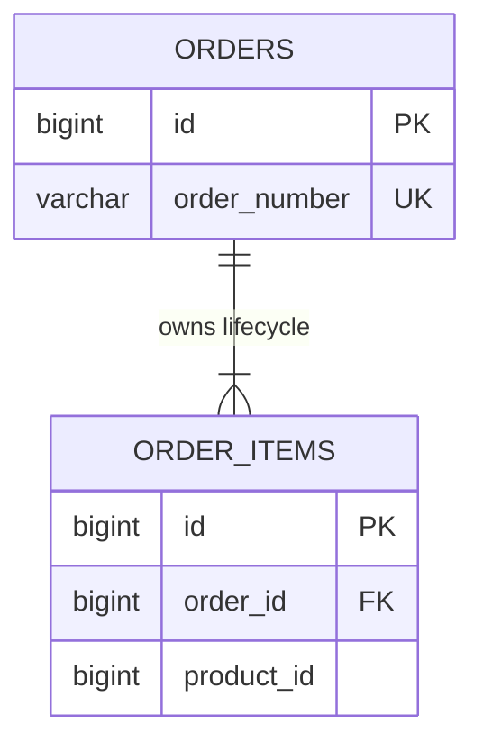

# JPA Associations And Ownership

<DocLabels items={[
  {label: 'Intermediate', tone: 'intermediate'},
  {label: 'Associations', tone: 'foundation'},
  {label: 'Aggregate integrity', tone: 'production'},
  {label: 'Shopverse current state', tone: 'shopverse'},
]} />

An association has three related but distinct owners: the database foreign key,
the JPA side that writes that key, and the domain aggregate that permits the
relationship to change. Make all three explicit.



## Owning Side And Aggregate Mutation

The side containing `@JoinColumn` normally owns the relational update. In an
Order-to-items association, the item writes `order_id`; `mappedBy = "order"` tells
the parent that the child owns that mapping.

```java
@OneToMany(
        mappedBy = "order",
        cascade = CascadeType.ALL,
        orphanRemoval = true,
        fetch = FetchType.LAZY
)
private final List<OrderItemEntity> items = new ArrayList<>();

public void addItem(ProductSnapshot product, int quantity) {
    items.add(new OrderItemEntity(this, product.id(), product.name(),
            quantity, product.unitPrice()));
}
```

The aggregate method establishes both sides in one place and protects invariants.
Exposing a public collection setter lets callers create an in-memory graph that
does not match the SQL Hibernate will issue.

<DocCallout type="shopverse" title="Current implementation">

Shopverse `OrderEntity` owns an `items` collection with cascade-all and orphan
removal. `OrderItemEntity` owns the foreign key through its lazy `@ManyToOne`, and
the package-scoped child constructor receives its Order. This is current code, not
a proposed model.

</DocCallout>

## Association Decision Table

| Relationship need | Typical mapping | Production question |
|---|---|---|
| child cannot exist without parent | parent `@OneToMany`, child owning `@ManyToOne` | should removal delete or archive the child? |
| child has an independent lifecycle | reference without broad cascade | which service/use case owns updates? |
| link has attributes such as role or date | explicit association entity | what is the unique business key? |
| one optional extension row | one-to-one or shared primary key | does the extra table improve lifecycle and access? |

Avoid direct many-to-many mappings when the relationship needs audit fields,
ordering, status, soft deletion, or independent permissions. Model the join table
as an entity instead.

## Cascades And Orphan Removal

Cascade controls which entity operation propagates through the object graph.
`orphanRemoval = true` schedules a child delete when it is removed from the
parent collection. Neither setting changes database cascade rules automatically.

<DocCallout type="mistake" title="CascadeType.ALL is not an aggregate definition">

Do not cascade merely for convenience. A cascade from one aggregate to another can
delete or merge more state than the service transaction intends. Apply cascades
only where lifecycle ownership is real.

</DocCallout>

## Fetch Boundary

Mapping an association lazy avoids unconditional loading, but it does not define
the query for a use case. Spring Data repository methods should select an entity
graph, projection, or explicit query for each read path. See
[Fetching Performance](./JPA-FETCHING-PERFORMANCE.md).

Do not make every association eager to avoid `LazyInitializationException`. That
replaces an explicit fetch failure with hidden joins, secondary selects, and
unbounded object graphs.

## HTTP And JSON Boundary

Entities should not define the public JSON contract. Serialization can traverse
lazy associations, expose internal columns, recurse through bidirectional links,
or trigger database work after the service boundary.

Use DTOs and explicit mapping. The canonical Jackson, converter, recursion, and
payload-limit guidance is in
[HTTP Message Conversion And Jackson](../web/HTTP-MESSAGE-CONVERSION-JACKSON.md).

<DocCallout type="production" title="Transaction scope is not a serialization strategy">

Keeping a persistence context open until JSON rendering can hide missing fetch
plans and allow controllers to execute SQL. Fetch the required data in the service
transaction and return a stable DTO.

</DocCallout>

## Foreign-Key Rollout

For a new required association:

1. add the foreign-key column as nullable;
2. deploy code that writes it while old replicas remain compatible;
3. backfill in bounded batches;
4. find and resolve orphaned or invalid rows;
5. add the index and foreign key using the engine's safe operational procedure;
6. make the column non-null only after coverage is proven.

<DocCallout type="code" title="Proposed evolution example">

If Order items later reference a service-owned product snapshot version, add the
version column through expand-and-contract. Do not replace historical product data
with a live cross-service entity association; services should not share a database
aggregate implicitly.

</DocCallout>

## Evidence Checklist

- capture insert, update, and delete SQL for aggregate mutation;
- assert foreign-key and unique constraints with the production engine;
- verify removing a child produces the intended delete or archive behavior;
- count queries for each DTO read path;
- test collection size and payload limits with representative cardinality;
- prove old and new application versions can both read the expanded schema.

## Interview Questions

<ExpandableAnswer title="Which side owns a bidirectional JPA association?">

The side that maps the foreign key, normally the side with `@JoinColumn`, owns the
relational update. The domain aggregate can still own the public mutation method.

</ExpandableAnswer>

<ExpandableAnswer title="Why can adding an item only to the inverse collection fail?">

The in-memory inverse side changed, but the owning side that writes the foreign key
did not. A helper method should update both sides consistently.

</ExpandableAnswer>

<ExpandableAnswer title="When is orphanRemoval dangerous?">

When removing an object from a collection should not delete its durable record, or
when the child is shared or independently owned. It is appropriate only for true
aggregate children with matching retention rules.

</ExpandableAnswer>

<ExpandableAnswer title="Why should Jackson annotations not be the primary N+1 fix?">

They only change serialization traversal. The repository query still needs an
explicit fetch plan, and the API should return a DTO that does not expose the
persistence graph.

</ExpandableAnswer>

## Official References

- [Spring Data JPA reference](https://docs.spring.io/spring-data/jpa/reference/)
- [Hibernate ORM association mappings](https://docs.hibernate.org/orm/current/userguide/html_single/)
- [Jakarta Persistence specification](https://jakarta.ee/specifications/persistence/)

## Recommended Next

Continue with [Repositories, Queries And Projections](./JPA-REPOSITORIES-QUERIES.md).
