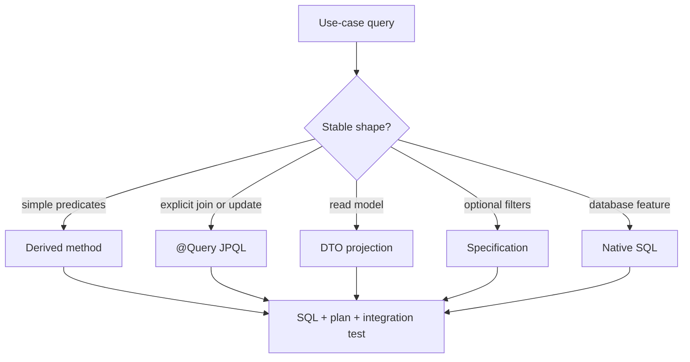

# JPA Repositories Queries And Projections

<DocLabels items={[
  {label: 'Intermediate', tone: 'intermediate'},
  {label: 'Repository design', tone: 'foundation'},
  {label: 'Query evidence', tone: 'production'},
  {label: 'Shopverse current state', tone: 'shopverse'},
]} />

A repository should express the persistence operations required by one domain
boundary. Choose the simplest query mechanism that keeps SQL shape, result size,
and compatibility visible.



## Repository Composition

```java
public interface UserRepository
        extends JpaRepository<User, Long>, JpaSpecificationExecutor<User> {

    @EntityGraph(attributePaths = {"roles", "roles.permissions"})
    Optional<User> findByUsername(String username);

    boolean existsByEmail(String email);
}
```

`JpaRepository` supplies persistence and paging operations. Add
`JpaSpecificationExecutor` only when the domain really exposes composable filters;
do not give every repository every abstraction by default.

<DocCallout type="shopverse" title="Current implementation">

Shopverse User and Role repositories combine `JpaRepository`, specifications, and
entity graphs. Order repositories declare named read paths for order number,
idempotency key, and customer history. These are current repository contracts.

</DocCallout>

## Query Mechanisms

### Derived Queries

Use concise derived methods for stable predicates:

```java
Optional<OrderEntity> findByOrderNumber(String orderNumber);
boolean existsByIdAndCustomerUsername(Long id, String username);
```

Long method names that encode several optional branches are harder to review than
an explicit query or specification.

### JPQL And Modifying Queries

JPQL operates on entity names and mapped fields:

```java
@Modifying(clearAutomatically = true, flushAutomatically = true)
@Query("""
       update UserAddress a
          set a.defaultAddress = false
        where a.user.username = :username
          and a.id <> :addressId
       """)
int clearOtherDefaults(String username, Long addressId);
```

Bulk DML bypasses managed entity state. Treat the affected-row count as evidence
and clear or isolate stale persistence-context state.

### Projections

Use a DTO or record projection when a use case needs a small stable read model:

```java
record OrderSummary(String orderNumber, OrderStatus status, BigDecimal total) {}

@Query("""
       select new com.example.OrderSummary(o.orderNumber, o.status, o.totalAmount)
         from OrderEntity o
        where o.customerUsername = :username
        order by o.createdAt desc
       """)
List<OrderSummary> findSummaries(String username, Pageable page);
```

Closed interface projections can be concise. Constructor projections make the
selected contract and types explicit. Open projections with arbitrary expressions
can force broader entity loading; verify their SQL.

### Specifications

Specifications fit optional filters and shared predicates. Keep authorization and
tenant scope mandatory rather than letting callers omit them.

```java
Specification<User> activeInTenant(String tenantId) {
    return (root, query, cb) -> cb.and(
            cb.equal(root.get("tenantId"), tenantId),
            cb.equal(root.get("status"), UserStatus.ACTIVE)
    );
}
```

<DocCallout type="production" title="A flexible query is an input surface">

Allow-list filter fields, sort properties, operators, page size, and result shape.
Parameter binding protects values; it does not make arbitrary column or expression
selection safe.

</DocCallout>

## Native SQL Boundary

Use native SQL for a justified database capability or a query that cannot be
expressed safely and efficiently otherwise. Native queries increase dialect,
mapping, count-query, and schema coupling. Cover them with production-engine
integration tests and an explicit migration owner.

## Pagination And Stable Ordering

Every paged query needs deterministic ordering, normally including a unique
tiebreaker. Large offsets can become expensive and unstable under concurrent
writes. Keyset pagination is a proposed option for large append-oriented histories,
but it changes the API cursor contract and must be designed rather than silently
substituted.

## Schema And Index Rollout

A new predicate or sort can require a new index. Create and validate the index
before routing production traffic to the new query. During rollback, keep the
index until no deployed version depends on it; removal is a later contract step.

<DocCallout type="code" title="Current versus proposed">

Current Shopverse repositories use pageable and list-based read paths. Keyset
pagination and additional covering indexes are recommendations for measured large
histories, not claims about the present implementation.

</DocCallout>

## Evidence Workflow

1. capture generated SQL and bounded bind diagnostics;
2. run with representative row counts and skew;
3. inspect the database execution plan and rows examined;
4. count queries and returned columns;
5. test empty, maximum-page, unauthorized, and timeout paths;
6. verify native SQL and migrations on the production engine.

## Interview Questions

<ExpandableAnswer title="When is a derived query the wrong Spring Data abstraction?">

When the name becomes unreadable, filters are optional/composable, the query needs
explicit joins or a DTO, or database-specific behavior must be visible and tested.

</ExpandableAnswer>

<ExpandableAnswer title="Why can a projection still trigger more SQL than expected?">

An open projection or nested property traversal can require entity materialization
or association access. Inspect the generated SQL rather than assuming the return
type guarantees the query shape.

</ExpandableAnswer>

<ExpandableAnswer title="Why is dynamic sorting a security and performance concern?">

User-selected properties can expose internal data, trigger expensive joins or
expressions, and create unindexed plans. Allow-list safe fields and bound page size.

</ExpandableAnswer>

<ExpandableAnswer title="What changes when a repository method uses bulk JPQL update?">

It executes directly in the database, bypassing dirty checking, callbacks, and
managed state. Flush first when required, inspect the affected-row count, and clear
or avoid stale entities.

</ExpandableAnswer>

## Official References

- [Defining Spring Data repository interfaces](https://docs.spring.io/spring-data/jpa/reference/repositories/definition.html)
- [Spring Data JPA query methods](https://docs.spring.io/spring-data/jpa/reference/jpa/query-methods.html)
- [Spring Data JPA projections](https://docs.spring.io/spring-data/jpa/reference/repositories/projections.html)

## Recommended Next

Continue with [Fetching Performance And N Plus One](./JPA-FETCHING-PERFORMANCE.md).
