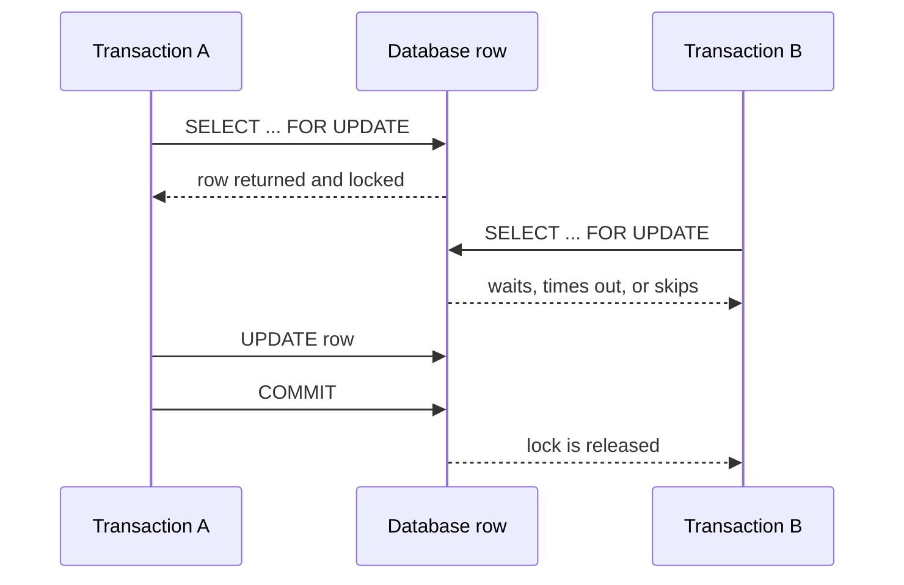

---
title: JPA Transactions Locking And Concurrency
---

# JPA Transactions Locking And Concurrency

Transaction boundaries, optimistic locking, pessimistic locking, atomic conditional updates, and Shopverse concurrency decisions.

Back to [Spring Data JPA](../SPRING-DATA-JPA.md).

## Transactions

Repository calls participate in the surrounding Spring transaction:

```java
@Transactional
public OrderResponse checkout(...) {
    OrderEntity order = repository.save(...);
    outboxService.enqueue(...);
    return mapper.toResponse(order);
}
```

The order and its outbox event commit or roll back together because both use
the same transaction manager and database.

Use `@Transactional(readOnly = true)` for read service methods. It communicates
intent and may enable provider optimizations, but it is not an authorization
or database-write prohibition.


## Locking And Concurrency

### Optimistic Locking

```java
@Version
private long version;
```

Optimistic locking assumes collisions are uncommon. It does not lock the row
when it is read. Instead, each transaction remembers the version it loaded and
proves during update that the row still has that version.

Shopverse Inventory uses this mapping:

```java
@Entity
class InventoryItem {

    @Id
    private Long id;

    private int availableQuantity;

    private int reservedQuantity;

    @Version
    private long version;
}
```

Assume product `101` starts as:

| Field | Value |
|---|---:|
| `available_quantity` | 1 |
| `reserved_quantity` | 0 |
| `version` | 7 |

Two checkout consumers read the same row:

```mermaid
sequenceDiagram
    participant A as Transaction A
    participant DB as inventory_items
    participant B as Transaction B

    A->>DB: SELECT product 101
    DB-->>A: available=1, version=7
    B->>DB: SELECT product 101
    DB-->>B: available=1, version=7
    A->>DB: UPDATE ... WHERE id=101 AND version=7
    DB-->>A: 1 row updated; version becomes 8
    B->>DB: UPDATE ... WHERE id=101 AND version=7
    DB-->>B: 0 rows updated
    B->>B: optimistic-locking exception
```

Generated update:

```sql
-- simplified conceptual shape
update inventory_items
set available_quantity = ?,
    reserved_quantity = ?,
    version = version + 1
where id = ? and version = ?;
```

Depending on the Hibernate version and dialect, the new version may instead be
calculated in Java and bound as `version = ?`. The concurrency guarantee comes
from the old version in the `WHERE` clause and the affected-row count.

The first transaction updates one row and changes version `7` to `8`. The
second transaction still asks for version `7`, so the database updates zero
rows. Hibernate interprets that zero-row result as stale state and raises an
optimistic-locking exception, commonly exposed as:

- `OptimisticLockException`;
- `StaleObjectStateException`;
- Spring's translated `ObjectOptimisticLockingFailureException`.

The failed transaction must roll back. It must not continue using its stale
entity.

For Shopverse, a safe retry means:

1. start a new transaction;
2. reload the Inventory item and its current version;
3. re-check available stock;
4. check the Order/reservation idempotency key;
5. execute the complete reservation operation again;
6. commit only one reservation and one corresponding outbox event.

Do not retry only `repository.save(staleEntity)`. That can repeat stale
decisions. Retry the complete idempotent business operation with bounded
attempts and backoff.

Optimistic locking prevents a lost update:

```text
without @Version:
Transaction A writes 0 available
Transaction B writes 0 available using stale state
both may believe they purchased the last item

with @Version:
one update succeeds
the stale update is rejected
the loser reloads and observes insufficient stock
```

It does not prevent:

- duplicate API requests by itself;
- duplicate Kafka event processing;
- conflicts across rows that do not share a version;
- overselling caused by code that bypasses the versioned entity;
- unbounded retry storms under high contention.

Shopverse combines `@Version` with unique Order/reservation business keys,
idempotent checkout, transactional boundaries, and database constraints.

Use optimistic locking when:

- contention is expected to be low or moderate;
- reads should not block other transactions;
- the operation can be retried safely;
- rejecting stale decisions is more important than waiting for a lock.

Prefer an atomic conditional update or carefully bounded pessimistic lock when
contention is consistently high and repeated optimistic retries would waste
resources.

### Pessimistic Locking

```java
@Lock(LockModeType.PESSIMISTIC_WRITE)
@Query("select item from InventoryItemEntity item where item.productId = :id")
Optional<InventoryItemEntity> findByProductIdForUpdate(
        @Param("id") Long productId
);
```

Typical SQL:

```sql
select *
from inventory_items
where product_id = ?
for update;
```

Pessimistic locking comes into play when the query runs. The database locks
the selected row immediately and other transactions that need a conflicting
lock must wait, fail, or skip the row depending on the database and query
style.



Keep locked transactions short, access rows in a consistent order, and never
wait for remote HTTP or Kafka operations while holding locks.

### Optimistic Locking Versus Pessimistic Locking

Both techniques protect shared data, but they are not the same.

| Question | Optimistic locking with `@Version` | Pessimistic locking with `@Lock` |
|---|---|---|
| When does it act? | during flush, update, or commit | during the read query |
| Does the first read block others? | no | yes, for conflicting locks |
| How is conflict detected? | update affects zero rows because version changed | second transaction waits, fails, or skips locked row |
| Best fit | normal business rows where conflicts are uncommon | worker/job rows where duplicate processing is dangerous |
| Typical failure | `OptimisticLockException` or Spring translated stale-object exception | lock timeout, deadlock victim, or skipped locked row |
| Retry style | retry the full idempotent business operation | keep lock scope short; retry after bounded backoff |

The simplest mental model:

```text
@Version:
  "I will not block you now, but my update will fail later if the row changed."

Pessimistic lock:
  "I am taking this row now; another worker must not process it at the same time."
```

### Shopverse Decision Guide

| Shopverse use case | Preferred protection | Reason |
|---|---|---|
| Two customers racing for the last inventory item | `@Version` on `InventoryItem` | both can read, but only one stale-sensitive stock update wins |
| Repeated checkout request from client/gateway retry | `Idempotency-Key` plus unique database constraint | this is duplicate request protection, not only row-update protection |
| Duplicate `order.created` Kafka delivery | idempotent consumer lookup by `orderNumber` | Kafka can deliver the same business event more than once |
| Outbox publisher claiming work | short pessimistic claim or atomic status update | two workers must not publish the same outbox row concurrently |
| Reservation expiry in multiple Inventory replicas | row claiming, `SKIP LOCKED`, atomic status update, or scheduler lock | every replica can run `@Scheduled`; each expired reservation needs one owner |

In Shopverse, `@Version` protects `InventoryItem` stock from lost updates. It
does not by itself prove that only one scheduler replica has selected an
expired reservation. A multi-replica expiry worker needs an ownership step:

```java
@Modifying
@Query("""
        update InventoryReservation reservation
           set reservation.status = 'EXPIRING'
         where reservation.id = :id
           and reservation.status = 'RESERVED'
           and reservation.expiresAt < :now
        """)
int claimExpiredReservation(Long id, Instant now);
```

Only the transaction that receives `1` updated row owns that expiry. Other
replicas receive `0` and skip it. The owning transaction can then release
stock, mark the reservation `EXPIRED`, and enqueue the compensation outbox
event.

Use pessimistic row locks or atomic status transitions for worker ownership.
Use optimistic locking for ordinary entity state where the business operation
can safely retry from a fresh read.

### Atomic Conditional Update

For a simple invariant, one update may be safer and faster than read-modify-write:

```java
@Modifying
@Query("""
        update InventoryItemEntity item
           set item.availableQuantity = item.availableQuantity - :quantity
         where item.productId = :productId
           and item.availableQuantity >= :quantity
        """)
int reserve(Long productId, int quantity);
```

The database evaluates the condition and update atomically.


