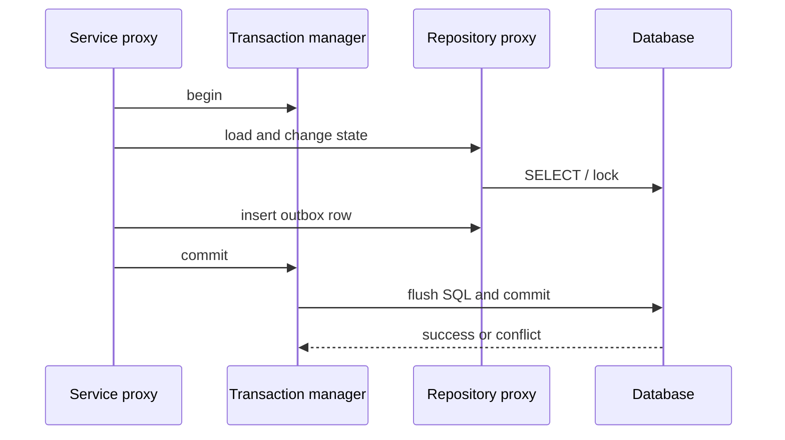

# JPA Transactions Locking And Concurrency

<DocLabels items={[
  {label: 'Advanced', tone: 'advanced'},
  {label: 'Concurrency control', tone: 'foundation'},
  {label: 'Production invariant', tone: 'production'},
  {label: 'Shopverse current state', tone: 'shopverse'},
]} />

The service operation owns the invariant. Spring Data repositories participate in
that transaction; they do not make several repository calls, an HTTP call, and a
Kafka send one atomic unit.



## Transaction Ownership

```java
@Transactional
public OrderResponse checkout(CheckoutCommand command) {
    OrderEntity order = createOrder(command);
    orderRepository.save(order);
    outboxService.enqueue(OrderCreated.from(order));
    return mapper.toResponse(order);
}
```

Domain state and the outbox row can commit together because they use the same
database and transaction manager. Publication occurs later. A remote call inside
this transaction is not atomic with the database and holds locks/connections while
waiting.

`@Transactional(readOnly = true)` communicates intent and may enable provider
optimizations. It is not an authorization boundary or a universal database write
prohibition.

## Choose The Smallest Correct Primitive

| Primitive | Best fit | Expected conflict evidence |
|---|---|---|
| `@Version` optimistic locking | low/moderate collision, safe full-operation retry | zero-row versioned update and translated stale-object exception |
| pessimistic row lock | short ownership claim or consistently contended row | lock wait, timeout, deadlock, or skipped row |
| atomic conditional update | invariant expressible in one statement | affected-row count `1` or `0` |
| unique constraint | duplicate business identity | constraint violation translated to domain conflict |

## Optimistic Locking

```java
@Version
private long version;
```

Two transactions may read version 7. The first update includes version 7 in its
predicate and advances it. The second affects zero rows and fails. Retry the whole
idempotent business operation in a new transaction: reload, re-check the invariant,
apply the decision, and commit. Do not retry only `save(staleEntity)`.

<DocCallout type="shopverse" title="Current inventory protection">

Shopverse `InventoryItem` currently has `@Version`, available quantity, and reserved
quantity. This prevents stale lost updates on that row. Duplicate checkout and
Kafka delivery are separate problems handled with business keys and idempotent
operations.

</DocCallout>

## Pessimistic Claims

```java
@Lock(LockModeType.PESSIMISTIC_WRITE)
@Query("select event from OutboxEvent event where event.id = :id")
Optional<OutboxEvent> findByIdForUpdate(Long id);
```

Keep the locked transaction short and never hold it across remote I/O. Access
multiple rows in a consistent order, configure bounded lock timeouts, and treat
deadlocks as an expected database concurrency outcome with a classified retry.

<DocCallout type="shopverse" title="Current outbox claim">

Order, Inventory, and Payment outbox repositories currently expose a pessimistic
`findByIdForUpdate` path. The shared runtime also has claim metadata. This documents
current code; it does not imply every scheduler path has globally unique ownership.

</DocCallout>

## Atomic Conditional Update

```java
@Modifying(clearAutomatically = true, flushAutomatically = true)
@Query("""
       update InventoryItem item
          set item.availableQuantity = item.availableQuantity - :quantity
        where item.productId = :productId
          and item.availableQuantity >= :quantity
       """)
int reserve(Long productId, int quantity);
```

An affected-row count of `1` wins; `0` means the condition no longer holds. This is
a proposed alternative for a narrow stock invariant, not the current Shopverse
Inventory implementation. It would need to update every related quantity and
version rule consistently before adoption.

## Isolation And Multi-Row Invariants

Row locks and versions protect only the state they cover. Write skew across two
rows, uniqueness across a predicate, or cross-service authority needs a database
constraint, a different transaction/isolation design, or distributed workflow.
Test the actual database engine because MVCC and lock behavior differ.

<DocCallout type="production" title="REQUIRES_NEW can consume two connections">

An outer transaction can retain its connection while an inner transaction requests
another. Under concurrency, a pool sized only for request threads can deadlock on
connection acquisition. Prefer one clear boundary unless independent commit is a
real requirement.

</DocCallout>

## Schema Rollout For Versioning

Add a version column through an expand-and-contract migration: introduce it with a
safe value, deploy code that reads and writes it, backfill/verify old rows, then add
the final constraint. During mixed deployment, old writers that do not include the
version predicate can defeat the protection; gate the rollout or preserve
compatibility until all writers participate.

## Concurrency Evidence

An integration test should run two real transactions on separate connections and
prove:

- which read or lock happens first;
- whether the second transaction blocks or proceeds;
- the exact exception or affected-row count;
- the committed final state and outbox count;
- bounded retry and timeout behavior;
- datasource pending/acquisition metrics under load.

For scheduler claims, leases, fencing, and `SKIP LOCKED`, continue with
[Locking And Work Ownership](../../reliability/locking/LOCKING-AND-WORK-OWNERSHIP.md).

## Interview Questions

<ExpandableAnswer title="Why must an optimistic-lock retry start a new transaction?">

The failed transaction is rollback-only and its entity state is stale. A correct
retry reloads current state and re-evaluates the complete idempotent operation.

</ExpandableAnswer>

<ExpandableAnswer title="What does a pessimistic repository lock actually protect?">

It protects matching database rows for the physical transaction according to the
database lock and isolation rules. It does not protect remote resources or rows the
query did not lock.

</ExpandableAnswer>

<ExpandableAnswer title="Why does saving an entity and sending Kafka inside @Transactional remain unsafe?">

The database transaction manager cannot atomically commit the broker send. A crash
can leave only one side durable. Store an outbox row with the domain change and
publish it later.

</ExpandableAnswer>

<ExpandableAnswer title="When is an atomic conditional update better than @Version?">

When the full invariant fits one database statement and the caller only needs a
win/lose result. It avoids loading stale state and retrying a larger object graph.

</ExpandableAnswer>

<ExpandableAnswer title="How can REQUIRES_NEW exhaust a connection pool?">

The outer transaction retains one connection while each concurrent inner
transaction waits for another. With insufficient headroom, all outer requests can
hold the pool and wait indefinitely for connections that cannot become free.

</ExpandableAnswer>

## Official References

- [Spring transaction propagation](https://docs.spring.io/spring-framework/reference/data-access/transaction/declarative/tx-propagation.html)
- [Spring Data JPA locking](https://docs.spring.io/spring-data/jpa/reference/jpa/locking.html)
- [Hibernate ORM locking](https://docs.hibernate.org/orm/current/userguide/html_single/)

## Recommended Next

Continue with [Auditing And Delete Semantics](./JPA-AUDITING-DELETING-TESTING.md).
