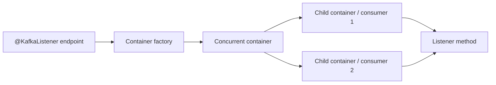

# Advanced Spring Kafka Containers Transactions Schemas And Testing

## Version Boundary

Spring Boot manages compatible Spring Kafka and Kafka client versions. This page
uses Spring Kafka 4.1 names where version-sensitive. Spring Kafka 4.0 introduced
`org.springframework.kafka.annotation.BackOff`; older releases used Spring Retry's
`Backoff` annotation and a differently cased retry attribute.

```java
import org.springframework.kafka.annotation.BackOff;
import org.springframework.kafka.annotation.RetryableTopic;

@RetryableTopic(
        attempts = "4",
        backOff = @BackOff(
                delay = 1_000,
                multiplier = 2.0,
                maxDelay = 30_000,
                jitter = 200
        ),
        exclude = IllegalArgumentException.class
)
@KafkaListener(topics = "payments.requested", groupId = "payment-service")
void consume(PaymentRequestedEvent event) {
    paymentService.process(event);
}
```

## Container Runtime

`@KafkaListener` registers an endpoint. A listener container owns the Kafka
consumer, poll thread, assignment, conversion, invocation, acknowledgment, error
handling, pause/resume, events, and shutdown. A concurrent container creates child
containers; it does not make one Kafka consumer safe for multiple threads.



Effective parallelism for a traditional group is bounded by assigned partitions.
Listener code must also respect database connections, HTTP limits, CPU, memory,
and key ordering.

### Lifecycle features to know

- `id`, `groupId`, `topics`, `topicPattern`, and explicit topic partitions;
- auto-startup and registry-based start/stop;
- dynamic endpoint/container creation;
- container groups and sequenced startup;
- rebalance callbacks and assignment events;
- consumer-started, stopped, non-responsive, auth, pause, and idle events;
- record/batch interceptors and filters;
- validation, class-level listeners, `@SendTo`, and async return types;
- seek callbacks, initial offsets, and controlled replay.

## Acknowledgment And Failure Matrix

| Choice | Commit/recovery intent | Key risk |
|---|---|---|
| `RECORD` | advance after each successful record listener call | more commit overhead; still redelivers after effect/commit gap |
| `BATCH` | advance after the poll batch succeeds | failed batch may repeat completed records |
| `MANUAL` | listener signals completion, container commits per mode | developers may acknowledge before durable effect |
| `MANUAL_IMMEDIATE` | commit immediately when invoked on consumer thread | behavior differs if called off-thread |
| `nack` | redeliver after controlled seek/backoff | must be called on consumer thread; affects remaining records |
| `asyncAcks` | allow out-of-order acknowledgments from a poll | defers commits and increases duplicate potential; incompatible with `nack` |

Manual acknowledgment does not create exactly-once business processing. The safe
default remains: durable idempotent business transaction first, offset progress
second.

Batch listeners need an explicit partial-failure policy. Use record-level recovery,
`BatchListenerFailedException`, partial acknowledgment where supported, or retry
the whole batch. Never silently skip an unknown failed position.

## Blocking Retry, Retry Topics, And DLT

Blocking retry holds the partition path and better preserves ordering, but consumes
poll-thread time and can violate poll budgets. Non-blocking retry republishes to
delay topics so the main consumer continues, but changes ordering and creates more
topics, groups, headers, and operational states.

Hard constraints:

- non-blocking retries do not support batch listeners;
- non-blocking retries cannot be combined with container transactions;
- moving a failed record to a retry topic can allow later same-key records to run;
- `attempts` includes the first delivery;
- a DLT requires ownership, alerting, retention, security, correction, and replay.

Configure exception classification, global timeout, retry-topic suffix/reuse,
retry/DLT concurrency, destination resolution, header retention, recovery-publish
failure, and DLT handler failure deliberately. Capture original topic, partition,
offset, timestamp, key, consumer group, exception type/message, stack trace policy,
delivery attempt, correlation ID, schema version, and deployment version without
leaking secrets.

With container transactions, failed records normally roll back and an
`AfterRollbackProcessor` controls seek/recovery. Batch recovery and transaction
boundaries require separate verification.

## Transactions And Exactly-Once Boundaries

Setting `spring.kafka.producer.transaction-id-prefix` allows Boot to configure a
Kafka transaction manager and transactional containers. Every live application
instance needs a unique prefix to avoid fencing.

```yaml
spring:
  kafka:
    producer:
      transaction-id-prefix: ${INSTANCE_ID}-orders-
    consumer:
      properties:
        isolation.level: read_committed
```

Use `KafkaTemplate.executeInTransaction` for a local group of Kafka writes. A
transactional listener can atomically publish Kafka output and commit consumed
offsets. `read_committed` consumers hide aborted results.

Database plus Kafka remains two systems. Transaction synchronization has an order
of commits and therefore a residual failure window. Prefer:

- transactional outbox for database-to-Kafka publication;
- inbox/unique event identity for consumer database effects;
- external idempotency key and reconciliation for remote APIs;
- Kafka transactions for Kafka consume-transform-produce.

## Serialization, Conversion, And Schemas

Separate these layers:

1. Kafka serializer/deserializer converts keys/values to bytes;
2. `ErrorHandlingDeserializer` captures failures that occur before listener entry;
3. Spring message conversion maps records/messages and type information;
4. schema-registry serializers enforce governed Avro/Protobuf/JSON Schema contracts.

Trust only known JSON packages. Do not depend on Java class names in type headers
as a cross-team event contract. Treat tombstone (`null`) payloads explicitly for
compacted topics. Delegating serializers/deserializers can route formats by topic
or headers, but heterogeneous topics increase governance and consumer complexity.

Schema tests must cover:

- old producer to new consumer;
- new producer to old consumer during rollout;
- missing/default/unknown fields;
- semantic changes such as units and identity;
- DLT/replay of old schema versions;
- rollback after a new event was published.

## Routing And Request/Reply

`RoutingKafkaTemplate` selects producer behavior by destination pattern when
different topics need different serializers or producer factories. Keep routing
rules unambiguous and observable.

`ReplyingKafkaTemplate` implements request/reply using correlation and reply topics.
It couples availability and latency more tightly than normal event streaming. Use
explicit timeouts, reply-topic security, correlation validation, late-reply policy,
and capacity isolation. Prefer normal HTTP/RPC when synchronous semantics are the
actual requirement.

## Observability

Enable Micrometer observations on templates and listener containers. Add stable,
low-cardinality tags through observation conventions. Record:

- publish outcome and latency;
- listener outcome and processing latency;
- topic/partition/offset in logs where safe, not as high-cardinality metric tags;
- retries, attempts, recoveries, DLT outcomes, idempotency conflicts;
- assignments, rebalances, pauses, non-responsive consumers, auth failures;
- native producer/consumer metrics and group lag.

Propagate trace/correlation context in bounded headers. Restore and clear logging
context on listener threads so one record cannot contaminate another.

## Graceful Shutdown And Kubernetes

Shutdown must stop new work, finish or bound in-flight processing, commit only
completed work, close consumers before the platform's termination deadline, and
allow another member to acquire partitions. Align:

- pod termination grace period;
- container shutdown timeout;
- processing and remote-call deadlines;
- readiness removal;
- pre-stop behavior;
- static membership/session timeout;
- deployment surge/unavailable settings.

Test forced termination as well as graceful termination. Redelivery after a kill is
expected; duplicate-safe effects are the protection.

## Test Pyramid

| Test | Proves |
|---|---|
| unit | mapping, classification, idempotency decisions |
| schema/contract | producer-consumer compatibility |
| container integration | actual broker serialization, assignment, commits, retries, DLT |
| database integration | inbox/outbox uniqueness and transaction boundaries |
| failure test | restart, broker loss, timeout, recovery, duplicate windows |
| load test | throughput, latency, lag, pools, hot keys, catch-up |

Prefer Testcontainers for production-like broker integration, including KRaft and
security where required. Embedded Kafka is useful for focused framework tests but
does not replace realistic cluster/security/failure tests. Wait on observable
conditions instead of arbitrary sleeps.

Required cases:

- duplicate delivery after processing but before commit;
- malformed bytes before listener entry;
- transient failure then success;
- permanent failure and DLT publish;
- DLT publish failure;
- partial batch failure;
- rebalance during processing;
- unique transactional ID across two instances;
- old/new schema overlap;
- SIGTERM and forced kill;
- lag recovery without overwhelming the database.

## Production Review Checklist

- [ ] Boot/Spring Kafka/Kafka client versions are compatible;
- [ ] topic key, schema, retention, and ownership are explicit;
- [ ] acknowledgment and transaction boundaries match the guarantee;
- [ ] listeners are idempotent for expected redelivery;
- [ ] retry/DLT preserves required ordering or documents the compromise;
- [ ] poll work fits the interval with measured headroom;
- [ ] concurrency respects partitions and downstream pools;
- [ ] security uses workload identity and least privilege;
- [ ] observations, lag, retry, DLT, and container events are monitored;
- [ ] shutdown, replay, rollback, and failure behavior are tested.

## Official References

- [Spring for Apache Kafka reference](https://docs.spring.io/spring-kafka/reference/)
- [Spring Kafka listener containers](https://docs.spring.io/spring-kafka/reference/kafka/receiving-messages/message-listener-container.html)
- [Spring Kafka transactions](https://docs.spring.io/spring-kafka/reference/kafka/transactions.html)
- [Spring Kafka non-blocking retries](https://docs.spring.io/spring-kafka/reference/retrytopic.html)
- [Spring Kafka testing](https://docs.spring.io/spring-kafka/reference/testing.html)

## Recommended Next

Apply the material in the [Kafka Architect Labs And Interview Workbook](../../integration/kafka/KAFKA-ARCHITECT-LABS.md).
