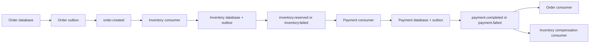

---
title: Spring Kafka Basics And Event Flow
---

# Spring Kafka Basics And Event Flow

Dependencies, Kafka concepts used by Spring, Shopverse event flow, KafkaTemplate publishing, and pull-model behavior.

Back to [Spring Kafka](../SPRING-KAFKA.md).

## Dependencies

The event-driven services use Spring Boot's Kafka starter:

```gradle
implementation 'org.springframework.boot:spring-boot-starter-kafka'
```

It provides Spring Kafka, Kafka client libraries, `KafkaTemplate`, listener
containers, serializers, consumer infrastructure, retry-topic support, health
information, metrics, and Spring Boot configuration.


## Kafka Concepts Used By Spring

| Concept | Purpose |
|---|---|
| Broker | Kafka server that stores partitions and serves producers/consumers |
| Cluster | One or more brokers acting as one Kafka system |
| Topic | Named stream of related records |
| Partition | Ordered append-only log and unit of consumer parallelism |
| Record | Key, value, headers, timestamp, partition, and offset |
| Offset | Record position inside one partition |
| Producer | Writes records to topics |
| Consumer | Polls and processes records |
| Consumer group | Consumers cooperating to process a topic |
| Group offset | Last committed processing position for a group |
| Replication | Copies partitions across brokers for fault tolerance |

Ordering is guaranteed only within one partition, not across an entire topic.


## Shopverse Event Flow



The transactional outbox closes the database/Kafka dual-write window. Domain
state and an outbox row commit together, then a scheduled publisher sends the
event to Kafka.


## Publishing With `KafkaTemplate`

Shopverse publishers call:

```java
var result = kafkaTemplate
        .send(event.getTopic(), event.getMessageKey(), event.getPayload())
        .get(10, TimeUnit.SECONDS);
```

`KafkaTemplate` is Spring's producer abstraction. It obtains a Kafka producer,
serializes the key and value, selects a partition, sends the record, and
returns a future containing broker metadata.

Shopverse waits up to ten seconds for broker acknowledgement before marking the
outbox row `PUBLISHED`. If sending fails, the row remains recoverable for a
later attempt.

The order number is used as the message key:

```text
key = ORD-1003
```

Kafka hashes a key to a partition. Events with the same order key normally go
to the same partition, preserving per-order ordering while allowing different
orders to be processed concurrently.

### Producer Configuration

Central configuration includes:

```yaml
spring:
  kafka:
    producer:
      acks: all
      properties:
        enable.idempotence: true
        max.in.flight.requests.per.connection: 5
```

- `acks=all` waits for all in-sync replicas required by the topic's durability
  policy.
- `enable.idempotence=true` prevents duplicate broker writes caused by
  supported producer retries during one producer session.
- bounded in-flight requests retain safe ordering behavior with idempotence.

Producer idempotence does not deduplicate two application calls, consumer
database updates, DLT replay, or an outbox event sent again after a crash.

### What Producer Idempotence Actually Solves

Producer idempotence is a producer-to-broker safety feature. It protects a
narrow but important failure case:

```text
1. Service sends record to Kafka.
2. Kafka stores the record.
3. The acknowledgement is delayed or lost.
4. Producer retries the same send.
5. Broker uses producer sequence metadata to avoid storing that retry twice.
```

It does not mean the whole business operation is exactly once. Kafka cannot
know whether two sends are one accidental retry or two intentional business
events when the application calls `KafkaTemplate.send(...)` twice.

```java
kafkaTemplate.send(topic, key, payload);
kafkaTemplate.send(topic, key, payload);
```

Those are two application sends. Producer idempotence does not collapse them
into one business event.

The transactional outbox also leaves one unavoidable duplicate window:

```text
1. Outbox row is marked PROCESSING.
2. Worker sends to Kafka.
3. Kafka stores the event and acknowledges it.
4. Application crashes before marking the outbox row PUBLISHED.
5. Stale claim recovery releases the row.
6. Worker sends the same event again after restart.
```

After a restart this can be a new producer session, so Kafka producer
idempotence may not deduplicate it. That is why the Shopverse event contract
and consumers are designed for at-least-once delivery.

```text
Producer idempotence = prevents some duplicate broker appends
Consumer idempotency = prevents duplicate business effects
```


## Kafka Uses A Pull Model

Kafka consumers pull data by repeatedly calling `poll()` on their assigned
partitions:

```text
Broker partition
      ^
      | poll records
      |
Consumer thread
      |
      +-- invoke listener
      +-- process record
      +-- commit offset
```

Spring's listener container owns the polling loop. Application code only
implements the listener method.

Pulling allows the consumer to control its processing rate and batch size.
Kafka does not invoke the Java method directly from a broker thread. Records
remain stored according to topic retention even after consumption; committed
offsets only record group progress.

If processing takes longer than the configured maximum poll interval, Kafka
can consider the consumer unhealthy, rebalance its partitions, and redeliver
records. Poll and processing settings must therefore match real workload.


