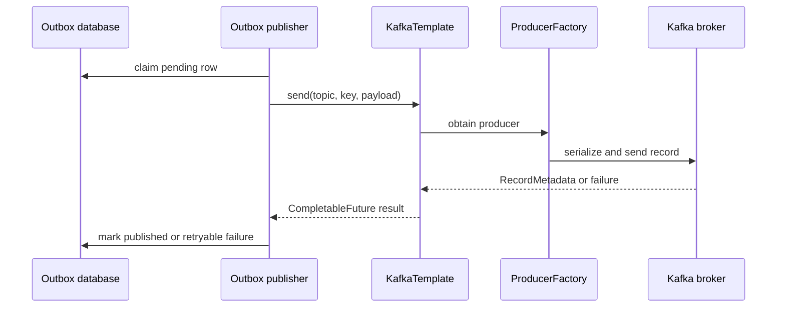

# Spring Kafka Publishing And Event Flow

<DocLabels items={[
  {label: 'Intermediate', tone: 'intermediate'},
  {label: 'Producer mechanics', tone: 'foundation'},
  {label: 'Schema and security', tone: 'production'},
  {label: 'Shopverse current state', tone: 'shopverse'},
]} />

Use [Apache Kafka](../../integration/APACHE-KAFKA.md) for broker, partition,
replication, and retention fundamentals. This page begins where Spring Boot creates
a producer factory and `KafkaTemplate`.



## Boot Configuration Boundary

```gradle
implementation 'org.springframework.boot:spring-boot-starter-kafka'
```

Spring Boot configures the producer factory and template from `spring.kafka.*`.
Use the Boot dependency platform rather than selecting an independent Spring Kafka
version.

```yaml
spring:
  kafka:
    bootstrap-servers: ${KAFKA_BOOTSTRAP_SERVERS:localhost:9092}
    template:
      observation-enabled: true
    producer:
      acks: all
      key-serializer: org.apache.kafka.common.serialization.StringSerializer
      value-serializer: org.apache.kafka.common.serialization.StringSerializer
      properties:
        enable.idempotence: true
        max.in.flight.requests.per.connection: 5
        compression.type: lz4
```

<DocCallout type="shopverse" title="Current configuration">

These producer and observation settings are present in Shopverse shared
configuration. They improve broker acknowledgment and supported retry behavior;
they do not make an application outbox publish exactly once.

</DocCallout>

## KafkaTemplate Send Contract

```java
CompletableFuture<SendResult<String, String>> result =
        kafkaTemplate.send(topic, orderNumber, payload);

SendResult<String, String> acknowledged =
        result.get(sendTimeoutSeconds, TimeUnit.SECONDS);
```

The future proves whether this send produced metadata or failed within the observed
call. A timeout is ambiguous: the broker may have stored the record even when the
application did not receive the acknowledgment.

<DocCallout type="mistake" title="Do not mark an outbox row published before acknowledgment">

Wait for the send result within a bounded deadline. On failure or ambiguity, leave
the durable row recoverable. A later send can duplicate the record, so consumers
must protect business effects.

</DocCallout>

## Current Shopverse Outbox Flow

Domain state and an outbox row commit in one local database transaction. A shared
publisher claims the row, sends its topic, key, and payload through `KafkaTemplate`,
then marks the row published or returns it to retryable state.

Integration tests currently prove that:

- domain/outbox commit and rollback share one transaction;
- the configured `KafkaTemplate` receives broker metadata from a Kafka container;
- outbox claim and completion state transitions release the claim.

This proves important boundaries, but a crash between broker acknowledgment and
the database `PUBLISHED` update still permits duplicate delivery.

## Key And Schema Contract

Choose a stable key that groups events requiring per-key order. The event envelope
should carry a stable event ID, event type, schema version, occurred time,
correlation ID, and service-owned payload.

For a compatible rollout:

1. add optional fields with safe defaults;
2. deploy tolerant readers before writers require the new field;
3. run old and new serializer fixtures in contract tests;
4. introduce a new event type/topic for a truly incompatible meaning;
5. preserve the old writer until rollback no longer needs it.

<DocCallout type="code" title="Proposed contract hardening">

Shopverse currently publishes JSON strings parsed into service-owned records. A
mandatory stable event ID and explicit schema-version field are recommended where
not already present; this is a proposed contract rule, not a claim about every
existing event.

</DocCallout>

## Serialization And Message Conversion

String JSON keeps the transport boundary simple but moves type selection and schema
validation into application code. Spring Kafka serializers, deserializers, and
message converters can provide typed records, but type headers and trusted-package
configuration become security and compatibility decisions.

The current Shopverse shared parser centralizes safe JSON parsing. Event records
remain service-owned; do not place all domain event classes in a shared starter.

## Producer Security

Production configuration should use TLS and an authenticated Kafka mechanism,
service-specific ACLs, protected trust/key material, and credential rotation.
Never log producer credentials or entire sensitive payloads. Restrict each service
to required topics and operations.

<DocCallout type="production" title="Proposed deployment control">

The repository's shared local configuration contains no SASL/TLS settings. Add
them through environment-specific secret-backed configuration and test certificate
or credential overlap before rotation; do not commit credentials to the config
repository.

</DocCallout>

## Evidence Checklist

- template success/failure/latency observations with bounded-cardinality tags;
- producer error, retry, request latency, record size, and buffer-pressure metrics;
- outbox pending age, claim age, attempts, and publish latency;
- schema fixture compatibility across deployed versions;
- broker acknowledgment in an integration test;
- redacted failure logs that retain topic, partition, offset, key hash, and event ID.

## Interview Questions

<ExpandableAnswer title="What does a successful KafkaTemplate future prove?">

It proves the configured producer completed the send and returned broker metadata
to that call. It does not prove a database update committed or a consumer applied
the business effect.

</ExpandableAnswer>

<ExpandableAnswer title="Why can an outbox publisher still produce duplicate Kafka records?">

The broker can acknowledge the send and the process can crash before marking the
database row published. Recovery sends the durable row again.

</ExpandableAnswer>

<ExpandableAnswer title="Why should event classes remain service-owned when parsing is shared?">

Parsing is transport infrastructure. Payload records express domain contracts;
sharing them across services couples independent deployments and ownership.

</ExpandableAnswer>

<ExpandableAnswer title="How do you roll out a required event field safely?">

First deploy readers that accept both representations, then deploy writers, verify
mixed-version traffic, and only later require the field after rollback no longer
needs the old form.

</ExpandableAnswer>

## Official References

- [Sending messages](https://docs.spring.io/spring-kafka/reference/4.0/kafka/sending-messages.html)
- [Serialization, deserialization, and conversion](https://docs.spring.io/spring-kafka/reference/4.0/kafka/serdes.html)
- [Monitoring KafkaTemplate performance](https://docs.spring.io/spring-kafka/reference/4.0/kafka/micrometer.html)

## Recommended Next

Continue with [Consumers And Delivery Semantics](./SPRING-KAFKA-CONSUMERS.md).
