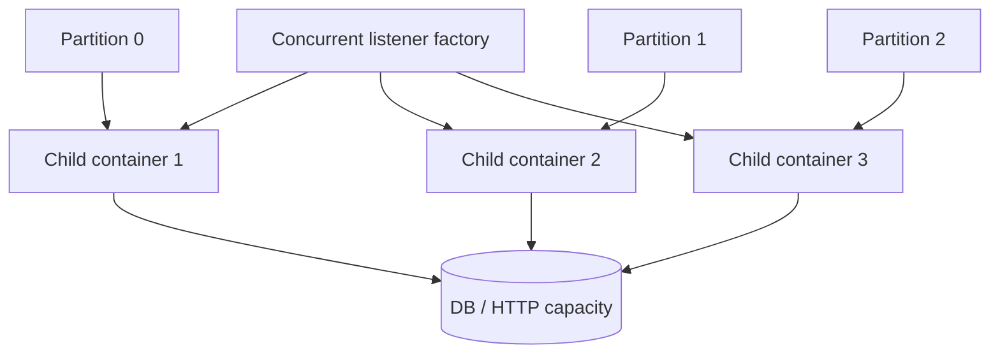

# Spring Kafka Listener Concurrency And Capacity

<DocLabels items={[
  {label: 'Advanced', tone: 'advanced'},
  {label: 'Listener capacity', tone: 'foundation'},
  {label: 'Rebalance safety', tone: 'production'},
  {label: 'Shopverse current baseline', tone: 'shopverse'},
]} />

Spring concurrency creates child listener containers. Useful parallelism is still
bounded by assigned partitions and by the database, HTTP, and CPU capacity used by
each listener.



## Effective Consumer Count

```text
group consumers = service replicas x listener concurrency
useful active consumers <= assigned topic partitions
```

Multiple `@KafkaListener` endpoints create separate containers. `@RetryableTopic`
also creates retry and DLT container infrastructure. Count all consumer threads,
not only the primary listener annotation.

<DocCallout type="shopverse" title="Current baseline">

Shared Shopverse configuration defaults listener concurrency to one and
`max.poll.records` to 50. This is a conservative baseline, not a measured optimum
for every topic. Capacity changes should be tested against current partition count,
key skew, database pool size, and retry traffic.

</DocCallout>

## Capacity Model

Approximate one sequential listener's sustainable service rate:

```text
records per second per child
  = 1 / average end-to-end processing seconds
```

At 50 ms per record, the idealized ceiling is 20 records/second before poll,
commit, network, lock, and retry overhead. Size from p95/p99 and peak bursts, not
only an average.

```text
required active children
  = ceiling(target records/second / measured records per child)
```

Then verify that partitions and downstream resources can support that number.

<DocCallout type="production" title="The smallest pool is the real bulkhead">

If six listener children call a five-connection datasource while HTTP traffic uses
the same pool, increasing Kafka concurrency can raise both lag and request latency.
Reserve or isolate capacity based on workload ownership.

</DocCallout>

## Poll Budget

The time to process records from a poll plus any deliberate delay must remain below
the consumer's poll interval budget. Large `max.poll.records`, slow downstream
calls, GC pauses, lock waits, or unbounded retries can cause the consumer to lose
its assignment and receive duplicate work.

Controls include:

- reduce records returned per poll;
- bound remote/database timeouts and retry attempts;
- use batch listeners only when batch failure semantics are designed;
- pause the container or partitions for controlled backpressure;
- keep CPU-heavy work off consumer threads only through an explicit bounded
  ownership design, not casual `@Async`.

## Retry Capacity

Retry topics shift delayed work to additional containers and partitions. Set retry
concurrency independently when failure traffic should not consume the full primary
capacity. Include retry and DLT rates in broker, connection-pool, and recovery
budgets.

<DocCallout type="mistake" title="More retry concurrency can amplify an outage">

When the dependency is still unhealthy, faster retry consumers create more failed
calls and more DLT traffic. Bound recovery rate and observe downstream saturation.

</DocCallout>

## Rebalance And Rolling Deployment

A rolling deployment temporarily runs old and new replicas in the same group.
Partitions are revoked and reassigned; processing pauses and work not durably
committed may be delivered again.

Spring Kafka 4.0 can use Kafka's newer consumer rebalance protocol through
`group.protocol=consumer`, subject to compatible brokers and clients. Assignment is
server-driven under that protocol; client-side custom assignors are not applied in
the same way. Shopverse does not currently enable this property, so adopting it is
a proposed compatibility-tested rollout.

Safe rollout sequence:

1. prove old and new event contracts are mutually readable;
2. ensure duplicate delivery is safe;
3. verify readiness does not route traffic before listener dependencies are ready;
4. stop containers and drain bounded in-flight work on termination;
5. watch rebalance duration, assignment, lag, and error rate;
6. roll back without changing group identity or requiring a new schema.

## Hot Partitions And Ordering

One hot key can dominate a partition while other children are idle. Increasing
concurrency does not split a partition. Diagnose records/bytes and processing time
per partition, then decide whether the key, partition count, or workload design can
change without violating ordering.

## Evidence Checklist

- container and child count by listener ID;
- assigned partitions and rebalance duration;
- records consumed, processing time, error rate, and poll age;
- lag and catch-up time by partition;
- datasource/HTTP pool pending and timeout metrics;
- primary, retry, and DLT throughput;
- graceful-stop duration and duplicate effects during a rolling restart.

## Interview Questions

<ExpandableAnswer title="Why can listener concurrency exceed useful parallelism?">

Each child needs an assigned partition. Extra consumers remain idle when the group
has fewer available partitions, while still adding lifecycle and rebalance cost.

</ExpandableAnswer>

<ExpandableAnswer title="Why can lowering max.poll.records improve stability?">

It reduces the worst-case work between polls, helping the consumer stay within its
poll interval and limiting the redelivery batch after failure. Throughput must still
be measured.

</ExpandableAnswer>

<ExpandableAnswer title="What must be included when calculating Spring retry-topic capacity?">

Count the primary listener containers plus retry and DLT containers, their
partitions and concurrency, and the downstream work each delivery repeats.

</ExpandableAnswer>

<ExpandableAnswer title="Why can a rolling deployment cause duplicate business work?">

Rebalances revoke and reassign partitions. A record whose effect committed before
its offset was durably committed can be delivered to the new owner.

</ExpandableAnswer>

<ExpandableAnswer title="What changes with the Kafka 4.0 consumer rebalance protocol?">

Partition assignment becomes server-driven and incremental. Custom client-side
assignors are not used in the same way, so broker/client compatibility and rollout
evidence are required before enabling it.

</ExpandableAnswer>

## Official References

- [Concurrent message listener containers](https://docs.spring.io/spring-kafka/reference/4.0/kafka/receiving-messages/message-listener-container.html)
- [Listener container properties](https://docs.spring.io/spring-kafka/reference/4.0/kafka/container-props.html)
- [Rebalancing listeners and Kafka 4.0 protocol](https://docs.spring.io/spring-kafka/reference/4.0/kafka/receiving-messages/rebalance-listeners.html)
- [Pausing and resuming listener containers](https://docs.spring.io/spring-kafka/reference/4.0/kafka/pause-resume.html)

## Recommended Next

Continue with [Retry, DLT And Recovery](./SPRING-KAFKA-RETRY-DLT-RECOVERY.md).
