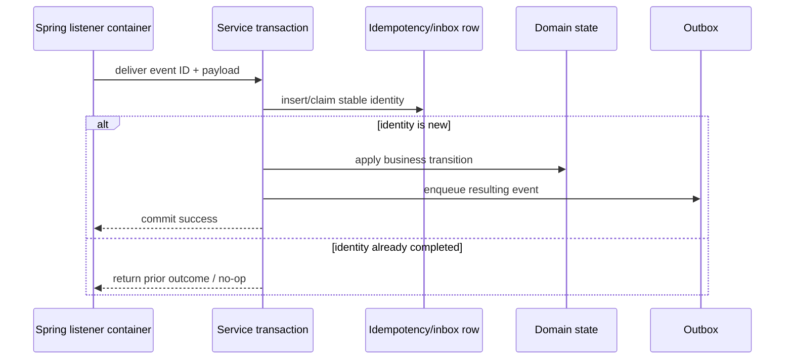

# Spring Kafka Consumer Idempotency And Replay

<DocLabels items={[
  {label: 'Advanced', tone: 'advanced'},
  {label: 'Consumer idempotency', tone: 'foundation'},
  {label: 'Audited replay', tone: 'production'},
  {label: 'Shopverse current state', tone: 'shopverse'},
]} />

Spring listener containers provide at-least-once failure handling, but they cannot
decide whether a business effect already happened. Put that decision inside the
same database transaction as the effect.



## Choose A Stable Identity

Prefer a producer-assigned immutable event ID. If the contract lacks one, a
topic-partition-offset tuple identifies one broker record for one cluster, while a
business key such as order number plus event type can protect a domain transition.
Choose based on the effect being deduplicated.

Do not use consumer ID, group ID, trace ID, or payload text as the primary business
identity:

- consumer and group identify processing topology, not an event;
- trace IDs can change across replay;
- equal payloads can be intentional separate events;
- storing/searching payload text is expensive and sensitive.

## Transaction Pattern

```java
@Transactional
public void handle(InventoryReservedEvent event) {
    if (!processedEventRepository.claim(event.eventId(), "inventory-reserved")) {
        return;
    }
    order.markInventoryReserved();
    outboxService.enqueue(PaymentRequested.from(order, event));
}
```

Back the claim with a unique constraint. A check followed by insert without a
constraint races across replicas. Record states such as `PROCESSING`, `COMPLETED`,
and `FAILED` only when recovery semantics require them; a simple completed-event
row may be enough.

<DocCallout type="production" title="Idempotency must cover the whole transaction">

Do not mark the event processed before the domain change commits. The identity,
domain effect, and resulting outbox row must commit or roll back together.

</DocCallout>

## Current Shopverse Protection

<DocCallout type="shopverse" title="Verified current implementation">

Saga services use stable domain keys such as order number, database constraints,
state transitions, and local transactions with outbox inserts. Terminal failures
are stored in each service's `failed_kafka_events` table, and replay enqueues a new
outbox row plus marks the failed record replayed in one transaction.

</DocCallout>

Current failed-event deduplication checks source topic plus payload for an unreplayed
record. That avoids obvious repeats but has no shown database unique constraint and
can race under concurrent DLT delivery. A stable event/record identity column with a
unique constraint is proposed hardening.

## Failed-Event Store

The current schema records source topic, payload, reason, retry count, failure time,
replayed state, replay count, actor, and replay time. Indexes support unreplayed and
topic-oriented operations.

Recommended additions for durable identity and safe operations:

| Field | Purpose |
|---|---|
| event ID or topic/partition/offset | unique failure identity |
| event type and schema version | choose decoder and compatibility path |
| key hash | investigate ordering without exposing raw key |
| exception class/category | aggregate terminal causes |
| first and last failure time | incident age and recurrence |
| payload encryption/reference | protect sensitive recovery content |
| resolution note/change ID | explain why replay became safe |

<DocCallout type="mistake" title="A DLT table is a security artifact">

It can contain customer data, tokens accidentally embedded in events, and internal
failure details. Encrypt or reference protected payloads, limit operator access,
audit reads/replays, and enforce retention.

</DocCallout>

## Audited Replay Through Outbox

```text
begin transaction
  load failed event
  verify authorization and replay policy
  parse the stored schema version
  enqueue a replay outbox event
  mark replay requested with actor and count
commit
outbox publisher sends later
```

This avoids a second database/Kafka dual-write. A replay request can still publish
more than once after a crash, so the destination listener remains idempotent.

<DocCallout type="shopverse" title="Current replay path">

`KafkaRecoveryService.replay` parses the stored JSON, enqueues through a
service-specific `KafkaReplayOutbox`, marks the failed row replayed, and increments
a replay metric in one Spring transaction. This is current code.

</DocCallout>

## Replay Admission

Before replay, require:

1. the underlying defect or dependency outage is resolved;
2. the stored schema can still be read;
3. duplicate business effects remain safe;
4. the target topic and service ownership are still valid;
5. replay rate is bounded below downstream capacity;
6. the operator, reason, change/incident ID, and outcome are audited.

Support dry-run validation where possible. A bulk “replay all” endpoint without
filters, rate control, and approval can recreate the original incident.

## Schema Evolution

Add identity/security columns through expand-and-contract: add nullable columns,
deploy writers, backfill identity where derivable, isolate ambiguous rows, then add
unique constraints. Keep old replay code working until all stored retained payloads
have expired, migrated, or received an explicit legacy decoder.

<DocCallout type="code" title="Proposed migration">

Adding `event_id`, `source_partition`, and `source_offset` to the current recovery
table is a proposed design. It requires event-envelope support, a collision audit,
and a mixed-version writer plan before a uniqueness constraint is safe.

</DocCallout>

## Evidence And Tests

- deliver the same record concurrently to two application instances;
- crash after domain commit but before offset commit and prove one business effect;
- deliver the same DLT record twice and prove one recovery identity;
- replay twice and prove the destination remains idempotent;
- test old stored payloads against the new decoder;
- measure failed-event age, replay rate, replay failure, and downstream saturation;
- verify authorization and audit records for view and replay operations.

## Interview Questions

<ExpandableAnswer title="Where should a consumer idempotency record be committed?">

In the same database transaction as the domain effect and any resulting outbox row.
Otherwise a crash can leave the marker and business state inconsistent.

</ExpandableAnswer>

<ExpandableAnswer title="Why is exists-then-save insufficient for failed-event deduplication?">

Two replicas can both observe no row and insert. A stable identity protected by a
database unique constraint is the concurrency authority.

</ExpandableAnswer>

<ExpandableAnswer title="Why should replay publish through an outbox?">

The replay audit update and publish request need one durable database commit. Direct
Kafka send plus row update recreates the database/broker dual-write window.

</ExpandableAnswer>

<ExpandableAnswer title="What is unsafe about deduplicating by payload text?">

Two intentional events can have equal payloads, formatting can change, comparison
is expensive, and the payload can contain sensitive data. Use immutable event or
record identity.

</ExpandableAnswer>

<ExpandableAnswer title="What must be true before an operator replays a poison event?">

The cause is resolved, its schema is readable, duplicate effects are safe, routing
is still valid, recovery rate is bounded, and the decision is authorized and
audited.

</ExpandableAnswer>

## Official References

- [Handling exceptions](https://docs.spring.io/spring-kafka/reference/4.0/kafka/annotation-error-handling.html)
- [Spring Kafka transactions and after-rollback processing](https://docs.spring.io/spring-kafka/reference/kafka/transactions.html)
- [Dead-letter publishing recoverer](https://docs.spring.io/spring-kafka/reference/4.0/kafka/annotation-error-handling.html)

## Recommended Next

Continue with [Operations And Incident Response](./SPRING-KAFKA-OPERATIONS-INCIDENT-RESPONSE.md).
