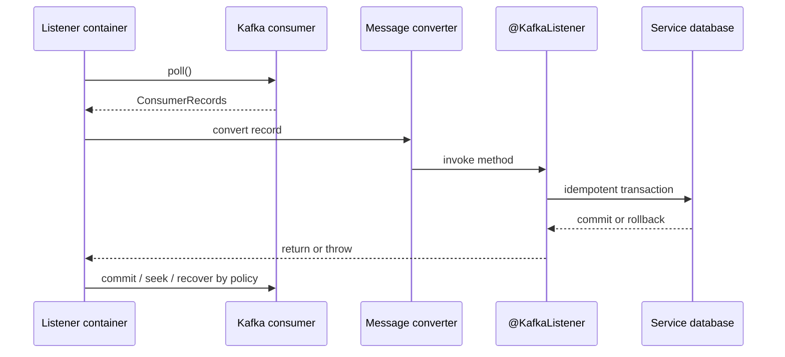

# Spring Kafka Consumers And Delivery Semantics

<DocLabels items={[
  {label: 'Advanced', tone: 'advanced'},
  {label: 'Listener containers', tone: 'foundation'},
  {label: 'Delivery boundary', tone: 'production'},
  {label: 'Shopverse current state', tone: 'shopverse'},
]} />

Generic group, offset, and delivery definitions live in
[Apache Kafka](../../integration/APACHE-KAFKA.md). Spring adds managed containers
that own polling, record conversion, listener invocation, offset handling, error
processing, lifecycle, events, and observations.



## Container Registration And Lifecycle

```java
@KafkaListener(
        id = "order-payment-completed",
        topics = "${shopverse.kafka.topics.payment-completed}",
        groupId = "${spring.application.name}"
)
public void onPaymentCompleted(String payload) {
    PaymentCompletedEvent event = eventParser.parse(
            payload, PaymentCompletedEvent.class);
    correlationContext.run(event.correlationId(),
            () -> orderService.confirm(event));
}
```

Spring registers a listener endpoint, creates a message listener container from the
selected factory, starts its consumer thread, and invokes the method after
conversion. Use a stable listener `id` when operators need to locate, pause, or
inspect a specific container through `KafkaListenerEndpointRegistry`.

<DocCallout type="shopverse" title="Current listener boundary">

Order, Inventory, and Payment saga listeners currently parse service-owned JSON
records through the shared parser, restore correlation context, and delegate to a
transactional service. Group IDs use `${spring.application.name}`, so replicas of
one service cooperate while different services retain independent progress.

</DocCallout>

## Method Signature And Conversion

Use a payload argument for simple application handling. Request
`ConsumerRecord<K,V>` when topic, partition, offset, key, timestamp, or headers are
required for idempotency and evidence. Do not let transport metadata leak through
every domain service method.

Header and payload limits, trusted type information, deserialization failure, and
unknown schema versions need explicit recovery policy. A poison record that fails
before the listener is invoked must still reach an error handler or recoverer.

## Acknowledgment Modes

Shopverse currently disables consumer auto-commit and uses record acknowledgment:

```yaml
spring:
  kafka:
    consumer:
      enable-auto-commit: false
      auto-offset-reset: earliest
      properties:
        max.poll.records: 50
    listener:
      ack-mode: record
```

| Mode | Spring container boundary | Main risk |
|---|---|---|
| `RECORD` | handle and commit each record for a record listener | more commit overhead |
| `BATCH` | handle records returned by a poll before commit | larger redelivery set |
| `MANUAL` | listener acknowledges; container applies its commit semantics | missing/incorrect acknowledgment paths |
| `MANUAL_IMMEDIATE` | attempts immediate commit when called on the consumer thread | behavior differs if called from another thread |

<DocCallout type="mistake" title="Manual acknowledgment is not database atomicity">

Acknowledging after a database call still leaves a crash window between the
database commit and offset commit. Protect the business effect with an event ID or
business key inside the same database transaction.

</DocCallout>

## Database And Kafka Transactions

A container configured with a Kafka-aware transaction manager can begin a Kafka
transaction before invoking the listener. Template sends and consumed offsets can
then commit together for a read-process-write flow within Kafka.

This does not turn a database transaction and Kafka transaction into one atomic
resource. When both are composed, commit ordering and compensation must be defined;
the transactional outbox remains the clearest boundary for durable database state
plus later Kafka publication.

<DocCallout type="code" title="Not current Shopverse configuration">

Shared Shopverse configuration does not currently define a producer transaction ID
prefix or container transaction manager. The documented runtime is record-ack,
at-least-once consumption with idempotent service handling and outbox publication.

</DocCallout>

Spring Kafka exactly-once semantics apply to the Kafka read-process-write sequence.
The read and application processing can still be attempted more than once; external
effects require their own idempotency.

## Thread, Context, And Cancellation Boundary

The listener runs on a container consumer thread. Restore tracing/correlation
context for each record and clear it afterward. Avoid `@Async` on the listener: a
returned method can let the container commit while detached work later fails, and
it breaks partition order, retry ownership, and graceful shutdown.

Long processing must remain below the consumer poll interval budget or be redesigned
with smaller poll batches, bounded handoff plus explicit ownership, or a different
work model. See [Listener Concurrency And Capacity](./SPRING-KAFKA-CONCURRENCY-CAPACITY.md).

## Failure And Security Boundary

- classify deserialization, validation, transient dependency, and permanent
  business failures separately;
- never log authentication material or full sensitive payloads;
- record topic, partition, offset, listener ID, event ID, attempt, and exception
  class using bounded-cardinality metrics;
- authorize recovery endpoints independently from ordinary consumer credentials;
- use service-specific topic ACLs in production.

## Evidence Checklist

- effective container configuration at startup;
- listener success/failure duration and delivery-attempt count;
- offset progress, lag, poll age, and rebalance events;
- database effect plus idempotency row under duplicate delivery;
- container stop/drain behavior during termination;
- Testcontainers test for success, throw, redelivery, and recovery.

## Interview Questions

<ExpandableAnswer title="What happens after an @KafkaListener method returns normally?">

The container applies its configured acknowledgment, transaction, and error-handler
semantics. With record acknowledgment and no container transaction, it can commit
that record's offset after successful listener completion.

</ExpandableAnswer>

<ExpandableAnswer title="Why can a database effect occur twice even with record acknowledgment?">

The database may commit and the process may crash before the offset commit. Kafka
redelivers the record, so the service transaction must recognize the event or
business operation as already applied.

</ExpandableAnswer>

<ExpandableAnswer title="Why is @Async usually unsafe on a Kafka listener?">

The container sees the listener return before detached work finishes. It can commit
the offset while the async task later fails, and ordering, retry, context, and
shutdown ownership become ambiguous.

</ExpandableAnswer>

<ExpandableAnswer title="What does Spring Kafka exactly-once semantics not cover?">

It does not make an external database, HTTP call, or other side effect atomic with
Kafka. Those resources still need idempotency, outbox, compensation, or another
explicit coordination design.

</ExpandableAnswer>

## Official References

- [Receiving messages](https://docs.spring.io/spring-kafka/reference/4.0/kafka/receiving-messages.html)
- [Listener container properties](https://docs.spring.io/spring-kafka/reference/4.0/kafka/container-props.html)
- [Transactions](https://docs.spring.io/spring-kafka/reference/4.0/kafka/transactions.html)
- [Exactly-once semantics](https://docs.spring.io/spring-kafka/reference/4.0/kafka/exactly-once.html)

## Recommended Next

Continue with [Listener Concurrency And Capacity](./SPRING-KAFKA-CONCURRENCY-CAPACITY.md).
