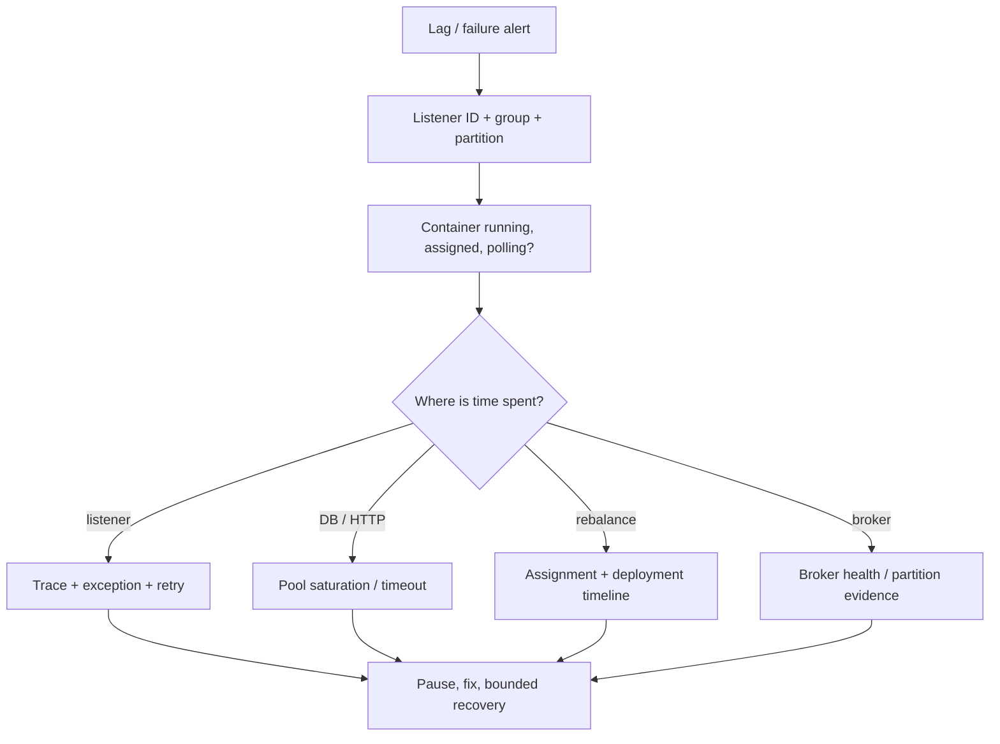

# Spring Kafka Operations And Incident Response

<DocLabels items={[
  {label: 'Advanced', tone: 'advanced'},
  {label: 'Incident runbook', tone: 'foundation'},
  {label: 'Production operations', tone: 'production'},
  {label: 'Shopverse evidence', tone: 'shopverse'},
]} />

Operate Spring Kafka by correlating broker lag with container polling, listener
duration, retries, downstream saturation, rebalances, and application deployment
events. Lag alone identifies a symptom, not its cause.



## Observability Baseline

Spring listener containers can publish Micrometer timers, native Kafka metrics,
observations, and lifecycle/application events. Keep metric tags bounded: listener
ID, result, exception class, service, and environment are suitable; event IDs,
keys, and payload values belong in traces or protected logs.

<DocCallout type="shopverse" title="Current baseline">

Shared Shopverse configuration enables observations for the Kafka template and
listeners and exposes Prometheus through Actuator. Integration tests prove broker
send metadata. Explicit listener IDs, non-responsive-container event alerts, and
per-retry-topic dashboards are proposed improvements.

</DocCallout>

Track together:

- group lag and oldest record age by partition;
- records consumed, listener success/failure duration, and delivery attempts;
- time since poll, container running/paused state, and assigned partitions;
- rebalance count/duration and deployment timestamps;
- retry/DLT throughput and oldest failed-event age;
- datasource/HTTP pool pending time, timeouts, and downstream error rate;
- outbox pending age and publish failures.

## Container Events And Control

Spring can publish idle, no-longer-idle, consumer start/stop, authentication retry,
and non-responsive consumer events. A `NonResponsiveConsumerEvent` means the poll
loop exceeded the configured monitoring threshold; investigate blocking listener
work, broker/client behavior, thread starvation, and pauses.

```java
@EventListener
void onNonResponsive(NonResponsiveConsumerEvent event) {
    alert(event.getListenerId(), event.getTimeSinceLastPoll());
}
```

Locate containers by stable listener ID:

```java
MessageListenerContainer container =
        registry.getListenerContainer("inventory-order-created");
container.pause();
// fix or protect dependency, then resume under operator control
container.resume();
```

<DocCallout type="production" title="Pause is control, not recovery">

Pausing keeps polling sufficiently to remain in the group while withholding
delivery according to container behavior. It does not repair poison data, reduce
existing lag, or make in-flight effects atomic. Record who paused it, why, and the
resume condition.

</DocCallout>

## Incident: Lag Rising

1. identify affected listener ID, group, topic, and partitions;
2. compare arrival rate with successful processing rate;
3. check whether the container is running, assigned, paused, and polling;
4. correlate listener time with database/HTTP pools and lock waits;
5. separate primary, retry, and DLT traffic;
6. inspect key skew and per-partition lag;
7. reduce load or pause only when it protects downstream recovery;
8. fix the bottleneck, resume gradually, and estimate catch-up time;
9. verify no duplicate business effects during recovery.

Do not increase concurrency until partitions and downstream pools have measured
headroom.

## Incident: Records Appear Lost

Check the Spring boundaries before claiming loss:

- was the intended listener container created and started?
- did placeholders resolve to the expected topic and group?
- is the group using the expected offset and reset policy?
- did deserialization fail before listener invocation?
- did a retry/DLT handler reroute the record?
- did the listener commit successfully but hide a business failure?
- did authorization prevent subscription or reads?

Use [Apache Kafka](../../integration/APACHE-KAFKA.md) for broker-level offset,
retention, replication, and command investigation.

## Incident: Rebalance Storm

Correlate member start/stop, health probes, deployments, poll interval breaches,
authentication errors, and network instability. Repeatedly restarting pods can
amplify the storm. Stabilize membership, bound listener work, and verify readiness
and liveness semantics before scaling.

Under the Kafka 4.0 consumer rebalance protocol, assignment is server-driven and
incremental. Do not enable it during an incident without prior broker/client and
rollback testing.

## Rolling Deployment And Shutdown

1. deploy tolerant readers before new event writers;
2. become unready before stopping listeners;
3. stop admission and pause/stop owned containers;
4. let bounded in-flight listener work complete or roll back;
5. close consumers before the platform grace deadline;
6. watch assignments, lag, duplicates, and retry rate as each replica changes;
7. keep old schema support throughout retained main/retry/DLT records.

An abrupt kill can redeliver committed business work whose offset did not commit.
Idempotency is part of graceful shutdown correctness.

## Security Operations

Production controls should include TLS, authenticated clients, service-specific
ACLs, secret-backed configuration, certificate/credential overlap during rotation,
and network policy. Separate ordinary consumer credentials from recovery operator
authorization.

<DocCallout type="mistake" title="Do not put payloads or credentials in incident evidence">

Log topic, partition, offset, listener ID, event type, schema version, attempt,
correlation ID, and a safe key/event hash. Store sensitive payloads behind audited
access and retention controls.

</DocCallout>

The repository's shared local configuration does not contain production SASL/TLS
settings. Treat the security controls above as deployment requirements, not current
repository implementation.

## Recovery Completion Evidence

- processing rate exceeds arrival rate until lag returns to target;
- listener error/retry/DLT rate returns to baseline;
- no non-responsive events or poll-budget breaches remain;
- downstream pools and brokers have stable headroom;
- duplicate-effect reconciliation is clean;
- paused containers are resumed and documented;
- the incident creates a regression, load, or rollout test.

## Interview Questions

<ExpandableAnswer title="Why is consumer lag insufficient to diagnose a Spring listener incident?">

Lag does not show whether time is spent in polling, conversion, listener code,
database/HTTP waits, retries, rebalance, or broker access. Correlate container and
downstream evidence.

</ExpandableAnswer>

<ExpandableAnswer title="What does a NonResponsiveConsumerEvent tell an operator?">

The container monitor observed that the poll loop exceeded its configured
threshold. It is a trigger to inspect blocking work, thread starvation, pauses, and
broker/client behavior, not proof of one root cause.

</ExpandableAnswer>

<ExpandableAnswer title="When should an operator pause a listener container?">

When temporarily stopping delivery protects a failing dependency or permits a
controlled repair, with a named owner, reason, impact assessment, and explicit
resume condition.

</ExpandableAnswer>

<ExpandableAnswer title="Why can restarting every consumer make a rebalance incident worse?">

Each membership change triggers more assignment work and pauses. Restart storms can
prevent the group from stabilizing long enough to process records.

</ExpandableAnswer>

<ExpandableAnswer title="What proves a rolling listener deployment is safe?">

Mixed versions deserialize retained events, duplicate delivery is idempotent,
containers drain within the grace period, assignments stabilize, and lag/retry/error
evidence stays within the rollback threshold.

</ExpandableAnswer>

## Official References

- [Monitoring](https://docs.spring.io/spring-kafka/reference/4.0/kafka/micrometer.html)
- [Application events](https://docs.spring.io/spring-kafka/reference/4.0/kafka/events.html)
- [Pausing and resuming](https://docs.spring.io/spring-kafka/reference/4.0/kafka/pause-resume.html)
- [Listener container properties](https://docs.spring.io/spring-kafka/reference/4.0/kafka/container-props.html)
- [Rebalancing listeners](https://docs.spring.io/spring-kafka/reference/4.0/kafka/receiving-messages/rebalance-listeners.html)

## Recommended Next

Return to the [Spring For Apache Kafka](../SPRING-KAFKA.md) route or apply the
Shopverse [Kafka Recovery Starter](../../platform/KAFKA-RECOVERY-STARTER.md).
