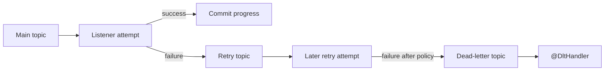

---
title: Spring Kafka Retry DLT And Recovery
---

# Spring Kafka Retry DLT And Recovery

Retry topics, DLT handlers, poison-event recovery guarantees, and replaying failed events.

Back to [Spring Kafka](../SPRING-KAFKA.md).

## Non-Blocking Retry With `@RetryableTopic`

Shopverse uses:

```java
@RetryableTopic(attempts = "3")
@KafkaListener(
        topics = "${shopverse.kafka.topics.payment-failed}",
        groupId = "${spring.application.name}"
)
public void onPaymentFailed(String payload) {
    PaymentFailedEvent event = readEvent(payload, PaymentFailedEvent.class);
    CorrelationContext.run(
            event.correlationId(),
            () -> handlePaymentFailed(event)
    );
}
```

`@RetryableTopic` creates non-blocking retry infrastructure. When the listener
throws, Spring publishes the failed record to a retry topic. A retry consumer
later invokes the listener again. After attempts are exhausted, Spring
publishes the record to a dead-letter topic.



`attempts = "3"` means three total delivery attempts in this policy, including
the original attempt. Backoff should be explicit in production so transient
dependencies have time to recover:

```java
@RetryableTopic(
        attempts = "3",
        backoff = @Backoff(delay = 1000, multiplier = 2.0, maxDelay = 10000)
)
```

Classify failures:

- retry transient database, broker, or dependency failures;
- do not repeatedly retry malformed JSON or permanently invalid business data;
- use bounded attempts and delay;
- monitor retry volume and retry-topic lag;
- keep retry duration compatible with business deadlines.

Non-blocking retry topics change cross-record ordering because later records on
the main topic can progress while an earlier record waits on a retry topic.
Do not use this pattern where strict partition ordering across failures is a
hard requirement.

Spring Kafka non-blocking retries are not compatible with batch listeners or
container transactions. Choose the retry and transaction model deliberately.


## `@DltHandler`

`@DltHandler` marks the method that Spring Retry Topic infrastructure invokes
after the configured attempts are exhausted:

```java
@DltHandler
public void onDeadLetter(ConsumerRecord<String, String> record) {
    String sourceTopic = record.topic().replaceFirst("-dlt$", "");

    failedKafkaEventService.record(
            sourceTopic,
            record.value(),
            "Inventory listener failed after retry policy",
            3
    );

    log.error(
            "Inventory event moved to DLT sourceTopic={} partition={} offset={}",
            sourceTopic,
            record.partition(),
            record.offset()
    );
}
```

The handler:

1. receives the record from the DLT;
2. determines the logical source topic;
3. persists an unresolved recovery record;
4. increments a DLT metric;
5. logs the terminal transport failure;
6. leaves replay as an explicit administrative action.

The DLT is a Kafka topic. Shopverse additionally persists a database record so
operators can query failures, retain replay audit fields, and replay through
the transactional outbox.

Prefer metadata from retry/DLT headers or a durable event envelope over
deriving the original topic by removing a suffix. Topic naming strategies can
change, and one listener can subscribe to multiple topics.


## What "One Poison Event Produces One Recovery Record" Means

A poison event is a record that fails every attempt, commonly because its
payload is malformed or its state violates a permanent rule.

This sequence should represent one unresolved incident:

```text
original attempt fails
retry attempt fails
final attempt fails
DLT handler runs
one failed_kafka_events row is created
```

Retry callbacks are delivery attempts, not separate incidents. Persisting a
row on every attempt would create three operator records for one event and
could trigger duplicate replay.

Shopverse currently checks:

```java
if (repository.existsBySourceTopicAndPayloadAndReplayedFalse(topic, payload)) {
    return;
}
repository.save(new FailedKafkaEvent(topic, payload, reason, retries));
```

This suppresses ordinary repeated DLT callbacks for the same unresolved topic
and payload. It is not a strict exactly-once guarantee: concurrent handlers
can both pass the existence check because the database has no matching unique
constraint, and identical payload text is not an ideal event identity.

A production-grade design should include an immutable `eventId` in every event
envelope and enforce:

```text
unique(service, consumer_group, event_id, recovery_state)
```

Alternatively, use a processed-event/inbox table with a unique event ID and
insert it in the same local transaction as the business effect. Database
uniqueness is the final race-safe guarantee.

Therefore, the precise current status is:

- **Implemented:** application-level suppression of common duplicate unresolved
  recovery records.
- **Not fully guaranteed under concurrency:** exactly one row without a unique
  event identity and database constraint.


## Replaying Failed Events

Shopverse administrator APIs load the persisted failure, enqueue its payload
through the local outbox, and record:

- replay count;
- replayed flag;
- replaying user;
- replay timestamp.

Replay only after fixing the permanent cause. Replaying unchanged poison data
creates another retry/DLT cycle.

Replay must use the original event ID and consumer idempotency rules when those
are introduced. An operator action should never bypass normal validation,
authorization, outbox, logging, or metrics.


