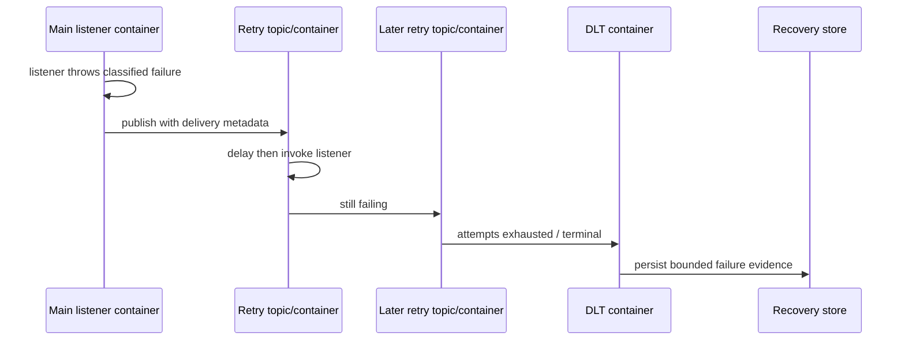

# Spring Kafka Retry DLT And Recovery

<DocLabels items={[
  {label: 'Advanced', tone: 'advanced'},
  {label: 'Retry topics', tone: 'foundation'},
  {label: 'Terminal recovery', tone: 'production'},
  {label: 'Shopverse current state', tone: 'shopverse'},
]} />

Non-blocking retry moves a failed record to a retry topic and lets the primary
consumer continue. Spring creates the retry/DLT topic topology and listener
containers; the service still owns exception classification, idempotency, and
terminal recovery.



## Annotation Mechanics

```java
@RetryableTopic(
        attempts = "3",
        backoff = @Backoff(delay = 1_000, multiplier = 2.0),
        exclude = {ValidationException.class, AuthorizationException.class}
)
@KafkaListener(
        id = "inventory-order-created",
        topics = "${shopverse.kafka.topics.order-created}",
        groupId = "${spring.application.name}"
)
public void onOrderCreated(String payload) {
    // parse, restore context, execute idempotent service transaction
}
```

Spring bootstraps retry topic names, destinations, and consumer containers. Retry
containers can have different concurrency from the primary container. Delivery
metadata is carried in headers and can be included in bounded logs/traces.

<DocCallout type="production" title="Compatibility constraints matter">

Spring Kafka 4.x non-blocking retries do not combine with container transactions
and are not supported for batch listeners. Choose transaction, batch, and retry
semantics together rather than stacking annotations independently.

</DocCallout>

## Failure Classification

| Failure | Typical policy |
|---|---|
| network timeout or temporary dependency outage | bounded retry with backoff and jitter |
| database deadlock victim | retry complete idempotent transaction |
| malformed JSON or unsupported schema | terminal recovery/quarantine |
| validation or impossible business state | no technical retry; record decision |
| authentication or authorization failure | alert and fail securely; do not hide with retry |
| programming defect | terminal recovery plus incident, not infinite attempts |

<DocCallout type="mistake" title="Retrying every RuntimeException is outage amplification">

Permanent failures consume retry partitions and downstream capacity while delaying
the real signal. Maintain explicit include/exclude classification and test it.

</DocCallout>

## Current Shopverse Topology

<DocCallout type="shopverse" title="Verified current behavior">

Order, Inventory, and Payment saga listeners use `@RetryableTopic(attempts = "3")`.
Order and Inventory DLT handlers receive a `ConsumerRecord`; Payment receives the
payload. All three persist terminal failures through the shared recovery service.

</DocCallout>

The current annotation uses framework defaults for backoff and exception
classification. Adding explicit classified exceptions, delay policy, topic
retention, and retry-container concurrency is proposed hardening and must be load
tested.

## DLT Handler Boundary

```java
@DltHandler
public void onDeadLetter(ConsumerRecord<String, String> record) {
    failedKafkaEventService.record(
            sourceTopic(record),
            record.value(),
            "Listener failed after retry policy",
            deliveryAttempt(record)
    );
}
```

The handler must be idempotent because it can also be retried or redelivered. Store
the original topic, partition, offset, key/event ID, schema version, attempts,
exception classification, first/last failure time, and payload reference or safely
protected payload.

<DocCallout type="mistake" title="Current raw-payload logging needs hardening">

Current Shopverse DLT handlers log full payload text at error level. That is a
verified current risk. Proposed remediation is to log metadata and an event/key
hash, protect stored payloads with access controls and retention, and reveal content
only through audited recovery tooling.

</DocCallout>

## Topic And Schema Rollout

Retry and DLT topics need explicit partition count, replication, retention, ACLs,
and observability. Their partitioning must preserve the ordering guarantee required
by the business path. An old retry record can outlive the deployment that produced
it, so new listeners must deserialize old schemas throughout the retention window.

Safe rollout:

1. make the new listener read old and new event/retry headers;
2. provision retry and DLT topics plus ACLs before enabling the annotation;
3. deploy with bounded retry concurrency;
4. observe retry age, throughput, and terminal rate;
5. keep the old handler contract until retained retries expire or migrate;
6. remove obsolete topics only after replay and rollback no longer need them.

## Recovery Guarantee

“One poison event produces one recovery record” is an application invariant, not a
Kafka guarantee. Enforce it with a durable unique identity such as source topic,
partition, offset or a stable event ID, and test duplicate DLT delivery. Payload
equality alone is expensive, sensitive, and can collapse intentional equal events.

Current Shopverse recovery stores guard unreplayed duplicates with source topic and
payload checks. A proposed stronger schema would persist immutable event/record
identity under a unique database constraint.

## Operational Evidence

- retry and DLT throughput, oldest age, and backlog;
- delivery attempt and exception classification;
- primary versus retry-container concurrency;
- failed recovery-store writes;
- DLT handler duration and database pool usage;
- terminal rate by event type and deployment version;
- payload access and replay audit events.

## Interview Questions

<ExpandableAnswer title="How does @RetryableTopic keep the main listener non-blocking?">

The failed record is published to a retry topic. A separate container consumes it
after the configured delay, so the primary container can continue polling other
records.

</ExpandableAnswer>

<ExpandableAnswer title="Why can non-blocking retry change per-key processing order?">

Later records on the main topic can proceed while an earlier failed record waits on
a retry topic. A workflow that requires strict per-key order needs another recovery
design or explicit state-machine protection.

</ExpandableAnswer>

<ExpandableAnswer title="Why can non-blocking retry not be combined with container transactions?">

Its failure path publishes to retry infrastructure using different container and
commit semantics. Spring documents the combination as unsupported; select one
coherent model and test its effective behavior.

</ExpandableAnswer>

<ExpandableAnswer title="What makes a DLT handler safe to run more than once?">

A stable record/event identity under a unique constraint and an idempotent recovery
transaction. Logging or saving the payload without identity does not prove
deduplication.

</ExpandableAnswer>

<ExpandableAnswer title="Why must schema compatibility cover the retry retention window?">

A record produced by an old version can remain delayed or retained until after new
code deploys. The new retry listener must still read it or route it deliberately.

</ExpandableAnswer>

## Official References

- [Non-blocking retries](https://docs.spring.io/spring-kafka/reference/4.0/retrytopic.html)
- [Retry-topic configuration](https://docs.spring.io/spring-kafka/reference/4.0/retrytopic/retry-config.html)
- [DLT strategies](https://docs.spring.io/spring-kafka/reference/4.0/retrytopic/dlt-strategies.html)
- [Exception classification](https://docs.spring.io/spring-kafka/reference/4.0/retrytopic/features.html)

## Recommended Next

Continue with [Consumer Idempotency And Replay](./SPRING-KAFKA-CONSUMER-IDEMPOTENCY-REPLAY.md).
