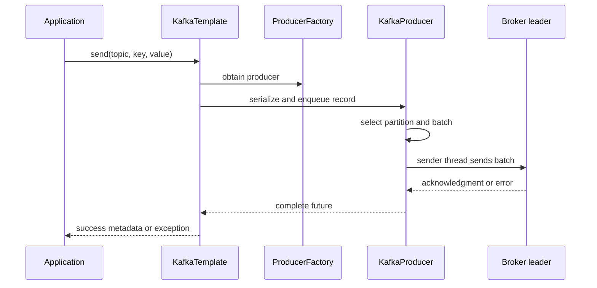
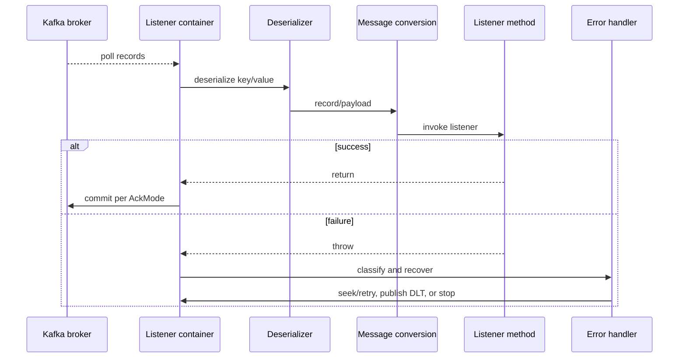

# Spring Kafka Runtime Internals And Failure Paths

Spring Kafka wraps Kafka clients; it does not replace their durability, partition,
offset, group, or threading rules.

## Startup And Auto-Configuration

Spring Boot reads `spring.kafka.*` and creates or contributes:

```text
KafkaProperties
  -> producer configuration -> ProducerFactory -> KafkaTemplate
  -> consumer configuration -> ConsumerFactory
  -> listener container factory -> listener containers
  -> KafkaAdmin/NewTopic where configured
```

`@KafkaListener` methods are discovered and registered as endpoints. At context
startup, the registrar asks the configured container factory to create listener
containers. A concurrent container creates multiple child containers, each with
its own Kafka consumer and poll thread.

## Producer Send Path



`KafkaTemplate.send()` normally returns before the broker result. Observe its
future:

```java
kafkaTemplate.send("orders.events", event.orderId(), event)
        .whenComplete((result, failure) -> {
            if (failure != null) {
                publishMetrics.recordFailure(failure);
                return;
            }
            publishMetrics.recordSuccess(result.getRecordMetadata());
        });
```

### Producer failure boundaries

| Failure | Where it appears | Response |
|---|---|---|
| serializer throws | caller/send path | reject/fix data; do not retry unchanged payload |
| buffer or metadata wait exceeds limit | send/future | contain load, investigate brokers/network |
| authorization/authentication | future/client logs | fail closed, rotate/fix credentials |
| oversized record | future | change payload/limits coherently; prefer object-store reference |
| delivery timeout/retries exhausted | future | outcome may require reconciliation; outbox retries safely |
| app crashes after DB commit before send | no Kafka call | transactional outbox |
| broker ack succeeds but outbox mark fails | relay retries | duplicate-safe consumer |

`acks=all` and producer idempotence improve Kafka-log durability and retry safety.
They do not atomically join a database transaction or make consumer effects
idempotent.

## Consumer Runtime Path



The listener container owns the consumer. It polls, maintains group membership,
invokes the listener, applies acknowledgment semantics, seeks after failures,
publishes container events, and closes the consumer. The listener must not share
or call that consumer from arbitrary threads.

## Consumer Failure Before Listener Invocation

Deserialization or message-conversion failures can occur before business code.
Use `ErrorHandlingDeserializer` or the version-appropriate conversion recovery so
the framework can expose the raw record and exception to recovery. Otherwise a
poison record can repeatedly fail at the same offset without reaching the method.

Treat validation separately: syntactically valid data can still violate the event
contract or business rules.

## Consumer Failure During Listener Invocation

When the listener throws, the configured common error handler decides whether to:

- retry in place with backoff;
- seek the partition and redeliver;
- recover with `DeadLetterPublishingRecoverer`;
- stop the container;
- roll back a transactional container and delegate to `AfterRollbackProcessor`.

Retry only transient failures. Infinite blocking retry stalls the partition and
can cause cascading failure. A recovery is complete only after the DLT/recovery
publication succeeds according to policy.

## Offset Boundary

The container commits according to its `AckMode`, but the same fundamental rule
applies:

```text
durable idempotent business effect first
safe offset progress second
```

If the effect commits and the offset commit fails, the record repeats. If the
offset advances before the effect, the effect can be missed. See
[Kafka Consumer Offset Commits](../../integration/kafka/KAFKA-CONSUMER-OFFSET-COMMITS.md).

## Batch Failure: 100 Successes And One Failure

For a batch listener, Spring cannot infer whether the first 100 effects are
atomic, idempotent, or merely scheduled. Choose deliberately:

- throw with a failing index using `BatchListenerFailedException` where the
  configured handler supports record-aware batch recovery;
- retry the entire batch and make all effects idempotent;
- use partial batch acknowledgment only with compatible ack mode/API and a
  strictly successful prefix;
- wrap all effects in one database transaction and roll the batch back;
- publish the failed record to DLT after bounded recovery, accepting ordering
  consequences.

Never catch the exception, log it, and return normally: the container can treat
the batch as successful and advance offsets.

## Blocking Retry Versus Retry Topics

| Blocking recovery | `@RetryableTopic` |
|---|---|
| current partition path waits | failed record is republished to retry destination |
| easier ordering | later same-key records may overtake failure |
| consumes poll/recovery time | adds topics, consumers, storage, and operations |
| works with batch-specific handlers | non-blocking retry does not support batch listeners |

Both paths require a terminal DLT policy, observability, idempotency, and controlled
replay.

## Transactions

A transactional listener can atomically commit consumed offsets with produced
Kafka records. Consumers of the output use `read_committed` when aborted records
must be hidden. This covers Kafka-to-Kafka work; it does not atomically roll back
a credit-card charge or ordinary database commit. Use outbox/inbox and business
idempotency for those boundaries.

Unique transactional IDs per live instance prevent producer fencing between pods.

## Shutdown And Rebalance

On shutdown, remove readiness, stop new work, wake/pause the poll loop through the
container lifecycle, allow bounded in-flight completion, commit only safe
progress, and close. Kubernetes grace periods must exceed the measured drain
time. A forced termination should cause safe duplicate replay, not loss.

During rebalance, a partition can move to another child/container. Any external
worker task from its former owner must be fenced or idempotent.

## Failure-Proof Configuration Questions

Before approving a listener, answer:

1. What exact event identity makes processing idempotent?
2. Which exceptions are transient, fatal, or business outcomes?
3. How many attempts occur and where do they wait?
4. What is committed for record and batch success/failure?
5. What happens when DLT publication itself fails?
6. Can retry violate per-key ordering?
7. What limits protect the database/API during backlog recovery?
8. Which metrics prove send acknowledgment, processing, commits, lag, and recovery?

## Official References

- [Spring Kafka sending messages](https://docs.spring.io/spring-kafka/reference/kafka/sending-messages.html)
- [Spring Kafka listener containers](https://docs.spring.io/spring-kafka/reference/kafka/receiving-messages/message-listener-container.html)
- [Spring Kafka exception handling](https://docs.spring.io/spring-kafka/reference/kafka/annotation-error-handling.html)
- [Spring Kafka transactions](https://docs.spring.io/spring-kafka/reference/kafka/transactions.html)

## Recommended Next

Use [Retry, DLT, And Recovery](./SPRING-KAFKA-RETRY-DLT-RECOVERY.md), then the
[Kafka Production Failure Playbook](../../integration/kafka/KAFKA-PRODUCTION-FAILURE-PLAYBOOK.md).

