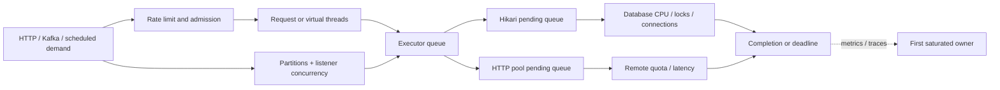

# Spring Resource Pools, Concurrency And Capacity

<DocLabels items={[
  {label: 'Advanced', tone: 'advanced'},
  {label: 'Capacity engineering', tone: 'production'},
  {label: 'Resource pools', tone: 'intermediate'},
  {label: 'Shopverse workload', tone: 'shopverse'},
]} />

Every queue is a promise to complete work later. Capacity engineering aligns
admission, concurrency, pools, partitions, deadlines, and replicas so that queues
remain bounded and overload fails in a controlled place.

<DocCallout type="production" title="Increase a pool only when its owner is the first bottleneck">
A larger upstream pool can amplify database CPU, lock waits, remote throttling,
allocation, and tail latency. Prove where work waits, then change one limit and
repeat the same load plus failure test.
</DocCallout>

## Cross-Resource Queue Map



Avoid simultaneous hidden queues. If HTTP requests, an executor, Hikari, and a
remote client can each queue independently, the oldest work may expire long before
it reaches the final resource.

## Workload And Little's Law

For a stable interval:

```text
average concurrency ~= throughput * average time in the measured boundary
```

At 400 requests/second and 250 ms end-to-end latency, average active requests are
about 100. If each request holds a database connection for only 40 ms:

```text
average active DB connections ~= 400 * 0.040 = 16
```

This is a starting estimate, not a pool setting. Use latency distributions, burst
shape, transaction mix, lock waits, failure mode, replica count, and measured
headroom. Averages hide p99 occupancy and synchronized retries.

Define the workload by operation, not one service-wide number:

| Operation | Rate/burst | DB hold | Remote wait | Idempotent | Deadline |
|---|---:|---:|---:|---|---:|
| catalog read | measured | measured | inventory/pricing | yes | bounded |
| place order | measured | measured | workflow begins after commit | keyed | bounded |
| payment reconcile | scheduled/batch | measured | provider | keyed | job window |

## Admission And Thread Model

Platform-thread pools bound concurrency partly through their worker count and queue.
Virtual threads make blocking tasks cheaper to represent but can admit far more work
to the same Hikari or HTTP pool. Add a semaphore, bulkhead, rate limit, or operation-
specific admission policy at the scarce boundary.

For WebFlux, event-loop workers should not block. Demand, `flatMap` concurrency,
prefetch, and connection pools define reactive in-flight work. Use the
[Reactive guide](../SPRING-REACTIVE.md) for that execution model.

Executor metrics need active count, pool size, queue size and oldest age, submission
rate, rejection, cancellation, and execution duration. An empty executor queue does
not prove health when work is waiting in Hikari or an HTTP pool.

## Hikari Database Connection Budget

```yaml
spring:
  datasource:
    hikari:
      maximum-pool-size: 20
      minimum-idle: 5
      connection-timeout: 2s
      validation-timeout: 1s
      idle-timeout: 10m
      max-lifetime: 29m
      keepalive-time: 5m
```

These are illustrative, not universal defaults. Confirm property units and
constraints against the Hikari version managed by the deployed Spring Boot BOM.

Pool size across replicas is constrained by the database:

```text
per-replica maximum
  <= floor((database connection limit
            - migration/admin/monitoring/recovery reserve
            - budgets for other services)
           / maximum simultaneous replicas)
```

Include rolling-deployment surge replicas. A configured maximum of 20 on eight
replicas is a potential 160 connections even if normal traffic uses fewer.

Connection hold time grows with long transactions, N+1 queries, lock waits, remote
calls inside a transaction, and `REQUIRES_NEW`. Fix those owners before increasing
the pool.

| Signal | Interpretation to test |
|---|---|
| active near max and pending rises | pool or database path is saturated |
| acquisition timeouts rise | callers exceed the wait budget |
| low active with high API latency | bottleneck is elsewhere |
| DB CPU/locks rise after pool increase | larger pool amplified contention |
| many idle connections across replicas | reserved capacity is wasteful |

## HTTP Client Pools And Deadlines

Feign, `RestClient`, HTTP Service Clients, `WebClient`, and Reactor Netty may own
different transports and pools. Identify the concrete client before tuning:

- pool maximum total and per target;
- pending-acquire or lease timeout;
- DNS, TCP connect, TLS handshake, write, first-byte, and read time;
- keep-alive, maximum lifetime, and idle eviction;
- response/body and streaming buffer limits;
- OAuth token acquisition;
- retry and circuit-breaker attempt budget.

The service operation owns one end-to-end deadline. Independent retries at client,
LoadBalancer, service, mesh, and gateway layers multiply work. Retry only safe or
idempotent calls and reserve capacity for recovery traffic.

## Kafka, Batch, And Scheduled Work

Kafka consumer concurrency cannot usefully exceed assigned partitions for one
consumer group. Increasing listeners also increases database and remote concurrency.
Track lag, oldest record age, poll/processing time, rebalance, retry topics, DLT, and
downstream acquisition.

Batch partitioning and chunk concurrency consume the same shared resources as HTTP.
Reserve capacity or schedule deliberate windows so a catalog import cannot starve
checkout. The [Batch guide](../SPRING-BATCH.md) owns restart and external-effect
semantics.

Scheduled and async execution require explicit executor and replica ownership. Use
the [Task Execution And Scheduling guide](../SPRING-ASYNC-PRODUCTION-ARCHITECT.md)
for queues, context cleanup, leases, fencing, and task shutdown.

## Shopverse Checkout Capacity Worksheet

For each checkout path, measure:

1. incoming request rate and burst;
2. time before a database connection is acquired;
3. transaction connection-hold time and lock/query breakdown;
4. inventory and payment HTTP pool acquisition plus network phases;
5. outbox write and Kafka publish lag;
6. executor, virtual-thread, or reactive in-flight count;
7. per-replica and rolling-surge totals;
8. deadline, timeout phase, retry count, and final business outcome.

Then inject a slow inventory dependency. A safe system bounds inventory admission,
protects database capacity, stops retry multiplication, preserves order idempotency,
and recovers the backlog without exceeding the SLO after the dependency returns.

## Metrics And Queries

Confirm actual names in `/actuator/prometheus`; binder names and normalization vary.
Useful relationships include:

```promql
max by (application, pool) (hikaricp_connections_pending)
```

```promql
max by (application, pool) (hikaricp_connections_active)
/
clamp_min(max by (application, pool) (hikaricp_connections_max), 1)
```

```promql
histogram_quantile(
  0.95,
  sum by (le, application) (rate(http_server_requests_seconds_bucket[5m]))
)
```

Correlate metrics with traces showing queue/pool acquisition and database/remote
spans. Low-cardinality operation and dependency names are safe; product, customer,
URL, exception-message, and job-parameter labels are not.

## Load And Failure Drills

- ramp one operation until its first queue saturates;
- hold throughput constant while increasing dependency latency;
- exhaust Hikari and HTTP pools separately and verify timeout classification;
- scale replicas through a rolling surge and verify total DB connections;
- pause Kafka consumption and measure recovery without starving HTTP;
- run catalog batch work beside checkout and validate reserved capacity;
- enable virtual threads and prove the same downstream admission limits;
- apply one pool change, repeat the identical test, and exercise rollback.

Deployment and shutdown verification belongs in the
[Production Lifecycle Runbook](../internals-production/PRODUCTION-LIFECYCLE.md);
do not copy its drain sequence into every pool configuration.

## Interview Checks

<ExpandableAnswer title="Why does HTTP concurrency not equal the required database pool size?">

A request holds a connection for only part of its lifetime. Estimate database
concurrency from throughput times connection-hold time, then account for bursts,
p99, locks, transaction mix, replicas, and headroom. Measure before configuring.

</ExpandableAnswer>

<ExpandableAnswer title="Why can increasing Hikari maximum reduce throughput?">

More concurrent queries can saturate database CPU, storage, locks, or memory and
increase queueing inside the database. If the DB is the first bottleneck, a larger
application pool amplifies contention instead of adding capacity.

</ExpandableAnswer>

<ExpandableAnswer title="Why do virtual threads require admission control?">

They make blocked tasks cheap but do not enlarge connections, remote quotas, locks,
or CPU. Many virtual threads can wait on one small pool, increasing pending time and
deadline failures. Bound concurrency at the scarce resource.

</ExpandableAnswer>

<ExpandableAnswer title="What replica count must a database connection budget use?">

Use the maximum simultaneous replicas, including autoscaling and rolling-deployment
surge, and subtract reserves plus other services from the database limit. Normal
steady-state replica count understates the potential connection total.

</ExpandableAnswer>

<ExpandableAnswer title="Why can several individually small retry policies overload a dependency?">

Retries multiply across client, application, LoadBalancer, mesh, gateway, and broker
layers. Each layer sees only its own attempts. Assign one policy owner and one total
deadline, then measure attempts and downstream concurrency together.

</ExpandableAnswer>

<ExpandableAnswer title="How do you identify the first saturated queue?">

Instrument admission, executor queue age, Hikari/HTTP pending acquisition, Kafka
lag, database locks/CPU, and remote latency, then correlate them in traces. The first
sustained wait increase under controlled load is the candidate owner; validate by a
single reversible limit change.

</ExpandableAnswer>

## Official References

- [Spring Boot task execution and scheduling](https://docs.spring.io/spring-boot/reference/features/task-execution-and-scheduling.html)
- [Spring Boot metrics](https://docs.spring.io/spring-boot/reference/actuator/metrics.html)
- [Spring Boot Prometheus endpoint](https://docs.spring.io/spring-boot/api/rest/actuator/prometheus.html)
- [HikariCP configuration](https://github.com/brettwooldridge/HikariCP#configuration-knobs-baby)
- [Spring Framework REST clients](https://docs.spring.io/spring-framework/reference/integration/rest-clients.html)
- [Spring for Apache Kafka listener concurrency](https://docs.spring.io/spring-kafka/reference/kafka/receiving-messages/listener-annotation.html)

## Recommended Next

Continue with the [Production Lifecycle Runbook](../internals-production/PRODUCTION-LIFECYCLE.md)
to verify admission, drain, forced termination, and recovery under the selected
capacity limits.
