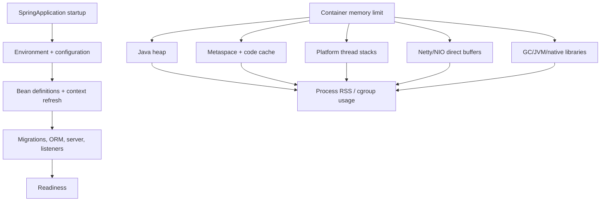

# Spring Boot Startup, JVM And Container Memory

<DocLabels items={[
  {label: 'Advanced', tone: 'advanced'},
  {label: 'Startup evidence', tone: 'intermediate'},
  {label: 'JVM and native memory', tone: 'production'},
  {label: 'Container operations', tone: 'production'},
]} />

Startup and memory are related but distinct budgets. Startup consumes CPU, class
loading, allocation, I/O, and dependency time; steady-state memory includes heap,
JVM native structures, threads, direct buffers, libraries, and diagnostics. Tune
each from observed ownership.

<DocCallout type="production" title="The container kills a process, not a Java heap">
An OOM kill can occur while heap metrics look healthy because the container limit
includes native memory and diagnostics. Always reconcile process/container RSS with
heap, metaspace, code cache, thread stacks, direct buffers, and JVM native evidence.
</DocCallout>

## Startup And Memory Ownership



## Measure Startup Before Deferring It

Spring Boot can record startup steps:

```java
public static void main(String[] args) {
    SpringApplication application =
            new SpringApplication(OrderServiceApplication.class);
    application.setApplicationStartup(new BufferingApplicationStartup(2048));
    application.run(args);
}
```

When enabled, exposed, and secured, `/actuator/startup` identifies Spring startup
steps. Combine it with JFR for class loading, allocation, CPU, locks, file I/O, and
GC. Record timestamps for context refresh, migrations, server bind, listeners,
runners, and readiness.

Common owned costs:

- classpath scanning, unused starters, and broad component scanning;
- remote configuration, discovery, JWKS, database, or broker waits;
- Liquibase migrations and Hibernate metadata;
- eager caches and large object graphs;
- remote calls in constructors or `@PostConstruct`;
- repeated startup retry without one deadline;
- class loading and verification from the selected packaging layout.

Global lazy initialization can improve the startup number by moving creation
failure and latency into the first request. Remove unnecessary work first; use
selective laziness only when deferred ownership is intentional, readiness remains
truthful, and the first-use path is tested.

CDS, AOT processing, native images, and extracted/layered packaging can change
startup and memory trade-offs. Compare build time, binary size, warmup, throughput,
diagnostics, reflection/resource compatibility, and rollback—not startup alone.

## Container Memory Budget

Use an explicit budget:

```text
container limit
  >= maximum heap
   + live metaspace and class unloading headroom
   + code cache
   + platform-thread stacks
   + direct/Netty/NIO buffers
   + GC and JVM native structures
   + native libraries and mapped files
   + bounded diagnostic headroom
   + safety margin
```

`-Xmx` must not equal the container limit. `MaxRAMPercentage` derives heap from the
visible container memory, but a percentage is not proof that remaining native
headroom fits this service.

```text
-XX:MaxRAMPercentage=70
-XX:InitialRAMPercentage=25
-XX:+ExitOnOutOfMemoryError
```

For a 1 GiB container, a 70% maximum heap leaves roughly 307 MiB for every non-heap
category and safety margin. A Netty gateway, many platform threads, class-heavy
application, agent, or large heap dump can exceed that remainder. Verify under the
highest planned concurrency and representative TLS/direct-buffer use.

`JAVA_TOOL_OPTIONS` is convenient but visible in process metadata and logs. Never
place secrets in JVM flags.

## Native Memory Evidence

Use multiple views:

| View | Answers |
|---|---|
| JVM memory metrics | heap, pools, metaspace, buffer pools |
| Native Memory Tracking | JVM-accounted native categories and reserved/committed memory |
| JFR | allocation, threads, class loading, GC, locks, native-related events |
| process RSS/cgroup usage | what the platform actually charges |
| thread dump | platform-thread count and ownership |
| transport metrics | pooled/direct buffer and connection behavior |

Native Memory Tracking has overhead and must be enabled before evidence is needed.
The difference between RSS and JVM-accounted categories can include libraries,
mapped files, allocator behavior, and measurement timing; avoid forcing the numbers
to match exactly without understanding each tool.

## Heap, Allocation, And GC

Start with the JDK's supported general-purpose defaults. Select a collector or heap
change from allocation rate, live-set size after GC, pause distribution, concurrent
cycle CPU, throughput, promotion/allocation stalls, and container headroom.

| Signal | Investigate before changing heap |
|---|---|
| high allocation but stable live set | allocation sources and object lifetime |
| live set approaches maximum heap | retention, cache bounds, workload growth |
| low heap but container OOM | native memory, direct buffers, stacks, diagnostics |
| pauses rise after pool increase | added concurrency, allocation, and live data |
| CPU rises with low pauses | concurrent collector and application contention |

ZGC can target very low pauses but still needs CPU and memory evidence. G1 is a
balanced server starting point. Do not combine copied GC flags whose interactions
and rollback are unknown.

## Diagnostic Artifact Security

Heap dumps can be approximately heap-sized and contain credentials, tokens, request
bodies, customer data, and encryption material. Define a writable volume, quota,
encryption, capture authorization, access audit, retention, and deletion before:

```text
-XX:+HeapDumpOnOutOfMemoryError
-XX:HeapDumpPath=/diagnostics
```

Apply the same policy to JFR, thread dumps, class histograms, NMT output, and startup
endpoint data. A diagnostic that fills the container filesystem can turn one failure
into a restart loop.

## Shopverse Evidence Scenarios

### Order Service Startup

Capture a cold start with Config Client, Liquibase, JPA, Kafka, and the web server.
Disable or delay one dependency at a time, then prove which work blocks context
refresh, which blocks readiness, and which can degrade safely. A shorter startup
that accepts traffic before migrations or listener ownership is not an improvement.

### Reactive Gateway Memory

Load-test large responses and slow clients while recording heap, direct-buffer pool,
RSS, event-loop latency, connection count, and cgroup memory. If RSS grows while heap
is stable, inspect response buffering and native transport memory before lowering
heap or changing GC.

## Executable Drills

1. Record cold and warm startup with startup steps and JFR.
2. Introduce one slow initializer and verify attribution plus readiness behavior.
3. Run at the real container limit until steady state and peak load.
4. Compare heap metrics, NMT, RSS, direct buffers, and platform-thread count.
5. Trigger a controlled heap OOM and a native/container-pressure failure separately.
6. Verify artifact capture, quota, encryption, access, and restart behavior.
7. Change one heap/collector/startup parameter and repeat the identical workload.

## Interview Checks

<ExpandableAnswer title="Why can a container be OOM-killed while Java heap is below Xmx?">

The platform charges process memory, including metaspace, code cache, platform-thread
stacks, direct buffers, JVM/GC native structures, libraries, and diagnostics. Compare
cgroup/RSS evidence with JVM pools and NMT rather than increasing heap blindly.

</ExpandableAnswer>

<ExpandableAnswer title="Why can global lazy initialization make startup look better but reliability worse?">

It moves bean creation, validation failures, and latency into first use. Readiness
may become true before an essential path is proven. Prefer removing startup work or
selective laziness with an explicit warmup and failure test.

</ExpandableAnswer>

<ExpandableAnswer title="What evidence distinguishes a heap leak from native-memory growth?">

A heap leak raises retained live data across full collections. Native growth can
raise RSS while heap remains stable. Correlate post-GC live set, heap dump, NMT,
buffer pools, thread count, mapped/native libraries, and container usage.

</ExpandableAnswer>

<ExpandableAnswer title="Why is MaxRAMPercentage not a complete container-memory policy?">

It derives a heap target but does not budget the service's actual metaspace, code
cache, stacks, direct buffers, native libraries, GC structures, diagnostics, and
safety margin. Validate the remainder under peak concurrency.

</ExpandableAnswer>

<ExpandableAnswer title="When is a lower-pause collector not a latency improvement?">

Concurrent collector CPU or memory overhead can increase queueing and end-to-end
latency even while stop-the-world pauses fall. Compare application throughput, CPU,
allocation stalls, dependency spans, and latency distribution under the same load.

</ExpandableAnswer>

<ExpandableAnswer title="What must a heap-dump-on-OOM design include?">

A bounded writable destination, enough quota, encryption, capture authority, access
audit, retention/deletion, and restart behavior. It must also account for dump size
and I/O so diagnostics do not exhaust the filesystem or expose production data.

</ExpandableAnswer>

## Official References

- [Spring Boot application startup tracking](https://docs.spring.io/spring-boot/reference/features/spring-application.html#features.spring-application.application-startup-tracking)
- [Spring Boot Actuator startup endpoint](https://docs.spring.io/spring-boot/api/rest/actuator/startup.html)
- [Spring Boot efficient deployments](https://docs.spring.io/spring-boot/reference/packaging/efficient.html)
- [Java launcher container and memory options](https://docs.oracle.com/en/java/javase/21/docs/specs/man/java.html)
- [Java Native Memory Tracking](https://docs.oracle.com/en/java/javase/21/vm/native-memory-tracking.html)
- [Java Flight Recorder API guide](https://docs.oracle.com/en/java/javase/21/jfapi/index.html)

## Recommended Next

Continue with [Resource Pools, Concurrency And Capacity](./RESOURCE-POOL-CONCURRENCY-CAPACITY.md),
then use the [Production Lifecycle Runbook](../internals-production/PRODUCTION-LIFECYCLE.md)
to verify deployment and recovery behavior.
