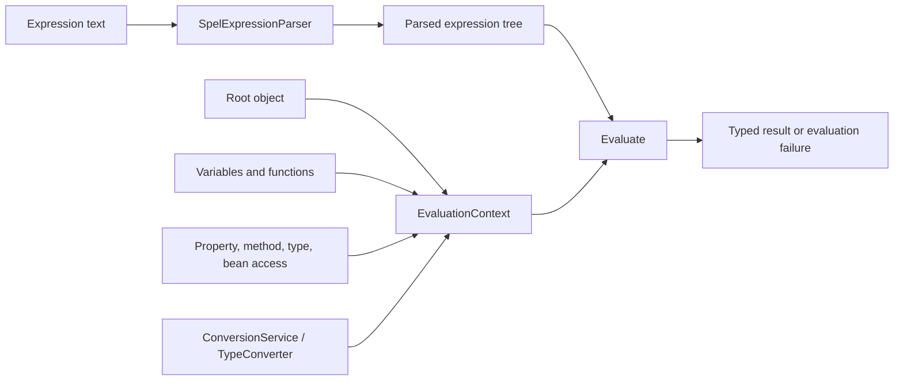

# SpEL Language And Evaluation Internals

<DocLabels items={[
  {label: 'Language fundamentals', tone: 'foundation'},
  {label: 'Evaluation internals', tone: 'advanced'},
  {label: 'Performance evidence', tone: 'production'},
]} />

An expression is parsed into a reusable representation and evaluated against an
explicit context. The expression text alone does not define which beans, methods,
variables, or types are accessible.

<DocCallout type="code" title="Parse once when evaluating repeatedly">
Treat parsing and evaluation as separate costs. Cache application-owned parsed
expressions by a bounded identifier, not by unlimited caller-controlled text, and
measure evaluation with the same root types used in production.
</DocCallout>

## Dependency

The engine is provided by `spring-expression`:

```gradle
implementation 'org.springframework:spring-expression'
```

Spring Boot starters that depend on Spring Context normally bring it transitively.
Declare the module directly only when the application intentionally uses the
expression engine without that surrounding starter.

## Runtime Pipeline



```java
ExpressionParser parser = new SpelExpressionParser();
Expression expression = parser.parseExpression("price * quantity");

StandardEvaluationContext context =
        new StandardEvaluationContext(new LineItem(25, 4));

Integer total = expression.getValue(context, Integer.class);
```

Parsing can fail before evaluation. Evaluation can then fail because a property,
method, variable, bean, index, type, or conversion is unavailable for the actual
context and root value.

## Literals And Operators

```text
42
'shopverse'.toUpperCase()
10 > 5 and 20 < 30
price * quantity
status matches 'PAID|SHIPPED'
value instanceof T(java.lang.Number)
```

Common operator groups include:

| Group | Operators |
|---|---|
| arithmetic | `+ - * / %` |
| comparison | `== != < <= > >=` |
| logical | `and or not` |
| type and text | `instanceof`, `matches` |
| conditional | ternary `? :`, Elvis `?:` |

`T(...)` resolves a Java type through the context's type locator. Constructor
calls use `new`, but constructing complex graphs inside expressions usually hides
ownership and makes failures harder to diagnose.

## Roots, Properties, Methods, And Indexing

Given a root containing `customer`, `items`, and `attributes`:

```text
customer.username
customer.getUsername()
items[0]
attributes['region']
```

Property access such as `customer.username` normally follows JavaBean conventions
and can call `getUsername()`. The root is available as `#root`; `#this` is the
current evaluation object and can change inside selection or projection.

Variables are explicit context entries:

```java
context.setVariable("minimum", BigDecimal.valueOf(100));
Expression eligible = parser.parseExpression("total >= #minimum");
```

Functions and custom property accessors can extend the language, but each extension
also expands the security, compatibility, and testing surface.

## Bean And Type Resolution

The `@` prefix requests a named bean:

```text
@pricingProperties.currency
```

Programmatic `StandardEvaluationContext` does not discover application beans by
magic; it needs a configured `BeanResolver`. Spring annotation integrations supply
their own contexts and resolvers when bean references are supported. Never assume
that a variable or bean visible in one integration exists in another.

## Null-Safe Navigation And Elvis

```text
customer?.address?.region ?: 'unknown'
```

| Operator | Meaning |
|---|---|
| `?.` | navigate only when the preceding value is non-null |
| `?:` | use the right side when the left result is null |

Null-safe navigation prevents a dereference failure at that step; it does not
prove that a default is correct. Required configuration and authorization data
should fail clearly rather than silently becoming `unknown` or `false`.

## Collection Selection And Projection

```text
items.?[active]
items.^[active]
items.$[active]
items.![name]
```

| Expression | Meaning |
|---|---|
| `.?[condition]` | select all matching elements |
| `.^[condition]` | select the first match |
| `.$[condition]` | select the last match |
| `.![expression]` | project every element |

Selection and projection allocate and traverse data. Move non-trivial pipelines
to Java Streams or repository queries where complexity, query planning, and
observability remain visible.

## Evaluation Context Choices

`StandardEvaluationContext` exposes the broad language model and can be customized
with resolvers, accessors, functions, a bean resolver, type conversion, and a type
locator. It is suitable for trusted application-owned expressions that require
those capabilities.

`SimpleEvaluationContext` is deliberately restricted and can be configured for
specific data-binding access. It reduces capability but is not a general promise
that arbitrary hostile expressions are safe. The application still owns expression
source, allowed grammar, data exposure, cost, and result handling.

## Type Conversion And Result Contracts

`getValue(context, TargetType.class)` asks the configured type converter to return
the required type. Conversion may fail even when expression evaluation produced a
value. Assert both value and Java type in tests, especially for numbers, durations,
collections, and map literals.

Avoid depending on incidental numeric promotion or string conversion. A typed
result contract makes changes to roots and configuration visible earlier.

## Compilation And Performance

Interpreted evaluation is flexible. Repeated stable expressions may benefit from
the SpEL compiler, which can generate bytecode after observing runtime types.

```java
SpelParserConfiguration configuration = new SpelParserConfiguration(
        SpelCompilerMode.MIXED,
        getClass().getClassLoader()
);
ExpressionParser parser = new SpelExpressionParser(configuration);
```

Compiler modes trade startup behavior and fallback semantics. Compilation is not
available for every expression shape, and changing root types can invalidate
assumptions. Benchmark the complete call path before enabling it globally; most
annotation predicates are not automatically the dominant service cost.

Production controls:

- cache only bounded application-owned expressions;
- cap collection sizes evaluated by selection/projection;
- avoid remote calls, blocking I/O, and mutation from property or method access;
- measure parse count, evaluation duration, failure count, and root-data size;
- do not log complete expressions when they may contain secrets or personal data.

## Failure And Diagnostic Matrix

| Symptom | Likely boundary | Evidence |
|---|---|---|
| parse failure | invalid expression text | exact parser exception and reviewed expression identifier |
| property or method missing | root type or accessor/resolver mismatch | root class plus restricted context configuration |
| bean not found | no bean resolver or wrong bean name | integration context and bean-resolution trace |
| conversion failure | result type differs from requested contract | raw result type and conversion exception |
| unexpected null | navigation or missing data | root snapshot with sensitive fields redacted |
| latency spike | collection size, resolver, method call, or repeated parsing | bounded timing and profiler evidence |

## Shopverse Evaluation Lab

Create an application-owned fraud-rule catalog where callers select a rule ID,
not raw expression text. Map the ID to one pre-parsed expression such as:

```text
total >= #reviewThreshold and customer?.riskLevel == 'HIGH'
```

Evaluate it against immutable command data with a deliberately configured context.
Test a missing variable, null customer, wrong numeric type, oversized item list,
and an attempted method call that the selected context does not allow. Record parse
count, evaluation duration, result type, and the rejected conclusion for each case.

## Official References

- [Spring Framework SpEL language reference](https://docs.spring.io/spring-framework/reference/core/expressions/language-ref.html)
- [SpEL evaluation](https://docs.spring.io/spring-framework/reference/core/expressions/evaluation.html)
- [SpEL compilation](https://docs.spring.io/spring-framework/reference/core/expressions/evaluation.html#expressions-spel-compilation)
- [Spring Framework `SimpleEvaluationContext`](https://docs.spring.io/spring-framework/reference/core/expressions/evaluation.html#expressions-evaluation-context)

## Recommended Next

Continue with [SpEL Spring Integrations](./SPEL-SPRING-INTEGRATIONS.md).
