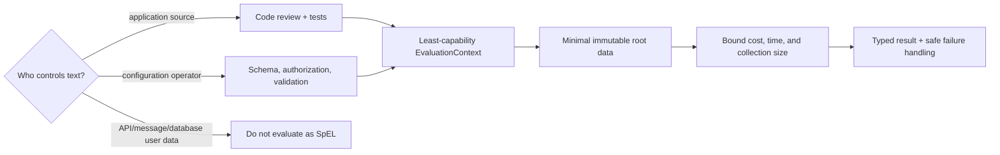

# SpEL Security, Production And Interview Guide

<DocLabels items={[
  {label: 'Advanced', tone: 'advanced'},
  {label: 'Security boundary', tone: 'production'},
  {label: 'Testing and incidents', tone: 'intermediate'},
]} />

Expression evaluation combines executable syntax with application data and
capabilities. Security depends on who controls the text, which context features
are enabled, what root data is exposed, how much work evaluation can perform, and
what the application does with the result.

<DocCallout type="mistake" title="Never evaluate raw client-controlled SpEL">
Do not accept expressions from request parameters, headers, database records,
message fields, or administrative forms and pass them to a powerful evaluation
context. Use an explicit allowlisted DSL or fixed rule identifiers mapped to
application-owned expressions.
</DocCallout>

## Trust Boundary



Application-owned annotation strings are still security-sensitive code. Operator
configuration needs an authenticated change path, schema, audit trail, rollback,
and a restricted expression feature set. User-controlled text should not cross
the expression-parser boundary.

## Capability Minimization

`StandardEvaluationContext` can expose method invocation, type references, bean
resolution, constructors, variables, functions, and custom accessors. Enable only
capabilities required by a trusted use case.

`SimpleEvaluationContext` intentionally supports a smaller data-binding-oriented
surface. It reduces risk but does not turn arbitrary expressions into a safe
multi-tenant rules platform. An attacker may still exploit allowed data traversal
or computational cost, and the result may still drive a sensitive action.

Prefer immutable DTO roots containing only required fields. Do not expose entities,
repositories, application contexts, secrets, authentication tokens, or broad
service beans to a configurable rule context.

## Method-Security Correctness

A method-security expression executes at an AOP boundary. Calls must cross the
published proxy, and self-invocation can bypass the check. A policy bean should be
side-effect free and return a decision from a narrow, indexed query.

Authorization and mutation also have a time boundary. When ownership can change,
enforce the invariant in the transaction or database operation as well as at the
pre-authorization check. `@PostAuthorize` can reject a returned value but cannot
undo remote calls or already committed work.

Cache keys must contain every dimension that separates authorized data. Event and
scheduling expressions must not conceal remote calls or unbounded work. Expression
syntax does not supply retry, idempotency, or distributed coordination.

## Cost And Performance Controls

- Parse trusted repeated expressions once; keep the cache bounded.
- Keep annotation expressions short and side-effect free.
- Cap collections exposed to selection and projection.
- Avoid database, network, filesystem, or blocking calls from general expressions.
- Treat authorization queries as normal production queries with indexes and latency budgets.
- Benchmark compilation only for a demonstrated hot path with stable root types.
- Alert on evaluation failure and latency without tagging metrics by raw expression text.

Expression strings and root values can contain personal data, tenant identifiers,
or secrets. Log a stable rule or annotation identifier, integration, exception
category, and redacted root type—not the complete expression and object graph.

## Production Failure Playbook

| Failure | Immediate response | Durable correction |
|---|---|---|
| startup expression fails | stop readiness and surface the precise configuration owner | validate typed configuration or test annotation parsing in CI |
| method security unexpectedly allows | disable affected route/policy and audit access | correct proxy boundary and policy test matrix |
| method security unexpectedly denies | preserve denial; inspect arguments, principal, and policy bean | fix named-argument or authority contract |
| cache key crosses tenants | evict affected cache and assess exposure | include authorization scope and test key uniqueness |
| dynamic expression creates CPU spike | reject new evaluations and cap workload | remove user-defined SpEL or introduce a bounded DSL |
| conditional bean initializes early | inspect condition report and lifecycle warnings | replace bean-referencing expression with property/classpath conditions |

## Testing Strategy

Test the smallest boundary that owns the contract:

1. parser/context unit tests for application-owned expressions;
2. policy-bean unit tests for authorization decisions;
3. Spring context tests for `@Value`, scheduling, conditions, and cache expressions;
4. method-security integration tests through the real proxy;
5. repository tests for projection SQL and query count;
6. failure tests for nulls, missing variables, conversion, denied access, and invalid configuration.

```java
@SpringBootTest
@EnableMethodSecurity
class OrderMethodSecurityTest {
    @Autowired OrderTimelineService service;

    @Test
    @WithMockUser(username = "john", roles = "CUSTOMER")
    void deniesAnotherCustomersOrder() {
        assertThatThrownBy(() -> service.getTimeline(42L))
                .isInstanceOf(AccessDeniedException.class);
    }
}
```

The test must call the injected proxy, not instantiate the service directly.
Add an allowed case, admin case, missing-authentication case, and policy-query
failure case. For JWT-specific name mapping, use the same authentication type and
claim rules as production.

## Interview Checks

<ExpandableAnswer title="What is the difference between ${...} and #{...}?">

`${...}` resolves external configuration through Spring's `Environment` and
conversion pipeline. `#{...}` parses and evaluates SpEL. They can be combined,
but grouped, nested, or validated configuration is clearer and safer through
`@ConfigurationProperties`.

</ExpandableAnswer>

<ExpandableAnswer title="How does authentication.name work in method-security SpEL?">

The method-security context exposes `authentication`. SpEL property access calls
`Authentication.getName()`. For a JWT resource server, the concrete authentication
and principal-claim configuration determine the returned name, so tests must use
the production mapping rather than assuming it is always the JWT subject.

</ExpandableAnswer>

<ExpandableAnswer title="Why does @orderAuthorization work inside @PreAuthorize?">

The method-security evaluation context has a Spring bean resolver. `@` requests a
bean by name, so the expression resolves `orderAuthorization` and invokes its
eligible method. The bean should implement a narrow, side-effect-free, observable
policy rather than hide a workflow in the expression.

</ExpandableAnswer>

<ExpandableAnswer title="Why should @Value not be used for every property?">

Scattered `@Value` fields do not form a cohesive typed contract and make nested
maps, validation, metadata, discovery, and testing harder. Use it for genuinely
isolated values. Use `@ConfigurationProperties` for a configuration domain with
ownership and startup validation.

</ExpandableAnswer>

<ExpandableAnswer title="Does SimpleEvaluationContext make arbitrary user expressions safe?">

No. It restricts available language capabilities, which is useful defense in depth,
but allowed navigation and computational cost can still be abused and the result
may still authorize a sensitive action. Prefer fixed application-owned rules or an
explicit allowlisted DSL.

</ExpandableAnswer>

<ExpandableAnswer title="Why can a bean reference in @ConditionalOnExpression cause lifecycle problems?">

Condition evaluation occurs while configuration is being assembled. Resolving an
application bean can initialize it before the complete post-processor chain, making
it ineligible for proxying or other processing. Prefer property, class, resource,
and missing-bean conditions for auto-configuration decisions.

</ExpandableAnswer>

<ExpandableAnswer title="Why can @PostAuthorize deny a response without protecting prior side effects?">

Post-authorization runs after method execution and has access to the result. It can
prevent that result from being returned, but it does not undo database work, remote
calls, or messages already performed. Prefer a pre-check or ownership-scoped data
operation when the method has effects.

</ExpandableAnswer>

## Official References

- [Spring Framework SpEL evaluation](https://docs.spring.io/spring-framework/reference/core/expressions/evaluation.html)
- [Spring Security method security](https://docs.spring.io/spring-security/reference/servlet/authorization/method-security.html)
- [Spring Security method testing](https://docs.spring.io/spring-security/reference/servlet/test/method.html)
- [Spring Boot condition annotations](https://docs.spring.io/spring-boot/reference/features/developing-auto-configuration.html#features.developing-auto-configuration.condition-annotations)
- [OWASP injection prevention](https://cheatsheetseries.owasp.org/cheatsheets/Injection_Prevention_Cheat_Sheet.html)

## Recommended Next

Continue with [Spring AOP](../SPRING-AOP.md) for proxy boundaries or the
[Spring Architect Interview Workbook](../SPRING-ARCHITECT-INTERVIEW-WORKBOOK.md)
for broader runtime scenarios.
