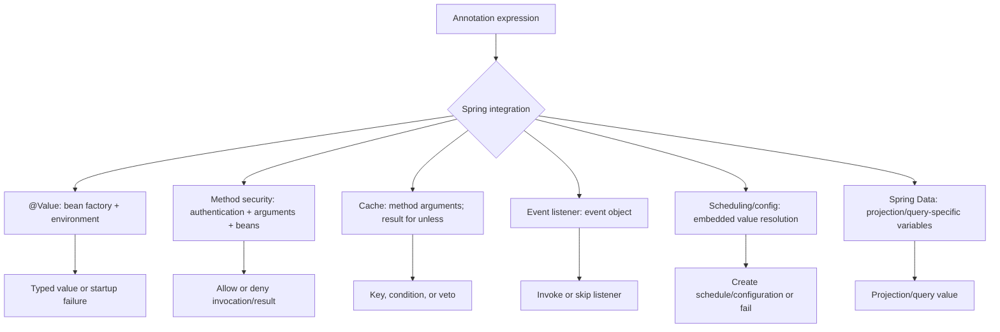

# SpEL Spring Integrations

<DocLabels items={[
  {label: 'Spring integrations', tone: 'intermediate'},
  {label: 'Shopverse examples', tone: 'shopverse'},
  {label: 'Runtime boundaries', tone: 'production'},
]} />

Spring integrations provide different expression roots, variables, bean access,
and evaluation timing. Copying a valid expression from one annotation to another
without checking that contract is a common source of runtime failures.

<DocCallout type="production" title="Identify when the expression runs">
State whether an expression is resolved during context creation, before method
invocation, after a result exists, or while handling an event. Timing determines
which data exists, whether side effects already occurred, and how failure is seen.
</DocCallout>

## Integration Context Map



## Property Placeholders Versus SpEL

| Syntax | Purpose | Example |
|---|---|---|
| `${...}` | resolve a value from Spring's `Environment` | `${server.port:8080}` |
| `#{...}` | parse and evaluate SpEL | `#{2 * 60}` |
| `#{${...}}` | resolve configuration, then evaluate the result | `#{${shopverse.timeout-by-service}}` |

```java
@Value("${shopverse.inventory.reservation-ttl:5m}")
Duration reservationTtl;

@Value("#{2 * 60 * 1000}")
long twoMinutesInMilliseconds;
```

The first uses placeholder resolution and type conversion. The second performs
expression evaluation. Combining both syntaxes is compact but increases parsing,
quoting, and failure complexity.

## `@Value` For Isolated Values

Constructor injection keeps an isolated value immutable and test-visible:

```java
@Component
final class ProviderClient {
    private final Duration timeout;

    ProviderClient(@Value("${shopverse.payment.timeout:2s}") Duration timeout) {
        this.timeout = timeout;
    }
}
```

The value after `:` is the placeholder default. Do not hide configuration required
for correctness behind a convenient default.

### Arrays And Lists

```properties
shopverse.gateway.allowed-origins=http://localhost:3000,https://shopverse.example
```

```java
@Value("${shopverse.gateway.allowed-origins:}")
String[] allowedOrigins;

@Value("#{'${shopverse.features:checkout,timeline}'.split(',')}")
List<String> enabledFeatures;

@Value("#{{'ROLE_ADMIN', 'ROLE_CUSTOMER'}}")
List<String> builtInRoles;
```

Splitting preserves whitespace unless normalized, and an empty default can produce
surprising elements depending on the input and converter. The list literal is code,
not external configuration.

### Maps And Typed Configuration

```properties
shopverse.timeout-by-service={order:2000,inventory:1500,payment:3000}
```

```java
@Value("#{${shopverse.timeout-by-service:{}}}")
Map<String, Integer> timeoutByService;
```

For grouped, nested, validated, or frequently changed values, prefer a typed
configuration domain:

```yaml
shopverse:
  timeout-by-service:
    order: 2s
    inventory: 1500ms
    payment: 3s
```

```java
@Validated
@ConfigurationProperties("shopverse")
public record ShopverseProperties(
        Map<String, @NotNull Duration> timeoutByService
) {
}
```

This provides validation, metadata, cohesive tests, and an immutable contract.

## Method Security

Method security supplies authentication, authorization helpers, method arguments,
and an application bean resolver. It requires Spring Security plus explicit method-
security enablement such as `@EnableMethodSecurity`; the web filter chain alone
does not activate method interception.

```java
@PreAuthorize(
    "hasRole('ADMIN') or "
    + "@orderAuthorization.isOwner(#id, authentication.name)"
)
public List<OrderTimelineResponse> getTimeline(Long id) {
    // invoked only after the pre-authorization decision
}
```

For order `123` and authenticated name `john`, the context resolves:

```text
#id                 -> 123
authentication.name -> "john"
@orderAuthorization -> bean named orderAuthorization
```

and invokes `orderAuthorization.isOwner(123L, "john")`. Keep ownership queries
indexed and narrowly scoped. A bean call inside an expression is executable code,
not a free metadata lookup.

```java
@PostAuthorize("returnObject.customerUsername == authentication.name")
@PreFilter("filterObject.customerUsername == authentication.name")
@PostFilter("filterObject.customerUsername == authentication.name")
```

`@PostAuthorize` runs after method and database work; denial does not undo those
effects. Prefer pre-authorization or an ownership-scoped query when possible.

## Spring Cache

Cache annotations expose method arguments and, for `unless`, the returned value:

```java
@Cacheable(
    cacheNames = "payments",
    key = "#orderNumber",
    condition = "#orderNumber != null",
    unless = "#result == null"
)
public PaymentResponse getByOrderNumber(String orderNumber) {
    // ...
}
```

| Attribute | Timing | Responsibility |
|---|---|---|
| `key` | before invocation | produce a stable, collision-safe key |
| `condition` | before invocation | decide whether caching applies |
| `unless` | after invocation | veto storage based on the result |

Include tenant or authorization scope when it is part of data identity. A compact
key that omits security boundaries can disclose another customer's cached data.

## Event Listeners

```java
@EventListener(condition = "#event.status == 'FAILED'")
public void onFailedPayment(PaymentStatusChanged event) {
    // ...
}
```

Use the expression only for small routing predicates. Listener failure, retry,
transaction phase, idempotency, and remote side effects remain normal application
responsibilities and should be visible in Java code.

## Scheduling And Conditional Configuration

String-based scheduling attributes can resolve placeholders or expressions:

```java
@Scheduled(fixedDelayString = "${shopverse.outbox.delay:1s}")
public void publishOutbox() {
    // ...
}

@Scheduled(fixedDelayString = "#{@outboxProperties.delay.toMillis()}")
public void publishConfiguredOutbox() {
    // ...
}
```

For a direct feature flag, prefer `@ConditionalOnProperty` to:

```java
@ConditionalOnExpression("${shopverse.simulation.enabled:false}")
```

An expression that references a bean during condition evaluation can initialize
that bean too early for complete post-processing. Use property and classpath
conditions for auto-configuration whenever they express the requirement.

Scheduled work also runs on every replica unless coordination exists. SpEL changes
the schedule value, not distributed ownership.

## Spring Data

An open projection can calculate a value:

```java
public interface OrderSummary {
    String getOrderNumber();

    @Value("#{target.orderNumber + ' - ' + target.status}")
    String getDisplayLabel();
}
```

Open projections may require more entity state and reduce query optimization.
For large read paths, prefer closed projections or explicit DTO queries with the
selected columns. Repository SpEL has a feature-specific variable set; never
accept raw query fragments or expression strings from clients.

## Integration Failure Matrix

| Symptom | Boundary to inspect | Evidence |
|---|---|---|
| application fails to start | `@Value`, schedule, or condition parsing/conversion | root cause plus property-source and condition report |
| authorization unexpectedly denies | argument name, authentication, bean resolver, policy result | method-security trace and policy test |
| cache collision or disclosure | key expression omitted identity scope | generated keys across tenant/customer cases |
| event listener never runs | condition root or event value mismatch | published event plus listener condition test |
| schedule differs from expectation | placeholder precedence and evaluation timing | resolved value and scheduler registration |
| projection triggers extra SQL | open projection accesses additional state | query count and selected columns |

## Official References

- [Spring Framework `@Value`](https://docs.spring.io/spring-framework/reference/core/beans/annotation-config/value-annotations.html)
- [Spring Security method security](https://docs.spring.io/spring-security/reference/servlet/authorization/method-security.html)
- [Spring cache annotations](https://docs.spring.io/spring-framework/reference/integration/cache/annotations.html)
- [Spring event annotations](https://docs.spring.io/spring-framework/reference/core/beans/context-introduction.html#context-functionality-events-annotation)
- [Spring Boot conditional annotations](https://docs.spring.io/spring-boot/reference/features/developing-auto-configuration.html#features.developing-auto-configuration.condition-annotations)
- [Spring Data JPA projections](https://docs.spring.io/spring-data/jpa/reference/repositories/projections.html)

## Recommended Next

Continue with [SpEL Security, Production And Interview Guide](./SPEL-SECURITY-PRODUCTION.md).
