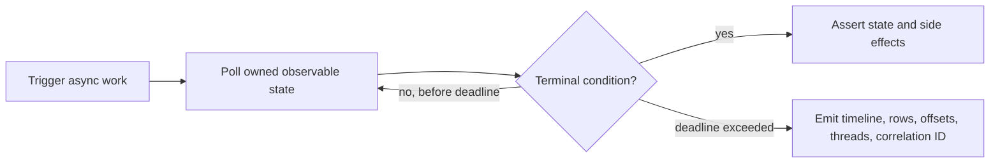

---
title: Async Contract And Flaky Test Prevention
description: Bounded asynchronous assertions, REST and event contract fixtures, deterministic data, isolation, parallel execution, and evidence-driven flaky-test prevention.
difficulty: Advanced
page_type: Testing
status: Implemented
learning_objectives:
  - Replace fixed sleeps with bounded condition-based assertions and timeout evidence
  - Protect REST, Kafka, security, and configuration compatibility contracts
  - Remove shared state and timing assumptions before enabling parallel execution
technologies: [Awaitility, JUnit, Kafka, Contract Testing, Spring]
last_reviewed: "2026-07-13"
---

# Async Contract And Flaky Test Prevention

<DocLabels items={[
  {label: 'Advanced', tone: 'advanced'},
  {label: 'Deterministic reliability', tone: 'production'},
  {label: 'Shopverse proposed', tone: 'preview'},
]} />

Async assertions, contract testing, test data, flaky-test prevention, parallel execution, guidelines, and references.

<DocCallout type="mistake" title="Time passing is not the assertion">
A fixed sleep neither proves completion nor explains failure. Wait for the owned
condition with a total deadline, bounded poll interval, and final diagnostics.
</DocCallout>



Back to [Spring Boot Testing](../SPRING-BOOT-TESTING.md).

## Awaiting Asynchronous Results

Use bounded polling:

```java
await()
        .atMost(Duration.ofSeconds(30))
        .pollInterval(Duration.ofMillis(500))
        .untilAsserted(() ->
                assertThat(orderRepository.findById(id).orElseThrow().getStatus())
                        .isEqualTo(CONFIRMED)
        );
```

Avoid:

```java
Thread.sleep(30000);
```

Fixed sleeps are slow when work completes early and flaky when it completes
slightly late.

Every wait needs:

- maximum duration;
- useful final assertion;
- bounded polling interval;
- diagnostics on timeout.


## Contract Testing

Microservices need compatibility tests for:

- REST requests/responses;
- Kafka event schemas;
- JWT claims and authority mapping;
- Config Server property names;
- database migrations versus entity mappings.

Consumer-driven contract tools can help when services deploy independently,
but simple schema fixtures and serialization tests are still valuable.


## Test Data

- Build the minimum object needed by the test.
- Use clear builders/factories for repeated valid objects.
- Generate unique business keys where constraints apply.
- Keep credentials and secrets fake.
- Do not share mutable fixtures between tests.
- Make timestamps controllable through `Clock` when business rules depend on
  time.


## Flaky Test Prevention

Common causes:

- shared database/topic state;
- fixed sleeps;
- dependence on execution order;
- random values without logging seeds;
- system clock/timezone dependence;
- asynchronous work not stopped;
- reused ports;
- external network calls;
- too much parallelism;
- one full context with uncontrolled background schedulers.

Fix the cause rather than rerunning until green.


## Parallel Execution

Parallel tests can improve speed only when tests and infrastructure are
isolated. Consider:

- database schemas and transactions;
- Kafka topic/group names;
- static state;
- file paths;
- container/CPU/memory limits;
- connection-pool capacity.

Start sequentially, measure, then enable bounded parallelism where isolation is
proven.


## Testing Guidelines

1. Test behavior, not private implementation.
2. Use the smallest sufficient scope.
3. Keep unit tests deterministic and infrastructure-free.
4. Use real MySQL/Kafka for database/broker contracts.
5. Give asynchronous tests deadlines.
6. Test success, denial, failure, duplicate, and rollback paths.
7. Keep test data isolated.
8. Do not mock the class under test.
9. Avoid over-verifying internal calls.
10. Make failures print actionable evidence.
11. Separate unit, integration, and E2E tasks.
12. Bound workers, containers, retries, and total runtime.

## Shopverse Current And Proposed Evidence

<DocCallout type="shopverse" title="Current: integration parallelism is deliberately conservative">
Shopverse infrastructure tests run with JUnit parallel execution disabled and one
Gradle fork. CI and smoke workflows use generated correlation/idempotency values
and bounded task budgets, reducing shared-key and runaway-task failures.
</DocCallout>

<DocCallout type="production" title="Proposed: standardize condition-based waits and timeout bundles">
Adopt one Awaitility helper that prints the relevant order timeline, outbox rows,
Kafka offsets/group state, and correlation ID when a deadline expires. Introduce
parallel execution only after database schemas, topics/groups, ports, files, and
static state are isolated.
</DocCallout>

## Expandable Interview Checks

<ExpandableAnswer title="Why is Thread.sleep a weak async assertion?">

It waits the full duration when work is fast, still fails when work is slightly
slow, and does not identify the condition or emit useful timeout evidence.

</ExpandableAnswer>

<ExpandableAnswer title="What must be isolated before enabling parallel tests?">

Database rows/schemas, Kafka topics and groups, ports, files, static state,
clocks, container capacity, and any other mutable resource shared by the tests.

</ExpandableAnswer>

<ExpandableAnswer title="Do consumer-driven contracts replace integration tests?">

No. They protect agreed request/response or message compatibility. Real transport,
security, database, broker, timeout, and deployment behavior still needs focused
integration evidence.

</ExpandableAnswer>


## Related Guides

- [Shopverse testing strategy](../../development/TESTING.md)
- [Spring Transactions](../SPRING-TRANSACTIONS.md)
- [Spring Kafka](../SPRING-KAFKA.md)
- [Security](../../security/SPRING-SECURITY-GENERIC.md)
- [Debugging](../../development/DEBUGGING.md)
- [HTTP Client Contract Tests](./HTTP-CLIENT-CONTRACT-TESTS.md)
- [CI Test Reliability Operations](./TEST-CI-RELIABILITY-OPERATIONS.md)


## Official References

- [JUnit user guide](https://docs.junit.org/current/user-guide/)
- [Spring testing reference](https://docs.spring.io/spring-framework/reference/testing.html)
- [Testcontainers JUnit 5](https://java.testcontainers.org/test_framework_integration/junit_5/)
- [Mockito documentation](https://javadoc.io/doc/org.mockito/mockito-core/latest/org.mockito/org/mockito/Mockito.html)
- [JaCoCo documentation](https://www.jacoco.org/jacoco/trunk/doc/)
- [PIT mutation testing](https://pitest.org/)

## Recommended Next

<TopicCards items={[
  {title: 'Integration and Testcontainers', href: '/spring/testing/INTEGRATION-TESTCONTAINERS', description: 'Apply bounded waits to real database and Kafka outcomes.', icon: 'boxes', tags: ['Kafka', 'MySQL']},
  {title: 'CI reliability operations', href: '/spring/testing/TEST-CI-RELIABILITY-OPERATIONS', description: 'Govern retries, quarantine, artifacts, and failure triage.', icon: 'gauge', tags: ['CI', 'Flaky tests']},
]} />


