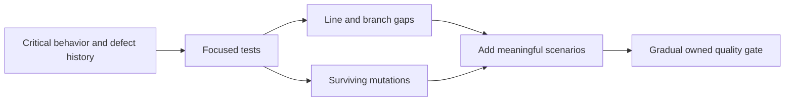

---
title: Coverage And Test Quality
description: Risk-based JaCoCo coverage, branch and changed-code gates, mutation testing, architecture checks, exclusions, and evidence of assertion strength.
difficulty: Advanced
page_type: Quality Guide
status: Proposed governance
learning_objectives:
  - Use coverage to locate untested risk without treating execution as correctness
  - Apply mutation testing to evaluate whether assertions detect changed behavior
  - Govern exclusions and gradual service-level quality gates transparently
technologies: [JaCoCo, PIT, Gradle, JUnit, ArchUnit]
last_reviewed: "2026-07-13"
---

# Coverage And Test Quality

<DocLabels items={[
  {label: 'Advanced', tone: 'advanced'},
  {label: 'Quality evidence', tone: 'production'},
  {label: 'Shopverse proposed', tone: 'preview'},
]} />

Coverage strategy, JaCoCo, other quality tools, exclusions, and testing do/do not guidance.

<DocCallout type="mistake" title="Execution is not detection">
Line coverage proves that code ran. Mutation testing and boundary assertions help
prove that the suite notices incorrect behavior. Use both as risk signals, not as
a substitute for design and review.
</DocCallout>



Back to [Spring Boot Testing](../SPRING-BOOT-TESTING.md).

## Test Coverage Strategy

Coverage is evidence of execution, not proof of correctness. A test can execute
every line without asserting the right outcome. Use coverage to find
unexercised risk, then evaluate test quality through assertions, mutation
testing, defect history, and review.

### Coverage By Test Level

Do not assign one percentage independently to unit, integration, and E2E tests.
They overlap and measure different risks:

| Test level | Coverage expectation | Primary purpose |
|---|---|---|
| Unit | broad branch coverage of domain and service logic | fast behavior and edge-case feedback |
| Spring slice | controllers, validation, serialization, repositories, security mapping | framework integration by layer |
| Integration | database, Kafka, HTTP client, migration, transaction, and security contracts | real dependency behavior |
| E2E | a small number of critical user journeys | deployed-system confidence |

A pragmatic starting policy:

| Metric or scope | Suggested starting target |
|---|---:|
| Overall line coverage | 70-80% |
| Overall branch coverage | 60-70% |
| Critical domain/security/payment logic | 85-90% line and strong branch coverage |
| Changed production code | 80% or higher where practical |
| Generated/configuration/DTO code | exclude deliberately or accept lower coverage |
| E2E journeys | cover critical paths, not a percentage of methods |

These are engineering guidelines, not universal quality guarantees. A small
payment authorization component may require stronger coverage than generated
configuration code. Teams should raise thresholds gradually after measuring
the current baseline.

Never satisfy a target with assertions that prove nothing:

```java
assertNotNull(service);
```

Prefer behavior and boundary assertions:

```java
assertThat(result.status()).isEqualTo(PaymentStatus.DECLINED);
verify(paymentRepository).save(argThat(payment ->
        payment.getFailureReason().equals("INSUFFICIENT_FUNDS")
));
verify(eventPublisher, never()).publishPaymentCompleted(any());
```

### What To Cover

For each important operation, cover:

- normal success;
- boundary values;
- invalid input;
- authorization allowed and denied;
- missing state;
- duplicate/idempotent request;
- optimistic-lock or conflict path;
- dependency timeout and retry exhaustion;
- transaction rollback;
- asynchronous eventual success and terminal failure;
- serialization and schema compatibility.

Coverage should be risk-weighted. Authentication, authorization, money,
inventory, transactions, concurrency, and recovery need deeper testing than
simple getters.


## JaCoCo

JaCoCo instruments Java bytecode and records which instructions, lines,
branches, methods, and classes execute during tests.

Gradle configuration:

```gradle
plugins {
    id 'java'
    id 'jacoco'
}

jacoco {
    toolVersion = '<managed-version>'
}

tasks.test {
    useJUnitPlatform()
    finalizedBy tasks.jacocoTestReport
}

tasks.jacocoTestReport {
    dependsOn tasks.test
    reports {
        html.required = true
        xml.required = true
        csv.required = false
    }
}
```

Reports are normally generated under:

```text
build/reports/jacoco/test/html/index.html
build/reports/jacoco/test/jacocoTestReport.xml
```

XML is useful for CI quality platforms; HTML is useful for local investigation.

### Coverage Enforcement

```gradle
tasks.jacocoTestCoverageVerification {
    violationRules {
        rule {
            limit {
                counter = 'LINE'
                value = 'COVEREDRATIO'
                minimum = 0.75
            }
            limit {
                counter = 'BRANCH'
                value = 'COVEREDRATIO'
                minimum = 0.65
            }
        }
    }
}

tasks.check {
    dependsOn tasks.jacocoTestCoverageVerification
}
```

Do not immediately impose a threshold above the existing baseline. First
publish the report, record the baseline, exclude only justified generated
code, then increase the gate in controlled steps.

### Unit And Integration Coverage

If unit and integration tests use separate Gradle tasks, each task can produce
an execution-data file. Merge them for a service report that includes production
classes once and execution data from every owned test task. Exact Gradle wiring
depends on the custom integration source set; verify task dependencies and missing
execution data rather than publishing a partial report as complete.

For a multi-service repository, publish:

- per-service reports for ownership;
- an aggregate report for visibility;
- changed-code coverage in pull requests;
- separate test-result and coverage artifacts.


## Other Test Quality Tools

| Tool | Purpose |
|---|---|
| JaCoCo | line, branch, instruction, method, and class coverage |
| PIT/Pitest | mutation testing; checks whether tests detect changed behavior |
| SonarQube/SonarCloud | combines coverage, duplication, bugs, vulnerabilities, and quality gates |
| Codecov/Coveralls | hosts and compares coverage reports, including pull-request diffs |
| Gradle test reports | test results, failures, and durations |
| JUnit XML | standard CI test-result exchange format |
| ArchUnit | verifies package, layer, and dependency architecture rules |
| Testcontainers | verifies behavior against real infrastructure |
| WireMock/MockWebServer | stubs HTTP dependencies and verifies client contracts |
| Awaitility | bounded assertions for asynchronous behavior |

Mutation testing is stronger than ordinary coverage for test effectiveness:

```text
production condition: quantity > 0
mutation:            quantity >= 0
```

If all tests still pass, the suite did not prove the boundary. Mutation testing
is CPU-intensive, so run it on critical modules or scheduled CI rather than
necessarily on every commit.

Static analysis and coverage solve different problems. A line can be covered
and still contain a security defect, race condition, resource leak, or weak
assertion.


## Coverage Exclusions

Potential exclusions include:

- generated sources;
- framework-generated bootstrap code;
- pure configuration property records;
- migration files, which need migration tests rather than Java coverage;
- simple DTOs only when they contain no behavior.

Do not broadly exclude controllers, entities, configuration classes, exception
handlers, or difficult code merely to improve the percentage. Record every
exclusion and its reason.


## Testing Do And Do Not

| Do | Do not |
|---|---|
| Test observable behavior | Test private methods directly |
| Use the smallest sufficient test scope | Start a full Spring context for every test |
| Mock external collaborators in unit tests | Mock the class under test |
| Use real infrastructure for persistence and broker contracts | Assume mocks prove SQL, locking, or Kafka behavior |
| Keep tests deterministic and isolated | Depend on order, shared state, or wall-clock timing |
| Use bounded Awaitility polling | Use long fixed sleeps |
| Cover success, denial, conflict, and rollback | Test only the happy path |
| Treat coverage as a diagnostic metric | Treat 100% coverage as proof of quality |
| Enforce gradual, risk-based coverage gates | Add meaningless tests to satisfy a percentage |
| Prefer Mockito and refactoring | Introduce PowerMock into new code |
| Close static mocks and resources | Leak test state into another test |
| Verify important side effects | Verify every internal method call |
| Use unique data and idempotency keys | Reuse mutable fixtures across tests |
| Keep E2E tests few and business-focused | Reproduce every validation case through Docker |

## Shopverse Current And Proposed Evidence

<DocCallout type="shopverse" title="Current: test tasks and reports exist, but no repository-wide JaCoCo gate was found">
Shopverse separates unit and integration tasks and CI retains selected test
reports. The scoped build search did not find a shared JaCoCo or PIT convention,
so the percentage examples on this page are guidance rather than implemented gates.
</DocCallout>

<DocCallout type="production" title="Proposed: baseline first, then gate changed critical code">
Publish per-service unit plus integration coverage, record justified exclusions,
and introduce non-regression before raising thresholds. Run PIT on critical money,
authorization, inventory, idempotency, and state-transition packages in a scheduled
or affected-module job.
</DocCallout>

## Expandable Interview Checks

<ExpandableAnswer title="Can 100 percent line coverage still hide a defect?">

Yes. Tests may execute a line without asserting its result or important branch.
Mutation testing and negative boundary assertions reveal some of those weak tests.

</ExpandableAnswer>

<ExpandableAnswer title="Why should coverage exclusions be reviewed like code?">

Broad exclusions can hide risky controllers, handlers, configuration, and domain
logic. Every exclusion needs a narrow pattern, owner, reason, and alternative evidence.

</ExpandableAnswer>

<ExpandableAnswer title="Why not run full mutation testing on every commit?">

It can be CPU-intensive. Prioritize critical or changed modules on pull requests
and run broader campaigns on a schedule while keeping surviving mutations visible.

</ExpandableAnswer>

## Official References

- [JaCoCo documentation](https://www.jacoco.org/jacoco/trunk/doc/)
- [PIT mutation testing](https://pitest.org/)
- [Gradle JaCoCo plugin](https://docs.gradle.org/current/userguide/jacoco_plugin.html)

## Recommended Next

<TopicCards items={[
  {title: 'CI reliability operations', href: '/spring/testing/TEST-CI-RELIABILITY-OPERATIONS', description: 'Turn quality reports into transparent delivery gates and artifacts.', icon: 'gauge', tags: ['CI', 'Gates']},
  {title: 'Mockito and unit testing', href: '/spring/testing/MOCKITO-UNIT-TESTING', description: 'Strengthen behavioral assertions when mutation evidence exposes weak tests.', icon: 'experiment', tags: ['Assertions', 'Mocks']},
]} />


