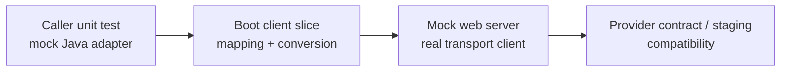

# Spring HTTP Client Contract Tests

<DocLabels items={[
  {label: 'Advanced', tone: 'advanced'},
  {label: 'Dependency contracts', tone: 'production'},
  {label: 'Shopverse proposed', tone: 'preview'},
]} />

Mocking `inventoryClient.getCatalog()` proves the caller's branch logic. It does
not prove HTTP method, path expansion, headers, JSON conversion, status decoding,
timeouts, or retry behavior. Client adapters need tests at the HTTP boundary.

<DocCallout type="tip" title="Keep both tests">
Use a Mockito unit test for caller decisions and a client contract test for the
adapter's wire behavior. They answer different questions and should not imitate
each other.
</DocCallout>

## Evidence Layers



| Boundary | Best evidence |
|---|---|
| caller fallback and domain mapping | Mockito unit test |
| `RestClient` request and body conversion | `@RestClientTest` plus `MockRestServiceServer` |
| `WebClient` reactive mapping | `@WebClientTest` and reactive assertions |
| connection/read timeout, disconnect, malformed chunking | mock web server using the production transport |
| HTTP Service interface annotations | generated proxy against a mock web server |
| Feign contract, encoder, decoder, interceptors | Feign client context plus mock web server |
| provider compatibility | generated OpenAPI/consumer contract and deployed provider test |

## Spring Boot 4 Client Slices

`@RestClientTest` comes from `spring-boot-restclient-test`. It configures
serialization support, `RestClient.Builder`, `RestTemplateBuilder`, and
`MockRestServiceServer` while excluding unrelated components.

```java
@RestClientTest(InventoryHttpClient.class)
class InventoryHttpClientTest {

    @Autowired InventoryHttpClient client;
    @Autowired MockRestServiceServer server;

    @Test
    void decodesOneInventoryItem() {
        server.expect(requestTo("/api/v1/inventory/public/items/42"))
                .andExpect(method(HttpMethod.GET))
                .andRespond(withSuccess(
                        """{"productId":42,"available":7}""",
                        MediaType.APPLICATION_JSON));

        assertThat(client.getInventory(42).available()).isEqualTo(7);
        server.verify();
    }
}
```

`@WebClientTest` comes from `spring-boot-webclient-test` and configures a
`WebClient.Builder`. Use a mock web server for network behavior and StepVerifier
or bounded blocking only in the test harness, never on an event-loop production
path.

## HTTP Service Clients

An annotated interface is still executable client code:

```java
interface InventoryHttpService {

    @GetExchange("/api/v1/inventory/public/items/{productId}")
    InventoryResponse get(@PathVariable long productId);
}
```

Build the proxy with the production `RestClient` or `WebClient` adapter and point
it at a mock server. Assert method, expanded path, query encoding, headers,
request body, response conversion, and non-success behavior.

## Feign Contract Coverage

Existing Feign tests should load the intended Spring Cloud contract, encoder,
decoder, request interceptors, load-balancer behavior where applicable, and
chosen underlying client. A direct Mockito mock of the Feign interface cannot
prove any of those.

Test at least:

- correlation and authorization propagation without secret logging;
- path and query encoding;
- expected JSON and unknown-field behavior;
- `4xx` domain mapping and `5xx` dependency mapping;
- empty, malformed, and oversized bodies;
- connect, pool-acquisition, response, and total deadlines;
- retry eligibility and total attempt count;
- idempotency keys for retried commands.

## Transport Failure Simulation

`MockRestServiceServer` is fast for request expectations and canned responses. A
mock web server exercises the actual HTTP client and can simulate delayed headers,
slow bodies, disconnects, invalid responses, and connection reuse. Spring's
current guidance prefers mock web servers for complete transport behavior.

Every failure test needs a bounded deadline; a hanging test is not timeout
evidence.

## Shopverse Current And Proposed State

<DocCallout type="shopverse" title="Current: production clients exist without focused HTTP contract tests found">
Auth Service declares `UserClient`; Order Service declares `InventoryClient` and
a Feign correlation interceptor. The scoped repository search did not find tests
that execute these adapters against a mock HTTP server.
</DocCallout>

<DocCallout type="production" title="Proposed: start with two narrow provider contracts">
Add one test proving Auth-to-User authorization-header propagation and response
decoding, and one proving Order-to-Inventory path/JSON/correlation behavior.
Then add timeout and `5xx` tests using the actual configured transport. Publish
failures with sanitized request summaries and attempt timing.
</DocCallout>

## Contract Fixture Governance

- Version request and response examples with the consuming adapter.
- Generate provider examples from the same public schema where practical.
- Treat unknown enum and additive field behavior explicitly.
- Keep third-party DTOs inside the adapter boundary.
- Store no real tokens, credentials, personal data, or production hosts.
- Fail CI when a released provider contract becomes incompatible.
- Record dependency route, status, attempt, and timeout phase with bounded tags.

## Expandable Interview Checks

<ExpandableAnswer title="Why is mocking a Feign interface insufficient?">

It proves caller behavior against a Java method but bypasses Feign's contract,
proxy, encoder, decoder, interceptors, transport, timeouts, and error mapping.

</ExpandableAnswer>

<ExpandableAnswer title="When should a client test use a mock web server?">

When the claim involves the production HTTP transport or network behavior such as
delayed responses, disconnects, connection reuse, and timeout phases.

</ExpandableAnswer>

<ExpandableAnswer title="Should a client retry test assert only the final result?">

No. Assert attempt count, elapsed budget, eligible method/error, propagated
idempotency context, final mapping, and that retries stop at the owned deadline.

</ExpandableAnswer>

## Official References

- [Spring Boot auto-configured REST clients](https://docs.spring.io/spring-boot/reference/testing/spring-boot-applications.html#testing.spring-boot-applications.autoconfigured-rest-client)
- [Spring Framework testing client applications](https://docs.spring.io/spring-framework/reference/testing/spring-mvc-test-client.html)
- [Spring HTTP Service Clients](https://docs.spring.io/spring-framework/reference/integration/rest-clients.html#rest-http-interface)
- [Spring Cloud OpenFeign](https://docs.spring.io/spring-cloud-openfeign/reference/)

## Recommended Next

<TopicCards items={[
  {title: 'HTTP client selection and runtime', href: '/development/spring-rest/REST-CLIENTS-FEIGN', description: 'Choose the client and define pools, deadlines, resilience, and ownership.', icon: 'network', tags: ['RestClient', 'WebClient']},
  {title: 'Async and contract reliability', href: '/spring/testing/ASYNC-CONTRACT-FLAKY-TESTS', description: 'Keep transport and compatibility tests deterministic and bounded.', icon: 'route', tags: ['Contracts', 'Flaky tests']},
]} />
