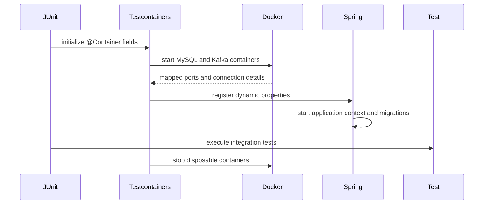

---
title: Integration Tests And Testcontainers
---

# Integration Tests And Testcontainers

Integration testing, Testcontainers, transactional tests, Kafka integration testing, and end-to-end testing.

Back to [Spring Boot Testing](../SPRING-BOOT-TESTING.md).

## Integration Tests

Integration tests verify collaboration that mocks cannot prove:

- Liquibase migrations;
- real database constraints;
- transaction commit and rollback;
- optimistic/pessimistic locking;
- outbox persistence;
- Kafka producer/consumer behavior;
- serialization contracts;
- application context wiring.

Keep each test focused. A single integration class does not need to prove the
entire platform.


## Testcontainers

Testcontainers starts disposable dependencies in Docker for tests:



Advantages:

- uses the real database/broker product;
- clean, repeatable state;
- dynamic isolated ports;
- same pattern locally and in CI;
- no shared developer database;
- validates migrations and production dialect behavior.

Costs:

- requires Docker;
- image pulls and startup consume time/resources;
- poorly scoped containers can make suites slow;
- parallel suites can exhaust Docker or host memory.


## Testcontainers Example

```java
@Testcontainers(disabledWithoutDocker = true)
@SpringBootTest
class InfrastructureIntegrationTest {

    @Container
    static final MySQLContainer<?> MYSQL =
            new MySQLContainer<>("mysql:8.4");

    @Container
    static final KafkaContainer KAFKA =
            new KafkaContainer("apache/kafka-native:3.9.1");

    @DynamicPropertySource
    static void properties(DynamicPropertyRegistry registry) {
        registry.add("spring.datasource.url", MYSQL::getJdbcUrl);
        registry.add("spring.datasource.username", MYSQL::getUsername);
        registry.add("spring.datasource.password", MYSQL::getPassword);
        registry.add("spring.kafka.bootstrap-servers",
                KAFKA::getBootstrapServers);
    }
}
```

Static containers are shared by tests in that class, reducing startup cost.
The Jupiter extension manages their lifecycle.

`disabledWithoutDocker=true` is convenient for unit-only local work, but CI
must clearly require Docker. A skipped integration suite must not be mistaken
for successful infrastructure verification.


## Testing Transactions

To prove commit and rollback, use an explicit transaction:

```java
transactionTemplate.executeWithoutResult(status ->
        outboxService.enqueue(...)
);
assertThat(outboxCount(id)).isOne();

transactionTemplate.executeWithoutResult(status -> {
    outboxService.enqueue(...);
    status.setRollbackOnly();
});
assertThat(outboxCount(id)).isZero();
```

This verifies that the test observes committed state outside the transaction.

Be careful with `@Transactional` on test methods: automatic rollback is useful
for cleanup, but can hide commit callbacks, locking behavior, and visibility
from another connection.


## Kafka Integration Testing

Producer acknowledgement:

```java
var result = kafkaTemplate
        .send(topic, "order-key", payload)
        .get(10, TimeUnit.SECONDS);

assertThat(result.getRecordMetadata().topic()).isEqualTo(topic);
assertThat(result.getRecordMetadata().offset())
        .isGreaterThanOrEqualTo(0);
```

Consumer tests should:

- use unique topics or isolated groups;
- await with a strict deadline;
- assert the business side effect;
- handle duplicates;
- stop listeners/executors cleanly;
- avoid unbounded sleeps.


## End-To-End Testing

An E2E test treats the system as deployed:

```text
authenticate
  -> call gateway checkout
  -> await terminal SAGA state
  -> read timeline/payment
  -> verify security and recovery
```

It proves routing, security, databases, Kafka, and service collaboration.
Failures are slower to diagnose, so E2E tests should cover a few critical
journeys rather than every validation branch.

Use generated correlation and idempotency IDs for isolation.


