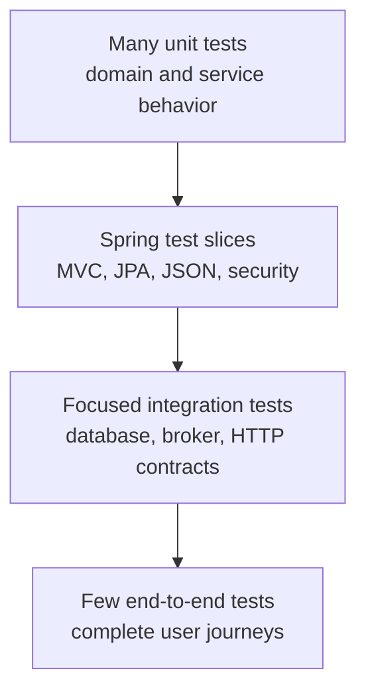
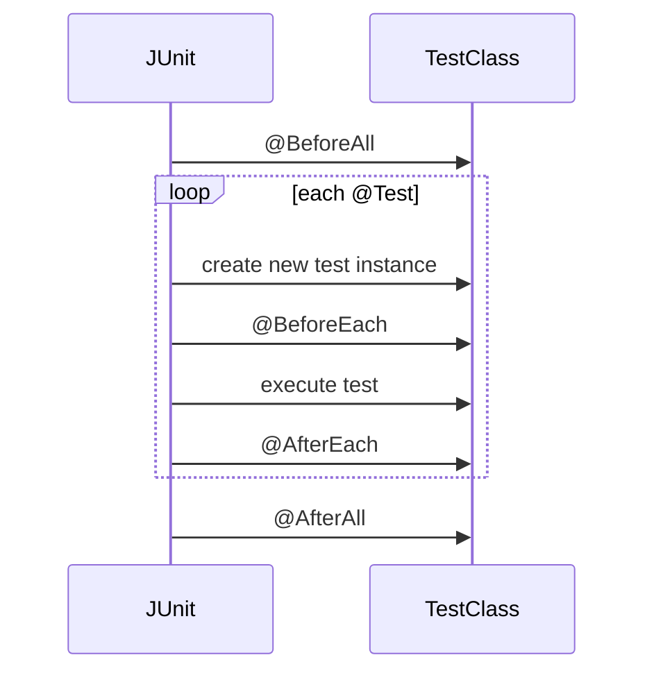

# JUnit Testing Fundamentals

<DocLabels items={[
  {label: 'Foundation', tone: 'foundation'},
  {label: 'Framework independent', tone: 'intermediate'},
  {label: 'Shopverse current', tone: 'shopverse'},
]} />

Test pyramid, dependencies, JUnit annotations, lifecycle, structure, assertions, and parameterized tests.

<DocCallout type="tip" title="Learn JUnit before Spring TestContext">
JUnit owns discovery, lifecycle, parameterization, extensions, and execution.
Spring later supplies an extension and application context; it does not replace
these foundations.
</DocCallout>

Back to [Spring Boot Testing](../SPRING-BOOT-TESTING.md).

## Test Pyramid



| Level | Proves | Typical speed |
|---|---|---|
| Unit | one class or function in isolation | milliseconds |
| Slice | one Spring framework layer | fast to moderate |
| Integration | collaboration with real infrastructure | seconds to minutes |
| End to end | deployed-system user journey | minutes |

More scope means more realistic wiring, but also more startup time, possible
failure causes, and resource use.


## Dependencies

Spring Boot test starter:

```gradle
testImplementation 'org.springframework.boot:spring-boot-starter-test'
testRuntimeOnly 'org.junit.platform:junit-platform-launcher'
```

It normally provides JUnit Jupiter, AssertJ, Mockito, Spring Test, JSON testing,
and other testing support.

Security:

```gradle
testImplementation 'org.springframework.security:spring-security-test'
```

Testcontainers:

```gradle
integrationTestImplementation platform(
        "org.testcontainers:testcontainers-bom:<version>"
)
integrationTestImplementation 'org.testcontainers:testcontainers-junit-jupiter'
integrationTestImplementation 'org.testcontainers:testcontainers-mysql'
integrationTestImplementation 'org.testcontainers:testcontainers-kafka'
```

Use the repository's dependency management rather than independently choosing
incompatible versions.


## JUnit Jupiter Execution Model

JUnit Platform discovers and launches test engines. JUnit Jupiter is the
programming and extension model used by JUnit 5/6-era tests.

```text
Gradle test task
  -> JUnit Platform Launcher
  -> Jupiter TestEngine
  -> discover test classes and methods
  -> execute lifecycle callbacks and tests
  -> publish results to Gradle reports
```


## Important JUnit Annotations

| Annotation | Purpose |
|---|---|
| `@Test` | one test case |
| `@BeforeEach` | setup before every test |
| `@AfterEach` | cleanup after every test |
| `@BeforeAll` | setup once before the class |
| `@AfterAll` | cleanup once after the class |
| `@DisplayName` | readable test/class name |
| `@Nested` | group related scenarios |
| `@ParameterizedTest` | execute one test with several arguments |
| `@ValueSource` | simple parameter values |
| `@CsvSource` | tabular argument values |
| `@MethodSource` | arguments from a factory method |
| `@EnumSource` | enum values |
| `@Timeout` | fail a test exceeding its deadline |
| `@Tag` | categorize tests |
| `@Disabled` | temporarily skip with a reason |
| `@TestInstance` | configure test-instance lifecycle |
| `@ExtendWith` | register a Jupiter extension |


## JUnit Lifecycle

Default lifecycle:



By default, JUnit creates a new test instance for every test method. This
reduces accidental state sharing.

`@BeforeAll` and `@AfterAll` are normally static. With:

```java
@TestInstance(TestInstance.Lifecycle.PER_CLASS)
```

they can be instance methods, but shared mutable state can make tests
order-dependent.

Do not depend on test execution order. Each test should arrange its own state.


## Test Structure

A readable test follows Arrange, Act, Assert:

```java
@Test
void returnsUserWhenIdExists() {
    // Arrange
    when(repository.findById(1L)).thenReturn(Optional.of(user));

    // Act
    UserResponse response = service.getUser(1L);

    // Assert
    assertThat(response.username()).isEqualTo("ahmed");
}
```

Test names should express behavior:

```text
createUserHashesPasswordAndAssignsRoles
anotherCustomerCannotReadTimeline
outboxCommitAndRollbackShareTheTransactionBoundary
```

Avoid names such as `testMethod1`.


## Assertions

JUnit:

```java
assertEquals(expected, actual);
assertThrows(ResourceNotFoundException.class, () -> service.getUser(99L));
```

AssertJ:

```java
assertThat(response.username()).isEqualTo("ahmed");

assertThatThrownBy(() -> service.getUser(99L))
        .isInstanceOf(ResourceNotFoundException.class)
        .hasMessageContaining("99");
```

Assert business outcomes and relevant state. Avoid asserting every internal
field when it is not part of the behavior.


## Parameterized Tests

Use one parameterized test when several inputs prove the same rule:

```java
@ParameterizedTest
@ValueSource(strings = {"weak", "password", "12345678"})
void rejectsWeakPasswords(String password) {
    assertThat(validator.isValid(password, context)).isFalse();
}
```

```java
@ParameterizedTest
@CsvSource({
        "1, true",
        "0, false",
        "-1, false"
})
void quantityMustBePositive(int quantity, boolean expected) {
    assertThat(isValidQuantity(quantity)).isEqualTo(expected);
}
```

Do not combine unrelated behaviors merely to reduce the number of methods.

## Shopverse Current And Proposed Practice

<DocCallout type="shopverse" title="Current: JUnit Platform is standardized by build conventions">
Shopverse Java services use Java 21, `useJUnitPlatform()`, and the JUnit Platform
launcher through shared build logic. Spring Boot `4.0.6` manages the compatible
Jupiter, AssertJ, Mockito, and Spring Test versions.
</DocCallout>

<DocCallout type="production" title="Proposed: make test taxonomy executable">
Adopt stable tags only where tasks or CI gates use them, keep test names focused on
behavior, and publish JUnit XML with duration and failure output for every task.
Do not create a tag vocabulary that has no owner or selection policy.
</DocCallout>

## Expandable Interview Checks

<ExpandableAnswer title="What is the difference between JUnit Platform and Jupiter?">

The Platform discovers and launches test engines. Jupiter is the programming and
extension model used to define and execute modern JUnit tests.

</ExpandableAnswer>

<ExpandableAnswer title="Why is the default per-method test instance useful?">

Each test receives a new class instance, reducing accidental mutable state sharing
and order dependence. External static or infrastructure state still needs isolation.

</ExpandableAnswer>

<ExpandableAnswer title="When should cases become a parameterized test?">

When several inputs prove the same rule with the same arrange/act/assert shape.
Keep unrelated behavior in separate tests even if combining it reduces method count.

</ExpandableAnswer>

## Official References

- [JUnit User Guide](https://docs.junit.org/current/user-guide/)
- [Spring Boot test dependencies](https://docs.spring.io/spring-boot/reference/testing/test-scope-dependencies.html)

## Recommended Next

<TopicCards items={[
  {title: 'Mockito and unit testing', href: '/spring/testing/MOCKITO-UNIT-TESTING', description: 'Add controlled collaborators while keeping production behavior under test.', icon: 'experiment', tags: ['Foundation', 'Mocks']},
  {title: 'Spring test slices and cache', href: '/spring/testing/SPRING-TEST-SLICES-CONTEXT-CACHE', description: 'Introduce Spring only when container wiring becomes part of the claim.', icon: 'layers', tags: ['TestContext', 'Boot 4']},
]} />


