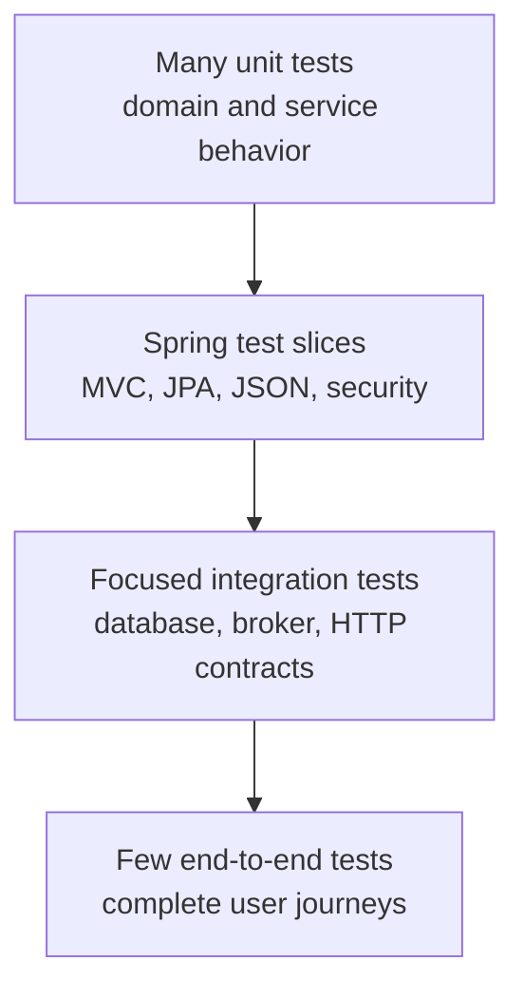
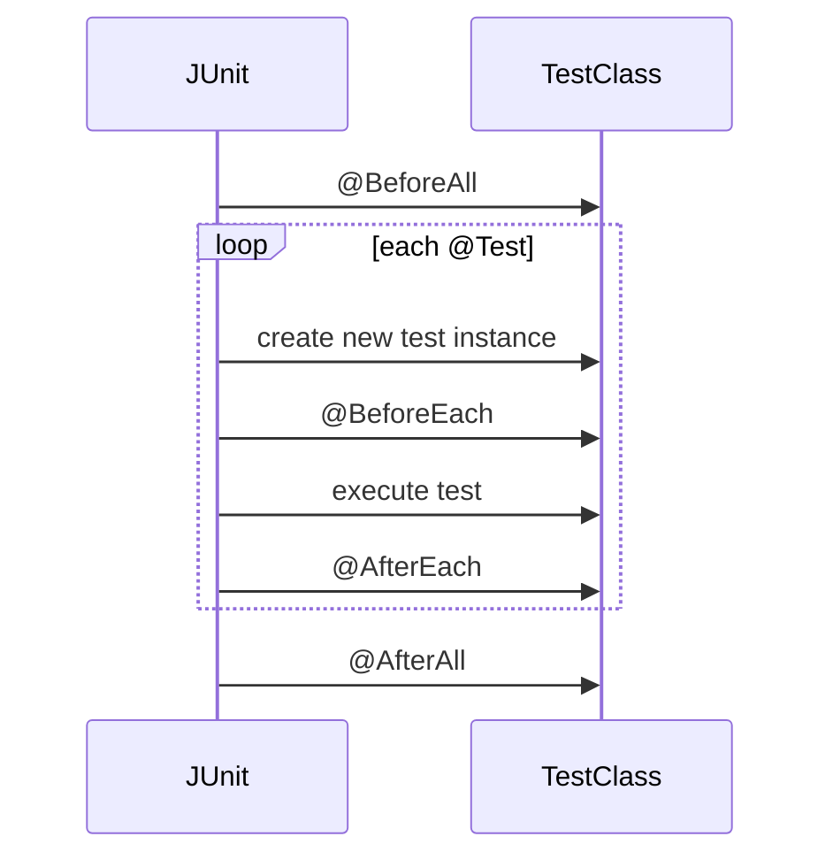

---
title: JUnit Testing Fundamentals
---

# JUnit Testing Fundamentals

Test pyramid, dependencies, JUnit annotations, lifecycle, structure, assertions, and parameterized tests.

Back to [Spring Boot Testing](../SPRING-BOOT-TESTING.md).

## Test Pyramid



| Level | Proves | Typical speed |
|---|---|---|
| Unit | one class or function in isolation | milliseconds |
| Slice | one Spring framework layer | fast to moderate |
| Integration | collaboration with real infrastructure | seconds to minutes |
| End to end | deployed-system user journey | minutes |

More scope means more realistic wiring, but also more startup time, possible
failure causes, and resource use.


## Dependencies

Spring Boot test starter:

```gradle
testImplementation 'org.springframework.boot:spring-boot-starter-test'
testRuntimeOnly 'org.junit.platform:junit-platform-launcher'
```

It normally provides JUnit Jupiter, AssertJ, Mockito, Spring Test, JSON testing,
and other testing support.

Security:

```gradle
testImplementation 'org.springframework.security:spring-security-test'
```

Testcontainers:

```gradle
integrationTestImplementation platform(
        "org.testcontainers:testcontainers-bom:<version>"
)
integrationTestImplementation 'org.testcontainers:testcontainers-junit-jupiter'
integrationTestImplementation 'org.testcontainers:testcontainers-mysql'
integrationTestImplementation 'org.testcontainers:testcontainers-kafka'
```

Use the repository's dependency management rather than independently choosing
incompatible versions.


## JUnit Jupiter Execution Model

JUnit Platform discovers and launches test engines. JUnit Jupiter is the
programming and extension model used by JUnit 5/6-era tests.

```text
Gradle test task
  -> JUnit Platform Launcher
  -> Jupiter TestEngine
  -> discover test classes and methods
  -> execute lifecycle callbacks and tests
  -> publish results to Gradle reports
```


## Important JUnit Annotations

| Annotation | Purpose |
|---|---|
| `@Test` | one test case |
| `@BeforeEach` | setup before every test |
| `@AfterEach` | cleanup after every test |
| `@BeforeAll` | setup once before the class |
| `@AfterAll` | cleanup once after the class |
| `@DisplayName` | readable test/class name |
| `@Nested` | group related scenarios |
| `@ParameterizedTest` | execute one test with several arguments |
| `@ValueSource` | simple parameter values |
| `@CsvSource` | tabular argument values |
| `@MethodSource` | arguments from a factory method |
| `@EnumSource` | enum values |
| `@Timeout` | fail a test exceeding its deadline |
| `@Tag` | categorize tests |
| `@Disabled` | temporarily skip with a reason |
| `@TestInstance` | configure test-instance lifecycle |
| `@ExtendWith` | register a Jupiter extension |


## JUnit Lifecycle

Default lifecycle:



By default, JUnit creates a new test instance for every test method. This
reduces accidental state sharing.

`@BeforeAll` and `@AfterAll` are normally static. With:

```java
@TestInstance(TestInstance.Lifecycle.PER_CLASS)
```

they can be instance methods, but shared mutable state can make tests
order-dependent.

Do not depend on test execution order. Each test should arrange its own state.


## Test Structure

A readable test follows Arrange, Act, Assert:

```java
@Test
void returnsUserWhenIdExists() {
    // Arrange
    when(repository.findById(1L)).thenReturn(Optional.of(user));

    // Act
    UserResponse response = service.getUser(1L);

    // Assert
    assertThat(response.username()).isEqualTo("ahmed");
}
```

Test names should express behavior:

```text
createUserHashesPasswordAndAssignsRoles
anotherCustomerCannotReadTimeline
outboxCommitAndRollbackShareTheTransactionBoundary
```

Avoid names such as `testMethod1`.


## Assertions

JUnit:

```java
assertEquals(expected, actual);
assertThrows(ResourceNotFoundException.class, () -> service.getUser(99L));
```

AssertJ:

```java
assertThat(response.username()).isEqualTo("ahmed");

assertThatThrownBy(() -> service.getUser(99L))
        .isInstanceOf(ResourceNotFoundException.class)
        .hasMessageContaining("99");
```

Assert business outcomes and relevant state. Avoid asserting every internal
field when it is not part of the behavior.


## Parameterized Tests

Use one parameterized test when several inputs prove the same rule:

```java
@ParameterizedTest
@ValueSource(strings = {"weak", "password", "12345678"})
void rejectsWeakPasswords(String password) {
    assertThat(validator.isValid(password, context)).isFalse();
}
```

```java
@ParameterizedTest
@CsvSource({
        "1, true",
        "0, false",
        "-1, false"
})
void quantityMustBePositive(int quantity, boolean expected) {
    assertThat(isValidQuantity(quantity)).isEqualTo(expected);
}
```

Do not combine unrelated behaviors merely to reduce the number of methods.


