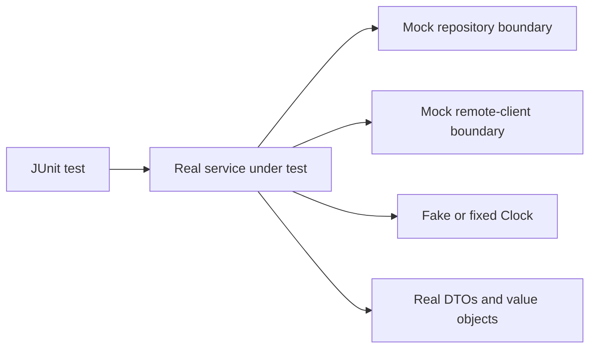

---
title: Mockito And Unit Testing
description: Framework-independent test-double foundations for focused Java service tests, interaction evidence, design seams, scoped static mocking, and legacy PowerMock migration.
difficulty: Foundation
page_type: Testing
status: Implemented
learning_objectives:
  - Distinguish mocks, stubs, spies, fakes, and real value objects
  - Stub and verify only collaborator behavior relevant to a business outcome
  - Prefer injectable seams over static, constructor, and private-method mocking
technologies: [Mockito, JUnit Jupiter, AssertJ, Java]
last_reviewed: "2026-07-13"
---

# Mockito And Unit Testing

<DocLabels items={[
  {label: 'Foundation', tone: 'foundation'},
  {label: 'Framework independent', tone: 'intermediate'},
  {label: 'Shopverse current', tone: 'shopverse'},
]} />

Mockito, mock usage, static and constructor mocking, PowerMockito guidance, and service unit tests.

<DocCallout type="tip" title="Keep production behavior real">
Construct the class under test normally. Replace only collaborators whose
responses or side effects the scenario must control. Spring context, proxy, SQL,
HTTP, and Kafka behavior require a broader test rather than deeper mocking.
</DocCallout>



Back to [Spring Boot Testing](../SPRING-BOOT-TESTING.md).

## Mockito

Mockito creates test doubles for collaborators:

```java
@ExtendWith(MockitoExtension.class)
class UserServiceTest {

    @Mock
    UserRepository repository;

    @Mock
    PasswordEncoder passwordEncoder;

    UserServiceImpl service;

    @BeforeEach
    void setUp() {
        service = new UserServiceImpl(repository, passwordEncoder, ...);
    }
}
```

### Stubbing

```java
when(repository.findById(1L))
        .thenReturn(Optional.of(user));

when(repository.save(any(User.class)))
        .thenAnswer(invocation -> invocation.getArgument(0));
```

Stub only behavior needed by the current test. Excess stubbing makes tests
hard to understand and can hide incorrect interactions.

### Verification

```java
verify(repository).save(any(User.class));
verify(repository, never()).delete(any(User.class));
verify(auditService).record(user, "USER_CREATED", "User account created");
```

Verify important side effects and absences. Do not verify every implementation
call, because that couples the test to harmless refactoring.

### Argument Matchers

Common matchers:

```java
any()
any(User.class)
eq("ADMIN")
isNull()
argThat(user -> user.getStatus() == UserStatus.ACTIVE)
```

`any(User.class)` means any non-null argument compatible with `User` for that
stub or verification. It is not an assertion by itself.

When one argument uses a matcher, all arguments in that method call should use
matchers:

```java
verify(repository).findByStatusAndName(eq(ACTIVE), anyString());
```

Avoid:

```java
verify(repository).findByStatusAndName(ACTIVE, anyString());
```

### Argument Captor

Capture an object when its constructed state matters:

```java
ArgumentCaptor<User> captor = ArgumentCaptor.forClass(User.class);

verify(repository).save(captor.capture());

assertThat(captor.getValue().getPassword()).isEqualTo("hashed-password");
assertThat(captor.getValue().getStatus()).isEqualTo(UserStatus.ACTIVE);
```

Prefer matchers for simple selection and captors for detailed post-call
assertions.

### `@InjectMocks`

```java
@InjectMocks
UserServiceImpl service;
```

Mockito attempts constructor, setter, or field injection. Explicit constructor
creation is often clearer when a service has important dependencies or test
fixtures.

### Mock, Spy, Fake, And Stub

| Type | Meaning |
|---|---|
| Mock | programmable object whose interactions can be verified |
| Stub | provides canned answers |
| Spy | wraps a real object and overrides selected behavior |
| Fake | working simplified implementation, such as an in-memory repository |

Use spies sparingly. They often indicate a class with too many responsibilities.


## When To Use Mocks

Mock a collaborator when the test needs to control or observe an external
boundary:

- repository behavior in a service unit test;
- payment provider response;
- email, audit, or event publisher side effects;
- clock, UUID generator, or feature flag;
- remote HTTP client response.

Do not mock:

- the class under test;
- simple value objects and records;
- collections;
- JPA entities only to avoid constructing valid fixtures;
- every internal method;
- framework behavior that should be proven by a slice or integration test.

Example:

```java
@ExtendWith(MockitoExtension.class)
class CheckoutServiceTest {

    @Mock
    InventoryClient inventoryClient;

    @Mock
    OrderRepository orderRepository;

    @InjectMocks
    CheckoutService checkoutService;

    @Test
    void doesNotCreateOrderWhenInventoryIsUnavailable() {
        when(inventoryClient.reserve(any()))
                .thenReturn(ReservationResult.unavailable());

        assertThatThrownBy(() -> checkoutService.checkout(request))
                .isInstanceOf(InventoryUnavailableException.class);

        verify(orderRepository, never()).save(any());
    }
}
```

This test mocks process boundaries but executes the actual checkout decision.


## Mockito Static And Constructor Mocking

Modern Mockito can mock static methods and constructed objects when the inline
mock maker is available:

```java
try (MockedStatic<UUID> uuid = Mockito.mockStatic(UUID.class)) {
    uuid.when(UUID::randomUUID).thenReturn(fixedUuid);

    assertThat(service.createId()).isEqualTo(fixedUuid.toString());
}
```

Static mocking is scoped by try-with-resources and must be closed. Prefer
injecting an abstraction:

```java
@Bean
Clock applicationClock() {
    return Clock.systemUTC();
}
```

```java
Instant now = clock.instant();
```

An injectable `Clock`, ID generator, factory, or client makes production code
more explicit and tests simpler. Static or constructor mocking is a migration
tool, not the preferred design.


## PowerMock And PowerMockito

PowerMock historically used custom class loading and bytecode manipulation for
static methods, constructors, private methods, and static initializers. That model
can conflict with modern JUnit, Java modules, coverage agents, IDE runners, and
Spring TestContext. Do not introduce it into new Boot 4 code.

Retain a PowerMock characterization test only for valuable legacy behavior that
cannot yet expose a seam, and attach an owned refactoring path. Prefer constructor
injection, wrapper interfaces, factories, `Clock`, ID providers, or a bounded
integration test. Never mock private methods; test observable behavior or extract
independently complex logic.


## Service Unit Tests

Service tests should cover:

- successful result;
- missing resource;
- duplicate/conflict paths;
- validation/business rule;
- state transition;
- important collaborator calls;
- no write when validation fails.

Shopverse-style example:

```java
@Test
void createUserHashesPasswordAndAssignsRoles() {
    when(repository.existsByUsername("ahmed")).thenReturn(false);
    when(passwordEncoder.encode("password123")).thenReturn("hashed-password");
    when(repository.save(any(User.class)))
            .thenAnswer(invocation -> invocation.getArgument(0));

    service.createUser(request);

    ArgumentCaptor<User> captor = ArgumentCaptor.forClass(User.class);
    verify(repository).save(captor.capture());
    assertThat(captor.getValue().getPassword())
            .isEqualTo("hashed-password");
}
```

Do not start Spring for pure business logic. Mockito and direct construction
give faster and more focused feedback.

## Shopverse Current And Proposed Practice

<DocCallout type="shopverse" title="Current: focused service tests use repository and encoder mocks">
User Service tests directly construct service implementations and control
repositories, password encoding, and other collaborators with Mockito. This keeps
domain branches fast without claiming to prove Spring proxies or persistence.
</DocCallout>

<DocCallout type="production" title="Proposed: use mutation results to find weak interaction tests">
Run mutation testing on critical payment, inventory, authorization, and state-
transition services. Replace call-count-only tests with assertions on business
state and forbidden side effects when surviving mutations expose weak evidence.
</DocCallout>

## Expandable Interview Checks

<ExpandableAnswer title="What should usually remain real in a Mockito unit test?">

The class under test, DTOs, value objects, collections, and deterministic domain
logic. Mock external collaborators whose behavior or side effects must be controlled.

</ExpandableAnswer>

<ExpandableAnswer title="Why can verifying every collaborator call make a test fragile?">

It encodes internal choreography rather than the business outcome, so harmless
refactoring breaks the test even when externally observable behavior is unchanged.

</ExpandableAnswer>

<ExpandableAnswer title="When is scoped static mocking acceptable?">

As a bounded migration seam for valuable legacy behavior when refactoring is not
yet possible. Close it with try-with-resources and prefer an injected abstraction.

</ExpandableAnswer>

## Official References

- [Mockito documentation](https://javadoc.io/doc/org.mockito/mockito-core/latest/org.mockito/org/mockito/Mockito.html)
- [JUnit extensions](https://docs.junit.org/current/user-guide/#extensions)

## Recommended Next

<TopicCards items={[
  {title: 'Spring test slices and cache', href: '/spring/testing/SPRING-TEST-SLICES-CONTEXT-CACHE', description: 'Move beyond mocks when Spring configuration or proxies are part of the claim.', icon: 'layers', tags: ['TestContext', 'Slices']},
  {title: 'Coverage and test quality', href: '/spring/testing/COVERAGE-TEST-QUALITY', description: 'Use branch and mutation evidence to review unit-test strength.', icon: 'gauge', tags: ['JaCoCo', 'PIT']},
]} />


