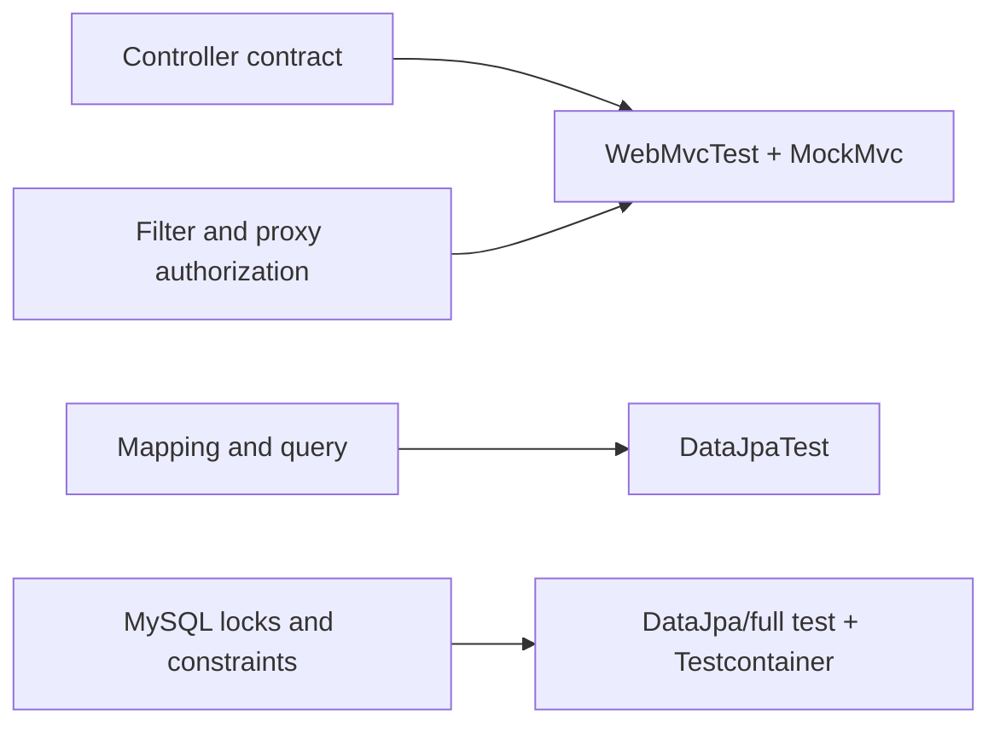

---
title: Spring MVC Repository And Security Tests
description: Spring Boot 4 MVC and Data JPA slices, MockMvc, security filters and method proxies, persistence constraints, transactions, locking, and production-dialect evidence.
difficulty: Advanced
page_type: Testing
status: Implemented
learning_objectives:
  - Distinguish standalone MockMvc, MVC slices, Data JPA slices, and full-context tests
  - Prove security at filter, URL, method-proxy, and ownership boundaries
  - Test persistence mappings and concurrency using the correct database evidence
technologies: [Spring Boot 4, MockMvc, Spring Security Test, Data JPA, MySQL]
last_reviewed: "2026-07-13"
---

# Spring MVC Repository And Security Tests

<DocLabels items={[
  {label: 'Advanced', tone: 'advanced'},
  {label: 'Spring-specific slices', tone: 'production'},
  {label: 'Shopverse current', tone: 'shopverse'},
]} />

Controller tests, MockMvc, repository tests, Spring test annotations, context loading, and security tests.

<DocCallout type="tip" title="Prove one Spring boundary at a time">
Use standalone MockMvc for explicitly installed MVC pieces, `@WebMvcTest` for
Boot MVC/security wiring, and `@DataJpaTest` for persistence. Use Testcontainers
when the claim depends on MySQL dialect, locking, migration, or index behavior.
</DocCallout>



Back to [Spring Boot Testing](../SPRING-BOOT-TESTING.md).

## Controller Tests

Controller tests verify:

- route and HTTP method;
- request binding;
- Jakarta Validation;
- response status and JSON;
- exception mapping;
- security rules where included;
- delegation to the service boundary.

### Standalone MockMvc

Shopverse User Service currently demonstrates:

```java
@ExtendWith(MockitoExtension.class)
class UserControllerTest {

    @Mock
    UserService userService;

    @Mock
    UserAddressService userAddressService;

    MockMvc mockMvc;

    @BeforeEach
    void setUp() {
        mockMvc = MockMvcBuilders
                .standaloneSetup(new UserController(userService, userAddressService))
                .setControllerAdvice(new GlobalExceptionHandler())
                .setValidator(validator)
                .build();
    }
}
```

Advantages:

- very fast;
- explicit controller/advice/validator setup;
- no application context.

Limitations:

- does not prove normal MVC auto-configuration;
- filters and security are absent unless explicitly added;
- mapper configuration can differ from the application.

### MVC Slice

Use a Spring MVC test slice when framework wiring matters:

```java
@WebMvcTest(UserController.class)
class UserControllerWebMvcTest {

    @Autowired
    MockMvc mockMvc;

    @MockitoBean
    UserService userService;
}
```

`@WebMvcTest` loads MVC-related components rather than the entire application.
Use `@MockitoBean` to replace service collaborators in the Spring context.

Choose standalone setup for a narrow unit-style controller test and
`@WebMvcTest` for MVC configuration, converters, filters, or security behavior.


## MockMvc Example

```java
mockMvc.perform(post("/api/v1/users")
                .contentType(MediaType.APPLICATION_JSON)
                .content(objectMapper.writeValueAsString(request)))
        .andExpect(status().isCreated())
        .andExpect(jsonPath("$.success").value(true))
        .andExpect(jsonPath("$.data.username").value("ahmed"));

verify(userService).createUser(any(CreateUserRequest.class));
```

Invalid input:

```java
mockMvc.perform(post("/api/v1/users")
                .contentType(MediaType.APPLICATION_JSON)
                .content(invalidJson))
        .andExpect(status().isBadRequest());

verify(userService, never()).createUser(any());
```


## Repository Tests

Use `@DataJpaTest` for:

- entity mappings;
- derived/custom queries;
- constraints;
- entity graphs and fetch behavior;
- optimistic locking;
- auditing when imported/configured;
- database-specific behavior when paired with the right database.

```java
@DataJpaTest
class OrderRepositoryTest {

    @Autowired
    OrderRepository repository;

    @Test
    void findsOrderByIdempotencyKey() {
        repository.saveAndFlush(order);

        assertThat(repository.findWithItemsByIdempotencyKey("checkout-1"))
                .isPresent();
    }
}
```

An H2 repository test is useful for generic JPA behavior but cannot prove every
MySQL detail. Use Testcontainers for dialect, locking, migration, index, and
constraint behavior that matters in production.

Tests managed by Spring may roll back automatically. Call `flush()` when the
test must surface a database constraint before the test ends.


## Spring Test Annotations

| Annotation | Use |
|---|---|
| `@SpringBootTest` | full application context |
| `@WebMvcTest` | MVC/controller slice |
| `@DataJpaTest` | JPA/repository slice |
| `@JsonTest` | JSON mapper and serialization slice |
| `@RestClientTest` | HTTP client slice |
| `@JdbcTest` | JDBC-focused slice |
| `@AutoConfigureMockMvc` | add MockMvc to a Boot test |
| `@ActiveProfiles` | select test profiles |
| `@TestPropertySource` | add test property sources |
| `@DynamicPropertySource` | register runtime-generated properties |
| `@Sql` | execute SQL before/after tests |
| `@DirtiesContext` | discard a modified cached context |
| `@Transactional` | run test in a test-managed transaction |
| `@MockitoBean` | replace a Spring bean with a Mockito mock |
| `@WithMockUser` | establish a mock security identity |

Use `@SpringBootTest` only when full wiring is the behavior being tested.
Application contexts are cached between compatible tests, but differing
properties or `@DirtiesContext` reduce reuse and increase runtime.


## Context Load Tests

```java
@SpringBootTest(properties = {
        "spring.cloud.config.enabled=false",
        "eureka.client.enabled=false"
})
class ApplicationTests {

    @Test
    void contextLoads() {
    }
}
```

This proves that a configured context can start. It does not prove business
behavior and should not be the majority of the suite.

Disable or replace external dependencies deliberately. Do not let a context
test accidentally call Config Server, Eureka, JWKS, Kafka, or a real database.


## Security Tests

Spring Security test support:

```java
@Test
@WithMockUser(username = "alice", roles = "CUSTOMER")
void customerCanEnterTheOwnedTimelineRoute() throws Exception {
    mockMvc.perform(get("/api/v1/orders/42/timeline"))
            .andExpect(status().isOk());
}
```

Required authorization scenarios:

- owner allowed;
- different customer denied;
- administrator allowed;
- missing authentication denied;
- invalid/expired token denied at resource-server boundary;
- authority/claim mapping tested separately.

Direct method tests prove method-security proxies only when the tested bean is
obtained from a Spring context. Calling `new Controller(...)` bypasses those
proxies.

## Shopverse Current And Proposed Evidence

<DocCallout type="shopverse" title="Current: fast standalone MVC and focused repository tests">
`UserControllerTest` installs advice and validation explicitly and proves success
plus field errors. Repository tests cover idempotency-key lookup. These tests are
valuable but do not by themselves prove deployed security chains, Boot's Jackson
mapper, MySQL locking, or Liquibase behavior.
</DocCallout>

<DocCallout type="production" title="Proposed: add two Boot 4 slices and one real-dialect concurrency test">
Add a `spring-boot-starter-webmvc-test` slice for User Service's Basic/JWT chain
selection and public error JSON. Add a focused Data JPA slice for mappings and
queries. Use the MySQL Testcontainer for the concurrent idempotency-key and lock
behavior that an embedded database cannot prove.
</DocCallout>

## Expandable Interview Checks

<ExpandableAnswer title="What does standalone MockMvc not prove?">

It does not load normal Boot MVC auto-configuration, filters, security, mapper
customization, or Spring proxies unless each is installed explicitly.

</ExpandableAnswer>

<ExpandableAnswer title="Why call saveAndFlush in a repository constraint test?">

Persistence errors can be deferred until flush or transaction completion.
Flushing forces SQL and surfaces the constraint inside the assertion boundary.

</ExpandableAnswer>

<ExpandableAnswer title="Can WithMockUser prove JWT decoding?">

No. It establishes a test security identity. JWT decoder, signature, claim, and
authority-conversion behavior needs resource-server configuration and token tests.

</ExpandableAnswer>

## Official References

- [Spring Boot MVC tests](https://docs.spring.io/spring-boot/reference/testing/spring-boot-applications.html#testing.spring-boot-applications.spring-mvc-tests)
- [Spring Boot Data JPA tests](https://docs.spring.io/spring-boot/reference/testing/spring-boot-applications.html#testing.spring-boot-applications.data-jpa-tests)
- [Spring Security servlet testing and MockMvc support](https://docs.spring.io/spring-security/reference/servlet/test/index.html)

## Recommended Next

<TopicCards items={[
  {title: 'Test slices and context cache', href: '/spring/testing/SPRING-TEST-SLICES-CONTEXT-CACHE', description: 'Understand which Boot 4 module loads the slice and how contexts are reused.', icon: 'layers', tags: ['Boot 4', 'Cache']},
  {title: 'Integration and Testcontainers', href: '/spring/testing/INTEGRATION-TESTCONTAINERS', description: 'Move database and Kafka claims onto real infrastructure.', icon: 'boxes', tags: ['MySQL', 'Kafka']},
]} />


