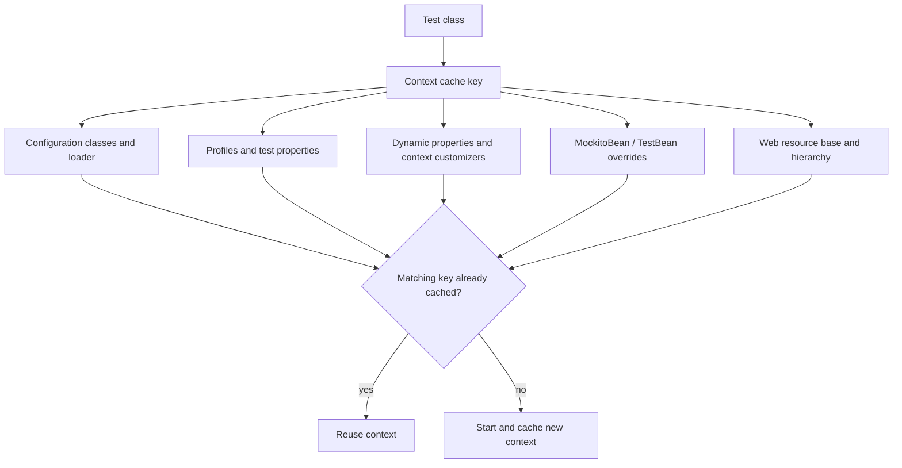

# Spring Test Slices And TestContext Cache

<DocLabels items={[
  {label: 'Advanced', tone: 'advanced'},
  {label: 'Suite performance', tone: 'production'},
  {label: 'Shopverse current', tone: 'shopverse'},
]} />

Spring TestContext loads and caches application contexts for compatible tests.
Boot test slices narrow auto-configuration and component scanning so a test can
prove one framework boundary without paying for the entire service.

<DocCallout type="tip" title="A slice is a dependency boundary">
Choose `@WebMvcTest`, `@DataJpaTest`, `@JsonTest`, `@RestClientTest`, or another
slice because its included infrastructure is the behavior under test. Importing
large application configurations until a slice resembles `@SpringBootTest`
removes its diagnostic value.
</DocCallout>

## Boot 4 Focused Test Modules

Spring Boot 4 exposes focused test annotations from focused modules:

| Claim | Annotation | Focused module/starter |
|---|---|---|
| MVC mapping, conversion, advice, filters | `@WebMvcTest` | `spring-boot-webmvc-test` / `spring-boot-starter-webmvc-test` |
| JPA mapping and repositories | `@DataJpaTest` | `spring-boot-data-jpa-test` / `spring-boot-starter-data-jpa-test` |
| JSON mapper contract | `@JsonTest` | JSON test support selected by Boot |
| imperative REST client adapter | `@RestClientTest` | `spring-boot-restclient-test` |
| reactive WebClient adapter | `@WebClientTest` | `spring-boot-webclient-test` |
| complete Boot context | `@SpringBootTest` | `spring-boot-test` plus application dependencies |

`spring-boot-starter-test` supplies common JUnit, Spring Test, AssertJ, Mockito,
JSON assertion, and Awaitility libraries. Focused starters/modules provide the
technology-specific test auto-configuration. Follow Boot dependency management.

## Context Cache Identity



Small differences in active profiles, inline properties, dynamic properties, or
bean overrides create different keys. Even inconsistent `@MockitoBean` field
qualifiers can fragment reuse.

## Cache Diagnostics

Enable cache logging when suite startup grows:

```properties
logging.level.org.springframework.test.context.cache=DEBUG
```

Inspect hit/miss counts, cache size, and eviction. The cache is static within the
test process; fork-per-test execution prevents reuse. The default maximum is
bounded, so excessive unique contexts can evict useful ones.

Spring Framework's context failure threshold defaults to one attempt per failing
cache key. Repeated tests requesting that same broken context are skipped quickly
instead of restarting it. Diagnose the first root failure; raising the threshold
does not fix configuration.

## Bean Overrides And Test Configuration

```java
@WebMvcTest(UserController.class)
class UserControllerWebMvcTest {

    @Autowired MockMvc mockMvc;

    @MockitoBean UserService userService;
    @MockitoBean UserAddressService userAddressService;
}
```

Use consistent override field names and qualifiers across tests that should share
a context. Set `enforceOverride = true` when accidentally creating a new mock bean
would hide missing application wiring.

Use `@TestConfiguration`, `@TestBean`, or `@Import` for deliberate test-only
collaborators. Avoid replacing the framework component whose behavior the slice is
supposed to prove.

## Dynamic Infrastructure Properties

`@DynamicPropertySource` can register container endpoints before context startup.
Different dynamic-property declarations contribute to context identity. When an
application context depends on a Testcontainer lifecycle, ensure the container
outlives every test that can reuse that cached context.

Spring Boot service connections can reduce manual property mapping when the
`spring-boot-testcontainers` module is present. Shopverse currently uses explicit
Testcontainers dependencies and dynamic properties in its integration source set;
document a migration before assuming `@ServiceConnection` is configured.

## DirtiesContext

`@DirtiesContext` removes and closes a context because a test changed singleton or
container state. It is not a generic flaky-test fix. Frequent use destroys cache
reuse and can conceal shared-state design problems.

Prefer resetting owned application state, isolating mutable collaborators, or
choosing a narrower slice. Use `@DirtiesContext` only when the context itself is
genuinely no longer safe to reuse.

## Shopverse Current And Proposed Evidence

<DocCallout type="shopverse" title="Current: common Boot starter plus selected focused support">
Shopverse service conventions use Boot `4.0.6` and JUnit Platform. Services depend
on `spring-boot-starter-test`; User Service additionally declares
`spring-boot-starter-webmvc-test`. Existing context-load tests disable Config
Server and Eureka explicitly to avoid accidental external calls.
</DocCallout>

<DocCallout type="production" title="Proposed: baseline cache keys and startup cost in CI">
Enable TestContext cache DEBUG logs in a diagnostic job, group unique keys by
profiles/properties/overrides, and record context startup contribution by service.
Standardize composed test annotations and bean override names before increasing
forks or hardware.
</DocCallout>

## Diagnostic Checklist

- Find the first context failure rather than downstream failure-threshold messages.
- Compare profiles, properties, dynamic sources, and bean overrides between tests.
- Confirm the build does not fork so aggressively that cache reuse disappears.
- Audit `@DirtiesContext` and explain each use.
- Ensure cached contexts do not reference stopped containers.
- Disable external integrations through owned test configuration, not broad mocks.
- Measure before merging slices into one full context.

## Expandable Interview Checks

<ExpandableAnswer title="Why can two similar Spring tests start different contexts?">

Their cache keys can differ through configuration classes, profiles, inline or
dynamic properties, context customizers, bean overrides, hierarchy, or web setup.

</ExpandableAnswer>

<ExpandableAnswer title="Why can more Gradle forks make Spring tests slower?">

The TestContext cache is static inside one process. Separate forks cannot share
it, so each process may repeat expensive application-context startup.

</ExpandableAnswer>

<ExpandableAnswer title="Should DirtiesContext be used to fix order-dependent tests?">

Only when a test genuinely corrupts the application context. Otherwise isolate or
reset the owned mutable state; routinely discarding contexts hides the cause and
slows the suite.

</ExpandableAnswer>

## Official References

- [Spring Boot testing Spring applications](https://docs.spring.io/spring-boot/reference/testing/spring-boot-applications.html)
- [Spring TestContext caching](https://docs.spring.io/spring-framework/reference/testing/testcontext-framework/ctx-management/caching.html)
- [Context failure threshold](https://docs.spring.io/spring-framework/reference/testing/testcontext-framework/ctx-management/failure-threshold.html)
- [`@MockitoBean` and `@MockitoSpyBean`](https://docs.spring.io/spring-framework/reference/testing/annotations/integration-spring/annotation-mockitobean.html)

## Recommended Next

<TopicCards items={[
  {title: 'MVC, repository, and security tests', href: '/spring/testing/SPRING-MVC-REPOSITORY-SECURITY-TESTS', description: 'Apply slices to web, security, and persistence contracts.', icon: 'security', tags: ['WebMvcTest', 'DataJpaTest']},
  {title: 'Integration and Testcontainers', href: '/spring/testing/INTEGRATION-TESTCONTAINERS', description: 'Manage real dependency and cached-context lifecycles together.', icon: 'boxes', tags: ['MySQL', 'Kafka']},
]} />
