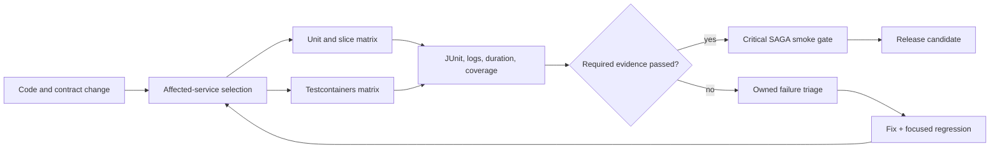

# Test CI Reliability Operations

<DocLabels items={[
  {label: 'Architect', tone: 'advanced'},
  {label: 'CI reliability', tone: 'production'},
  {label: 'Shopverse current', tone: 'shopverse'},
]} />

Fast CI is useful only when required evidence still runs and failures remain
diagnosable. Optimize selection, sharding, cache reuse, and infrastructure
lifecycle together; raw parallelism can increase contention and flakiness.

<DocCallout type="mistake" title="A retry is diagnostic evidence, not a pass policy">
If the first run fails and an automatic rerun passes, the build discovered
nondeterminism. Record both attempts and keep the risk visible. Silent retry-until-
green converts defects into false confidence.
</DocCallout>

## Delivery Evidence Flow

## Selection And Sharding

Shopverse CI already derives service matrices from changed paths. Keep a fallback
for shared build logic, platform modules, schemas, or infrastructure changes that
affect multiple services.

Shard by historical duration and resource class, not test count alone. A shard
with three Testcontainers classes can cost more than hundreds of unit tests.

Account for:

- Spring context cache reuse within a process;
- container image pull and startup;
- Docker, CPU, memory, ports, and database connections;
- static state and singleton external resources;
- test ordering assumptions that must be removed, not preserved;
- maximum runner and service quotas.

Avoid splitting classes with the same expensive context across many forks unless
measured wall-clock improvement exceeds repeated startup cost.

## Shopverse Current Pipeline

<DocCallout type="shopverse" title="Current: service matrices and separate infrastructure gates">
`.github/workflows/ci.yml` runs unit tests per affected service, uploads failed
reports, runs Testcontainers `integrationTest` for selected services, and gates a
Compose-based authenticated checkout SAGA smoke test. Gradle commands cap workers
at two. The repository test strategy assigns separate time budgets to unit and
integration tasks.
</DocCallout>

The build-logic integration task disables JUnit parallel execution and uses one
fork. That is a conservative isolation baseline; increase concurrency only after
resource and state isolation are demonstrated.

<DocCallout type="production" title="Proposed: publish duration and context-startup evidence">
Upload JUnit XML for every task, not only HTML on failure. Track class duration,
queue duration, context cache miss/startup, container startup, retry outcome, and
runner utilization. Rebalance matrices from percentiles while keeping one stable
service owner for each shard.
</DocCallout>

## Quarantine Policy

A quarantined test still represents unverified behavior. Require:

- issue and owner;
- first failing commit and failure signature;
- production risk and compensating coverage;
- quarantine mechanism that keeps it visible in reports;
- expiry date and escalation;
- fix or deletion decision;
- evidence that the test, not the product, is nondeterministic.

Do not quarantine security, payment, migration, idempotency, or data-integrity
tests without an explicit release-risk decision. Never use `@Disabled` with no
reason and owner.

## Failure Triage

Classify before rerunning:

| Signal | First evidence |
|---|---|
| assertion mismatch | expected/actual domain and contract values |
| context startup | first cause, cache key, condition report, missing dependency |
| timeout | thread dump, queue/pool state, polling diagnostics, elapsed phases |
| Testcontainer | Docker health, image, logs, mapped ports, resource pressure |
| Kafka | topic/group identity, offsets, consumer assignment, duplicate state |
| infrastructure | runner/network/service status separated from product failure |
| order-dependent | randomized order/seed, shared state, leaked threads/resources |

Preserve the first failure artifact. A later rerun cannot reconstruct the state
that made the original attempt fail.

## Incident To Regression Workflow

1. State the violated production invariant and user impact.
2. Capture the smallest trustworthy evidence: trace, message, row state, payload,
   timeout phase, or security decision.
3. Add the lowest-scope test that reproduces the actual mechanism.
4. Add a broader contract/integration test only when infrastructure collaboration
   was essential.
5. Verify the test fails before the fix and passes after it.
6. Link the incident, code change, test, metric, and rollback condition.
7. Add mutation or negative variation when a weak assertion could pass accidentally.

An E2E reproduction alone is often slow and opaque. Keep it only when it protects
a critical journey; preserve a focused regression near the failure owner too.

## CI Quality Gates

- Required tasks cannot be silently skipped when Docker or credentials are absent.
- Failed and skipped counts, durations, and reports are retained.
- No unbounded retries or sleeps.
- Timeouts leave thread/container/service diagnostics.
- Coverage gates are risk-based and combined with assertion/mutation evidence.
- Contract diffs and consumer compatibility are release inputs.
- Quarantine count and age are visible SLOs for the test system.
- A red build has an owner and a documented stop-the-line/escalation rule.

## Expandable Interview Checks

<ExpandableAnswer title="Why can adding more CI shards make a Spring suite slower?">

Separate processes cannot share the static TestContext cache and may repeat
application-context and container startup while competing for the same runner
resources.

</ExpandableAnswer>

<ExpandableAnswer title="When is automatic test retry acceptable?">

As bounded diagnostic collection that records the original failure and rerun
outcome. It should not silently convert a flaky required test into a green gate.

</ExpandableAnswer>

<ExpandableAnswer title="What makes an incident regression test trustworthy?">

It reproduces the violated mechanism, fails before the fix, passes after it,
asserts the user-relevant invariant, and runs at the smallest boundary that still
contains the cause.

</ExpandableAnswer>

## Official References

- [JUnit test execution](https://docs.junit.org/current/user-guide/#running-tests)
- [Spring TestContext caching](https://docs.spring.io/spring-framework/reference/testing/testcontext-framework/ctx-management/caching.html)
- [Gradle test reporting](https://docs.gradle.org/current/userguide/java_testing.html#test_reporting)

## Recommended Next

<TopicCards items={[
  {title: 'Async and flaky-test prevention', href: '/spring/testing/ASYNC-CONTRACT-FLAKY-TESTS', description: 'Remove nondeterministic waits and shared state before adding CI retries.', icon: 'route', tags: ['Awaitility', 'Isolation']},
  {title: 'Coverage and test quality', href: '/spring/testing/COVERAGE-TEST-QUALITY', description: 'Use coverage and mutation evidence as risk signals in delivery gates.', icon: 'gauge', tags: ['JaCoCo', 'PIT']},
]} />
