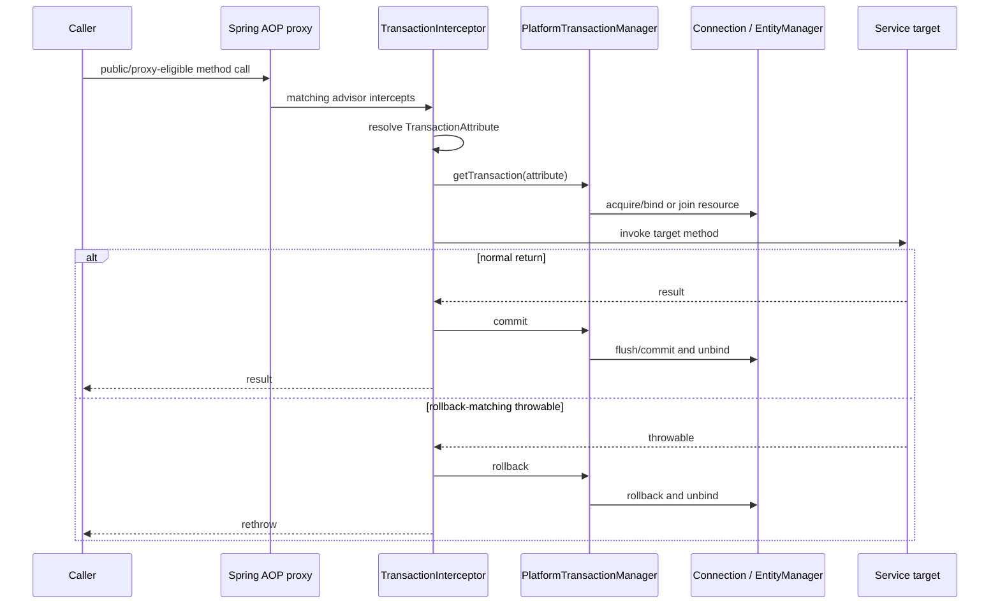
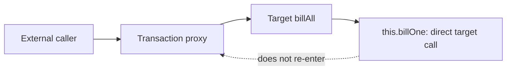

# Spring Transaction Proxy Mechanics And Boundary Design

`@Transactional` is transaction metadata. It does not independently open a database
transaction. Spring must discover the metadata, publish an advised bean, receive a call
through that proxy and delegate to a transaction manager that owns the physical resource.

## End-To-End Execution



The main participants are:

1. `@EnableTransactionManagement` or Boot auto-configuration registers transaction advice.
2. An auto-proxy creator examines Spring-managed beans.
3. A transaction advisor matches eligible methods carrying resolved transaction metadata.
4. `TransactionInterceptor` selects the `PlatformTransactionManager`.
5. The manager starts, joins, suspends or rejects a transaction according to propagation.
6. JDBC/JPA resources and synchronization are associated with the current execution context.
7. On method exit, the interceptor applies rollback rules, then commits or rolls back.

For JPA, a flush may send SQL before commit. Flush is not durability; commit can still fail.

## Method Eligibility Matrix

The safest portable application convention is to place `@Transactional` on concrete public
service methods invoked from another bean. Other cases depend on proxy mechanism and Spring
version details.

| Method/call shape | Proxy-mode result | Why |
|---|---|---|
| public instance method called from another bean | normally intercepted | caller invokes the published proxy |
| public method called through `this` | not newly intercepted | call stays on target and never re-enters proxy |
| private method | not a useful proxy transaction entry point | private methods cannot be overridden/exposed by normal Spring proxies |
| static method | not intercepted | it belongs to the class, not a proxied bean instance/virtual dispatch |
| final method with class-based proxy | cannot be overridden, so not advised through subclass interception | subclass proxy cannot replace final dispatch |
| final implementation invoked through a JDK interface proxy | interface call may be intercepted | JDK proxy handles the interface call without subclassing the target method |
| protected/package-visible method | class-based proxy support is version/package dependent; not exposed by JDK interface proxy | requires an overridable class-proxy method and compatible visibility |
| constructor | not an ordinary call on the fully published proxy | target construction happens before callers receive proxy identity |
| `@PostConstruct` method | unsafe as a new proxy transaction boundary | callback runs during bean initialization, commonly on the target before normal proxy use |
| method on object created with `new` | not intercepted | object did not pass through Spring proxy infrastructure |
| method executed on another thread | caller transaction does not move automatically | imperative resource binding is execution-context/thread associated |

Do not design around obscure visibility allowances. Public application-service methods give
clear boundaries, stable tests and consistent behavior across proxy strategies.

## Why Private Methods Do Not Work

```java
@Service
class OrderService {

    public void place(Order order) {
        persist(order);
    }

    @Transactional
    private void persist(Order order) {
        repository.save(order);
    }
}
```

The proxy exposes/intercepts eligible calls before invoking the target. An external caller
cannot call the private method, and a subclass proxy cannot override it. The call from
`place()` is also a direct target call. Therefore the annotation does not establish the
intended boundary.

### Correct design: put the boundary on the public use case

```java
@Service
class OrderService {

    @Transactional
    public OrderId place(CreateOrder command) {
        Order order = Order.create(command);
        repository.save(order);
        outbox.save(OrderCreated.from(order));
        return order.id();
    }

    private Money calculateTotal(CreateOrder command) {
        return command.lines().stream()
                .map(OrderLineCommand::total)
                .reduce(Money.ZERO, Money::add);
    }
}
```

Private helpers participate because the already-started public transaction remains active;
they do not need their own annotation.

## Why Static Methods Do Not Work

```java
@Transactional
public static void updateInventory(...) { }
```

Spring AOP proxies represent bean instances. Static invocation is resolved against a class
and does not dispatch through that instance proxy. Move state-changing work into a managed
service or wrap the static computation inside an instance transaction boundary.

```java
@Service
class InventoryApplicationService {

    @Transactional
    public void adjust(Adjustment command) {
        Quantity normalized = InventoryMath.normalize(command.quantity()); // static pure helper
        repository.adjust(command.sku(), normalized);
    }
}
```

Static pure functions are fine; transaction ownership belongs to the instance use case.

## Why Self-Invocation Does Not Apply New Metadata

```java
@Service
class BillingService {

    @Transactional
    public void billAll(List<Invoice> invoices) {
        for (Invoice invoice : invoices) {
            billOne(invoice); // direct target call
        }
    }

    @Transactional(propagation = Propagation.REQUIRES_NEW)
    public void billOne(Invoice invoice) { }
}
```

The first external call crosses the proxy and starts the outer transaction. Inside the
target, `this.billOne(...)` is an ordinary Java call. It does not return to the proxy, so
the `REQUIRES_NEW` metadata is never evaluated. `billOne` runs inside the existing outer
transaction.



If the outer method had no transaction, the self-invoked method would run without the
intended transaction.

## Correct Ways To Create Transaction Boundaries

### Pattern 1: Transactional public application service

Put one local transaction around the database invariant/use case:

```java
@Service
class CheckoutService {

    @Transactional
    public CheckoutResult checkout(CheckoutCommand command) {
        Order order = orderRepository.getRequired(command.orderId());
        order.confirm(command.expectedVersion());
        outboxRepository.save(OutboxEvent.orderConfirmed(order));
        return CheckoutResult.from(order);
    }
}
```

This is the default recommendation. The controller is outside the transaction; repositories
and private domain helpers participate inside it.

### Pattern 2: Extract a collaborator for distinct propagation

```java
@Service
class InvoiceBatchService {
    private final SingleInvoiceService singleInvoiceService;

    public void process(List<InvoiceId> ids) {
        ids.forEach(singleInvoiceService::processOne);
    }
}

@Service
class SingleInvoiceService {

    @Transactional(propagation = Propagation.REQUIRES_NEW)
    public void processOne(InvoiceId id) {
        // one independent physical transaction per invoice
    }
}
```

The cross-bean call enters the collaborator's proxy. This also creates a meaningful business
responsibility and makes propagation tests explicit.

`REQUIRES_NEW` holds/acquires an independent connection while any outer transaction is
suspended. Size the pool and bound concurrency accordingly.

### Pattern 3: Use `TransactionTemplate` for a lexical boundary

```java
@Service
class ImportService {
    private final TransactionTemplate transactionTemplate;

    void importRows(List<Row> rows) {
        for (Row row : rows) {
            transactionTemplate.executeWithoutResult(status -> {
                try {
                    repository.save(map(row));
                } catch (InvalidRowException exception) {
                    status.setRollbackOnly();
                    throw exception;
                }
            });
        }
    }
}
```

`TransactionTemplate` is useful when begin/end must be visible inside a loop, callback or
non-public implementation detail. It avoids proxy self-invocation, but still requires a
correctly configured manager and disciplined error handling.

### Pattern 4: Low-level manager API

`PlatformTransactionManager` can begin/commit/rollback explicitly. Prefer
`TransactionTemplate` unless infrastructure code needs direct status/control; manual paths
must always roll back and release resources correctly.

### Pattern 5: Reactive transaction boundary

Imperative `@Transactional` with a reactive manager uses Reactor context rather than a
thread-local JDBC assumption. `TransactionalOperator` makes the reactive scope explicit:

```java
return transactionalOperator.transactional(
        repository.save(order)
                .then(outboxRepository.save(event))
);
```

The subscribed reactive chain must remain inside the operator. Calling `block()` or escaping
work into an unrelated subscription breaks the intended execution model.

### Pattern 6: AspectJ weaving—specialized option

Spring transaction management supports an AspectJ mode that weaves transaction behavior
into class bytecode rather than relying on calls through a proxy. It can address local-call
interception, but adds build/load-time weaving, tooling, debugging and operational complexity.
Use it only when the team deliberately owns that model; do not introduce it merely to avoid
extracting a collaborator.

### Discouraged workarounds

- self-injecting the bean to call its own proxy;
- `AopContext.currentProxy()`;
- looking up the bean from `ApplicationContext` inside business methods.

They can work in constrained situations but couple domain code to proxy plumbing, obscure
call graphs and make tests/lifecycle behavior harder.

## Choosing The Correct Boundary

A transaction should protect one local consistency invariant and remain short.

```text
validate command without holding locks where possible
  -> begin transaction
  -> load authoritative state
  -> re-check invariant
  -> modify state
  -> write durable outbox/audit state
  -> commit
  -> perform remote/asynchronous work outside transaction
```

Avoid holding a database transaction across:

- HTTP/gRPC calls;
- waiting for user input;
- large file transfer or CPU-heavy generation;
- sleeps/backoff;
- Kafka publication assumed to be atomic with the database;
- unbounded loops or batch sizes.

For DB plus Kafka/service workflows, use an outbox, saga and idempotent consumer rather than
claiming the local annotation creates distributed atomicity.

## Rollback Behavior

By default, Spring transaction rules roll back for `RuntimeException` and `Error`, not every
checked exception. Configure a checked business/technical exception explicitly when needed:

```java
@Transactional(rollbackFor = InventoryImportException.class)
public void importInventory(Path file) throws InventoryImportException { }
```

Spring evaluates the throwable leaving the intercepted method. If code catches and suppresses
it, the interceptor sees a normal return. If an inner participating scope marked the shared
transaction rollback-only and the outer catches the exception, commit can throw
`UnexpectedRollbackException`.

Do not return an async handle from an imperative transactional method and assume later work
remains in the transaction. The interceptor normally completes the transaction when the
method invocation returns.

## Propagation Boundary Examples

| Requirement | Candidate | Caution |
|---|---|---|
| all repository changes succeed/fail together | `REQUIRED` | default shared physical transaction |
| each batch item commits independently | cross-bean `REQUIRES_NEW` or template per item | extra connections and partial batch success |
| method must never run outside a transaction | `MANDATORY` | fails immediately without caller transaction |
| non-transactional remote call around DB work | split pre/post step or `NOT_SUPPORTED` deliberately | suspended context and consistency design |
| partial rollback using savepoint | `NESTED` when manager/resource support it | not an independent commit |

## Testing The Boundary

Do not only assert that an annotation exists. Test observable commit behavior through the
real proxy.

1. Call the public Spring bean, never instantiate it manually.
2. Make the method perform at least two related writes.
3. Fail after the first write and verify neither becomes visible after transaction completion.
4. Test the checked-exception policy explicitly.
5. For `REQUIRES_NEW`, use separate proxied beans and verify independent commit/rollback.
6. Avoid a test-level transaction when proving real commit visibility.
7. Run concurrency/isolation tests against the production database engine with separate
   threads and physical connections.

```java
@SpringBootTest
class CheckoutTransactionIT {

    @Autowired CheckoutService checkoutService;
    @Autowired OrderRepository orders;
    @Autowired OutboxRepository outbox;

    @Test
    void rollsBackOrderAndOutboxTogether() {
        assertThatThrownBy(() -> checkoutService.checkout(failingCommand()))
                .isInstanceOf(PricingException.class);

        assertThat(orders.findById(orderId())).isEmpty();
        assertThat(outbox.findAll()).isEmpty();
    }
}
```

## Production Diagnosis

| Symptom | Prove |
|---|---|
| annotation appears ignored | managed bean, proxy type, advisor, call path and visibility |
| partial database writes | actual transaction manager/resource, exception handling and autocommit |
| `UnexpectedRollbackException` | inner participant marked shared transaction rollback-only |
| pool exhaustion after propagation change | nested `REQUIRES_NEW`, concurrent calls and acquisition time |
| lazy-load failure outside service | persistence-context boundary and mapping timing |
| async code sees no transaction | thread/subscription boundary and transaction started inside task |
| remote side effect survived rollback | resource was never part of local database transaction |

## Interview Answers

**Does `@Transactional` work on private methods?** Not as a normal proxy entry point. Private
methods cannot be externally invoked or overridden by a subclass proxy, and internal calls
do not re-enter the proxy. Put the annotation on the public use-case method or use an explicit
`TransactionTemplate` boundary.

**Does it work on static methods?** No in Spring's instance-proxy model. Move state-changing
work into a managed instance service.

**Why does self-invocation fail?** Because `this.method()` invokes the target directly after
the caller has already crossed the proxy. The interceptor never sees the inner call, so its
transaction attributes/propagation are not applied.

**How should a new transaction boundary be added?** Prefer a public application-service
method called through another bean. For a genuinely distinct inner unit, extract a proxied
collaborator or use `TransactionTemplate`. Use AspectJ only as a deliberate platform choice.

## Official References

- [Spring declarative transaction annotations](https://docs.spring.io/spring-framework/reference/data-access/transaction/declarative/annotations.html)
- [Spring transaction propagation](https://docs.spring.io/spring-framework/reference/data-access/transaction/declarative/tx-propagation.html)
- [Spring AOP proxying mechanisms](https://docs.spring.io/spring-framework/reference/core/aop/proxying.html)
- [Spring programmatic transaction management](https://docs.spring.io/spring-framework/reference/data-access/transaction/programmatic.html)

