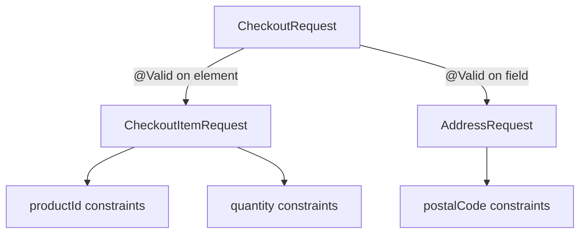

# Spring Bean Validation Fundamentals

<DocLabels items={[
  {label: 'Intermediate', tone: 'intermediate'},
  {label: 'Boundary validation', tone: 'production'},
  {label: 'Shopverse current', tone: 'shopverse'},
]} />

Jakarta Bean Validation declares structural rules close to a Java type. Spring
Boot supplies a provider through `spring-boot-starter-validation` and integrates
the resulting validator with MVC, method validation, and configuration binding.

<DocCallout type="mistake" title="A constraint supports specific Java types">
`@NotBlank` applies to character sequences, not `URI`, numbers, or arbitrary
objects. Use `@NotNull URI providerBaseUrl` after configuration binding, or keep
the source property as `@NotBlank String` and parse it deliberately.
</DocCallout>

## Core Constraint Semantics

| Constraint | Typical contract |
|---|---|
| `@NotNull` | reference must exist |
| `@NotBlank` | text must contain a non-whitespace character |
| `@NotEmpty` | collection, map, array, or text must contain an element |
| `@Size` | bounded text or container length |
| `@Positive`, `@Min`, `@Max` | numeric bounds |
| `@DecimalMin`, `@Digits` | decimal range and precision shape |
| `@Pattern` | bounded text format, not semantic authorization |
| `@Past`, `@Future` | temporal relationship to the validator clock |
| `@Email` | email-shaped input, not proof of mailbox ownership |
| `@AssertTrue` | boolean invariant exposed as a property |

Most constraints other than explicit null constraints consider `null` valid.
Compose `@NotNull` with a range or format constraint when absence is invalid.

```java
public record CreateProductRequest(
        @NotBlank @Size(max = 120) String name,
        @NotNull @Positive BigDecimal price,
        @NotBlank @Pattern(regexp = "[A-Z]{3}") String currency
) {
}
```

## Cascading Through An Object Graph

`@Valid` is a cascade marker, not a validation rule. It asks the validator to
traverse the referenced object and apply constraints declared there.



```java
public record CheckoutRequest(
        @NotEmpty
        @Size(max = 20)
        List<@Valid CheckoutItemRequest> items,

        @NotNull
        @Valid AddressRequest shippingAddress
) {
}
```

Without the nested `@Valid`, constraints inside the item or address can be
skipped. Container-element constraints can also target keys and values directly:

```java
public record PermissionRequest(
        @NotEmpty Set<@NotBlank String> permissions,
        Map<@NotBlank String, @Positive Integer> limits
) {
}
```

## MVC Request Bodies

```java
@PostMapping("/checkout")
OrderResponse checkout(@Valid @RequestBody CheckoutRequest request) {
    return orderService.checkout(request);
}
```

`@Valid` alone does not mean non-null. `@RequestBody` is required by default and
owns missing-body behavior; an explicit `@NotNull` constraint changes validation
mode and can participate in method validation. Keep the distinction visible when
mapping errors.

## Validation Layers

```text
HTTP decoding and binding
  -> structural Bean Validation
  -> service authorization and business invariants
  -> entity lifecycle validation when enabled
  -> database constraints and locking
```

Bean Validation can reject a negative quantity. The service must decide whether
the caller owns the cart and whether stock can be reserved. A unique database
constraint remains the race-safe guarantee for uniqueness.

<DocCallout type="shopverse" title="Current: Shopverse validates transport DTOs before service work">
`OrderController.checkout` applies `@Valid` to `CheckoutRequest` and constraints
to the idempotency header. `UserControllerTest` proves that an invalid user
request returns field errors and never invokes `UserService`.
</DocCallout>

<DocCallout type="production" title="Proposed: standardize constraint ownership">
Keep cheap deterministic shape rules on DTOs; keep ownership, inventory, account,
and duplicate-state checks in transactional services; keep database constraints
for concurrent integrity. Document the public error code for each boundary.
</DocCallout>

## Production Review

- Bound strings, collections, nesting, and uploads before expensive work.
- Keep regular expressions safe from catastrophic backtracking.
- Use a deterministic clock when testing temporal constraints.
- Do not include secrets or entire rejected values in messages.
- Localize messages through stable codes rather than parsing provider text.
- Keep request DTOs separate when create and update contracts materially differ.
- Test nested and container-element paths such as `items[0].quantity`.

## Expandable Interview Checks

<ExpandableAnswer title="Does Valid reject null by itself?">

No. It cascades into a value when one exists. Use the transport binding contract
or an explicit null constraint when absence is invalid.

</ExpandableAnswer>

<ExpandableAnswer title="Why can nested constraints be skipped?">

Validation does not traverse an arbitrary object graph automatically. Each field,
record component, collection element, or map value that must be traversed needs
the appropriate `@Valid` cascade marker.

</ExpandableAnswer>

<ExpandableAnswer title="Can Bean Validation replace a unique database constraint?">

No. An application check can race with another transaction. The database
constraint is the final concurrent guarantee; validation improves the earlier
client-facing failure path.

</ExpandableAnswer>

## Official References

- [Spring Bean Validation integration](https://docs.spring.io/spring-framework/reference/core/validation/beanvalidation.html)
- [Spring MVC validation](https://docs.spring.io/spring-framework/reference/web/webmvc/mvc-controller/ann-validation.html)
- [Jakarta Validation](https://jakarta.ee/specifications/bean-validation/)

## Recommended Next

<TopicCards items={[
  {title: 'Method and custom validation', href: '/spring/validation/METHOD-CUSTOM-GROUPED-CONFIGURATION-VALIDATION', description: 'Add service proxies, cross-field constraints, groups, sequences, and startup validation.', icon: 'layers', tags: ['Validated', 'Groups']},
  {title: 'Errors, testing, and production', href: '/spring/validation/VALIDATION-ERRORS-TESTING-PRODUCTION', description: 'Map each validation mode to its exception, public contract, and evidence.', icon: 'experiment', tags: ['Errors', 'Tests']},
]} />
