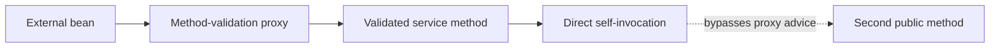

# Spring Method Custom Grouped And Configuration Validation

<DocLabels items={[
  {label: 'Advanced', tone: 'advanced'},
  {label: 'Proxy-aware', tone: 'production'},
  {label: 'Shopverse configuration', tone: 'shopverse'},
]} />

Method validation, custom constraints, groups, and configuration validation solve
different problems. Use each only when the simpler DTO constraint model cannot
express the required boundary clearly.

## Valid Versus Validated

Both annotations can ask Spring MVC to validate a bound request object, but they
have different ownership and capabilities.

| Concern | `@Valid` | `@Validated` |
|---|---|---|
| Declared by | Jakarta Validation | Spring Framework |
| Default-group request DTO validation | yes | yes |
| Select validation groups | no | yes, for example `@Validated(OnCreate.class)` |
| Cascade into a nested property | place `@Valid` on that property or type use | does not replace the nested `@Valid` cascade marker |
| Proxy-based service method validation | marks cascaded arguments; does not activate the proxy | class-level annotation commonly activates method-validation advice and can select groups |
| Modern Spring MVC method validation | direct constraints trigger built-in method validation | class-level use selects the older AOP-proxy path; remove it to use MVC's built-in Spring Framework 6.1+ path |

For a simple `@RequestBody`, prefer `@Valid`. Use `@Validated` when a genuine
group must be selected or when a non-MVC Spring bean intentionally uses
proxy-based method validation. Neither annotation makes nested validation happen
automatically: each nested boundary that must be traversed still needs `@Valid`.

<DocCallout type="mistake" title="Method validation is version and boundary dependent">
The common interview shortcut “`@Valid` cannot validate method parameters, while
`@Validated` can” is too broad. In Spring Framework 6.1+, MVC has built-in method
validation when constraints are declared directly on controller parameters or
return values. Service method validation still normally relies on a Spring proxy
activated with class-level `@Validated`.
</DocCallout>

## Version-Aware MVC Method Validation

Spring Framework 6.1 and later provides built-in MVC validation for controller
methods. Direct constraints on parameters or return values trigger method
validation and can raise `HandlerMethodValidationException`.

```java
@RestController
class ProductController {

    @GetMapping("/{id}")
    ProductResponse get(@PathVariable @Positive Long id) {
        return productService.get(id);
    }
}
```

<DocCallout type="production" title="Choose one controller validation mode">
For the MVC built-in mode added in Spring Framework 6.1, remove class-level
`@Validated` from the controller. Keeping it selects AOP proxy method validation
instead. Record the supported framework baseline and test the actual exception
and public error shape rather than mixing guidance from both modes.
</DocCallout>

`@Valid` by itself cascades and does not trigger method validation. A direct
constraint such as `@NotNull`, `@Positive`, or a return-value constraint does.

## Service Method Validation

Service beans still commonly use proxy-based validation:

```java
@Service
@Validated
class TransferService {

    public Receipt transfer(
            @NotBlank String account,
            @Positive BigDecimal amount,
            @Valid TransferOptions options
    ) {
        // Business operation
    }
}
```

The call must cross the Spring proxy. A direct call from one method to another on
the same instance bypasses method-validation advice. Move the validated operation
to another bean, validate explicitly, or redesign the boundary; proxy
self-injection hides ownership.



## Cross-Field Custom Constraints

Use a type-level constraint when a relationship spans fields:

```java
@ValidDateRange
public record PromotionRequest(
        @NotNull Instant startsAt,
        @NotNull Instant endsAt
) {
}
```

```java
final class DateRangeValidator
        implements ConstraintValidator<ValidDateRange, PromotionRequest> {

    @Override
    public boolean isValid(PromotionRequest value,
                           ConstraintValidatorContext context) {
        if (value == null || value.startsAt() == null || value.endsAt() == null) {
            return true;
        }
        return value.endsAt().isAfter(value.startsAt());
    }
}
```

Let `@NotNull` own missing fields; the custom validator owns only the relationship.
Validators should be stateless, thread-safe, deterministic, and cheap. Remote
calls and database queries belong in a service, where timeouts, transactions, and
failure policy are explicit.

## Groups And Sequences

Groups can select different constraint sets:

```java
interface OnCreate {}
interface OnUpdate {}

public record UserRequest(
        @Null(groups = OnCreate.class)
        @NotNull(groups = OnUpdate.class) Long id,
        @NotBlank(groups = {OnCreate.class, OnUpdate.class}) String username
) {
}
```

```java
@PostMapping
UserResponse create(
        @Validated(OnCreate.class) @RequestBody UserRequest request
) {
    return userService.create(request);
}
```

Separate create and update records are often clearer. Use groups when the shared
model is genuine and the phase distinction is stable. `@GroupSequence` can defer
an expensive group until cheap checks pass, but complex group graphs make failure
ownership hard to explain.

## Configuration Properties Validation

```java
@ConfigurationProperties("shopverse.payment")
@Validated
public record PaymentProperties(
        @NotNull URI providerBaseUrl,
        @NotNull Duration timeout,
        @DecimalMin("0.01") BigDecimal approvalLimit
) {
}
```

Invalid properties should fail startup before the service accepts traffic.
Typed binding already parses `URI` and `Duration`; apply constraints compatible
with those bound types.

<DocCallout type="shopverse" title="Current: Shopverse validates critical startup configuration">
Inventory properties use `@NotNull Duration reservationTtl` and a positive scan
delay. Payment properties validate the approval limit. Order Controller currently
has class-level `@Validated`; because the services use a modern Spring baseline,
the team should choose and test whether that controller remains proxy-validated
or migrates to MVC's built-in method-validation mode.
</DocCallout>

<DocCallout type="production" title="Proposed: add startup and proxy-boundary evidence">
Add application-context tests for missing and malformed configuration. Add one
external service-call test and one direct self-invocation test so method-validation
proxy behavior is understood before relying on it for a security or money rule.
</DocCallout>

## Expandable Interview Checks

<ExpandableAnswer title="Why can service method validation disappear during self-invocation?">

Proxy advice runs when a caller crosses the Spring proxy. A direct call on the
same object does not cross that proxy, so the method-validation interceptor does
not run.

</ExpandableAnswer>

<ExpandableAnswer title="Should a custom constraint query the database?">

Normally no. Validators should remain deterministic and cheap. Database-backed
business rules need transaction, timeout, concurrency, and error ownership in a
service; a database constraint remains the final race-safe guarantee.

</ExpandableAnswer>

<ExpandableAnswer title="When are validation groups preferable to separate DTOs?">

When one genuine model has stable validation phases and sharing improves clarity.
If create and update carry different fields or semantics, separate DTOs are
usually easier to evolve and test.

</ExpandableAnswer>

## Official References

- [Spring MVC validation](https://docs.spring.io/spring-framework/reference/web/webmvc/mvc-controller/ann-validation.html)
- [Spring method validation](https://docs.spring.io/spring-framework/reference/core/validation/beanvalidation.html#validation-beanvalidation-spring-method)
- [Spring Boot type-safe configuration properties](https://docs.spring.io/spring-boot/reference/features/external-config.html#features.external-config.typesafe-configuration-properties)

## Recommended Next

<TopicCards items={[
  {title: 'Validation fundamentals', href: '/spring/validation/BEAN-VALIDATION-FUNDAMENTALS', description: 'Review constraint and cascade semantics before adding proxy or group complexity.', icon: 'book', tags: ['Constraints', 'Valid']},
  {title: 'Errors, testing, and production', href: '/spring/validation/VALIDATION-ERRORS-TESTING-PRODUCTION', description: 'Map each validation mode to exception ownership and public evidence.', icon: 'experiment', tags: ['Exceptions', 'Tests']},
]} />
