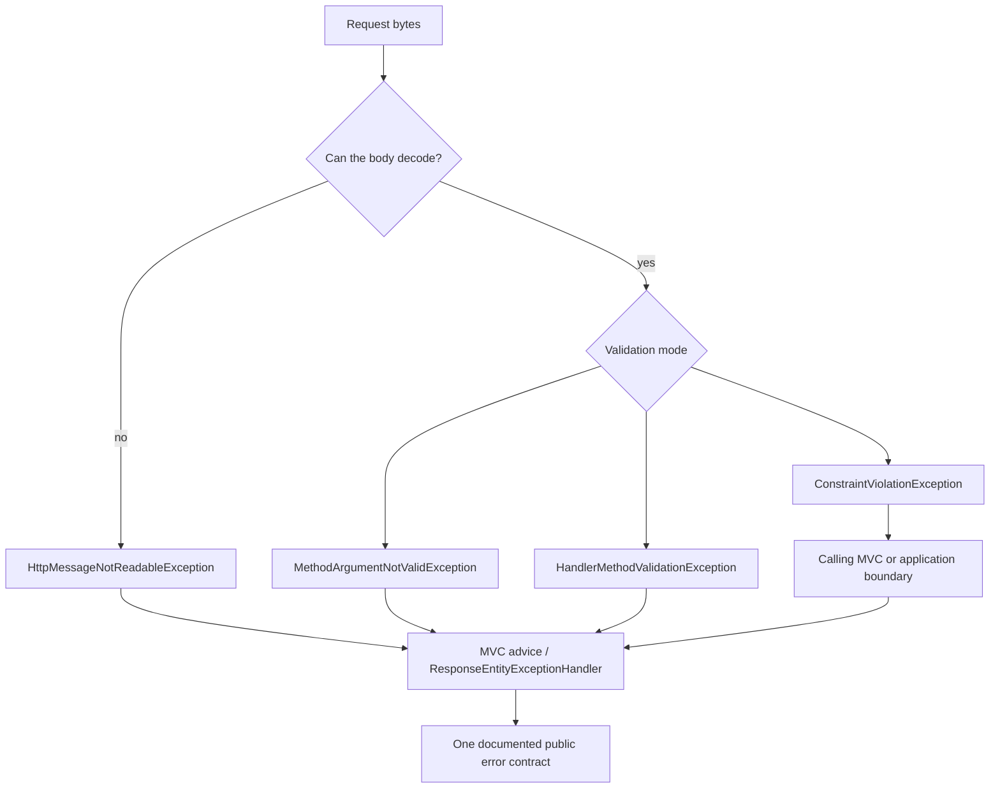

# Spring Validation Errors Testing And Production

<DocLabels items={[
  {label: 'Advanced', tone: 'advanced'},
  {label: 'Error ownership', tone: 'production'},
  {label: 'Shopverse current', tone: 'shopverse'},
]} />

Validation errors are not one exception. Request decoding, single-object
validation, controller method validation, service proxy validation, domain rules,
and database constraints enter different translation paths.

## Exception Ownership



| Condition | Typical exception | Owner |
|---|---|---|
| malformed or incompatible JSON | `HttpMessageNotReadableException` | MVC error contract |
| one `@Valid` body/model object | `MethodArgumentNotValidException` | MVC error contract |
| constraints across handler parameters/return | `HandlerMethodValidationException` | MVC error contract |
| proxy-validated service method | `ConstraintViolationException` | application boundary calling the service |
| business invariant | domain exception | service policy mapped at transport boundary |
| concurrent integrity conflict | database exception | transaction/service mapping with safe detail |

Spring MVC applications should handle both body and handler-method validation
exceptions because the controller signature determines which one is raised.

## Generic Spring And Shopverse Contracts

Spring Framework supports RFC 9457 through `ProblemDetail`, `ErrorResponse`, and
`ResponseEntityExceptionHandler`. A generic Spring guide can use:

```java
ProblemDetail problem = ProblemDetail.forStatus(HttpStatus.BAD_REQUEST);
problem.setTitle("Request validation failed");
problem.setProperty("fieldErrors", fieldErrors);
```

Shopverse also has a repository-specific `ApiErrorResponse`:

```java
public record ApiErrorResponse(
        int status,
        String message,
        LocalDateTime timestamp,
        Map<String, String> errors
) {
}
```

<DocCallout type="mistake" title="Do not present two shapes as one contract">
`ProblemDetail` is generic Spring/RFC guidance. `ApiErrorResponse` is a current
Shopverse transport type. A service must document which media type and schema it
actually returns; sharing a helper module does not make two JSON shapes identical.
</DocCallout>

## Current Shopverse Coverage And Gap

<DocCallout type="shopverse" title="Current: User Service translates several validation paths">
`GlobalExceptionHandler` delegates `MethodArgumentNotValidException` and
`ConstraintViolationException` to `ApiErrors`, and separately maps malformed JSON
and type mismatch. `UserControllerTest` asserts stable field messages for an
invalid create request.
</DocCallout>

The handler does not currently show explicit ownership for
`HandlerMethodValidationException`. With MVC built-in method validation, letting
the generic catch-all translate it could turn a client error into a generic `500`.
Confirm actual resolver ordering and add a dedicated contract test before claiming
coverage.

<DocCallout type="production" title="Proposed: select one service contract and cover every MVC validation mode">
For each service, choose RFC `ProblemDetail` or the Shopverse response type,
document it in OpenAPI, and map both `MethodArgumentNotValidException` and
`HandlerMethodValidationException` to equivalent stable paths. Preserve a generic
internal `500` for genuinely unexpected failures.
</DocCallout>

## Stable Field Paths And Safe Messages

Return machine-stable paths such as `items[0].quantity`, a bounded public message,
and a stable code. Avoid rejected passwords, tokens, full payment data, SQL text,
constraint names, or validation provider class names.

When localizing, treat message codes as the contract input. Do not make clients
parse translated sentences. Resolve locale deliberately from supported request
metadata and provide a documented fallback.

## Entity And Database Boundaries

Entity validation can run before persistence lifecycle operations, but it does
not replace database constraints or locking:

```text
request shape
  -> service business rule
  -> entity lifecycle validation
  -> database constraint / lock
```

Map known integrity conflicts to a safe public conflict only after identifying
the intended constraint. A blanket `DataIntegrityViolationException -> 409`
can hide operational defects such as schema drift or truncated data.

## Testing Strategy

Test a custom validator directly for its owned rule:

```java
Set<ConstraintViolation<PromotionRequest>> violations =
        validator.validate(invalidRequest);

assertThat(violations)
        .extracting(ConstraintViolation::getMessage)
        .contains("endsAt must be after startsAt");
```

Then test the framework boundary:

- malformed JSON does not become a field-validation response;
- nested DTO paths are stable;
- direct controller parameter constraints produce the expected method-validation
  exception and public response;
- service proxy validation is tested through the proxy, plus a self-invocation
  counterexample;
- error bodies omit rejected secrets;
- database races are tested concurrently against the real constraint.

## Production Evidence

- Count validation failures by normalized route, stable code, and field category;
  do not tag metrics with raw values.
- Alert on sudden server-error growth after a validation-mode migration.
- Sample bounded safe diagnostics with correlation and trace IDs.
- Measure validator latency if custom constraints are nontrivial.
- Keep a rollback plan when switching from proxy controller validation to MVC
  built-in validation because exception type and advice selection can change.

## Expandable Interview Checks

<ExpandableAnswer title="Why must an MVC application handle two validation exceptions?">

One-object validation commonly raises `MethodArgumentNotValidException`, while
constraints across controller parameters or return values can raise
`HandlerMethodValidationException`. The method signature decides the mode.

</ExpandableAnswer>

<ExpandableAnswer title="Is ProblemDetail the implemented Shopverse error schema everywhere?">

No. It is the generic Spring RFC 9457 model. Shopverse also implements
`ApiErrorResponse`, and some services use different helper paths. Each service's
actual public schema must be documented and contract-tested explicitly.

</ExpandableAnswer>

<ExpandableAnswer title="Why should rejected values be omitted from validation errors?">

They can contain passwords, tokens, personal data, or payment information. Return
safe field paths, codes, and messages while keeping sensitive diagnostics out of
responses, logs, and metric tags.

</ExpandableAnswer>

## Official References

- [Spring MVC validation](https://docs.spring.io/spring-framework/reference/web/webmvc/mvc-controller/ann-validation.html)
- [Spring MVC error responses](https://docs.spring.io/spring-framework/reference/web/webmvc/mvc-ann-rest-exceptions.html)
- [Spring testing](https://docs.spring.io/spring-framework/reference/testing.html)

## Recommended Next

<TopicCards items={[
  {title: 'REST error contracts', href: '/development/spring-rest/REST-ERROR-CONTRACTS', description: 'Place validation alongside security, conversion, domain, and database failures.', icon: 'route', tags: ['ProblemDetail', 'ApiErrorResponse']},
  {title: 'REST testing', href: '/development/spring-rest/REST-TESTING', description: 'Exercise the error boundary through MockMvc and broader integration tests.', icon: 'experiment', tags: ['MockMvc', 'Evidence']},
]} />
