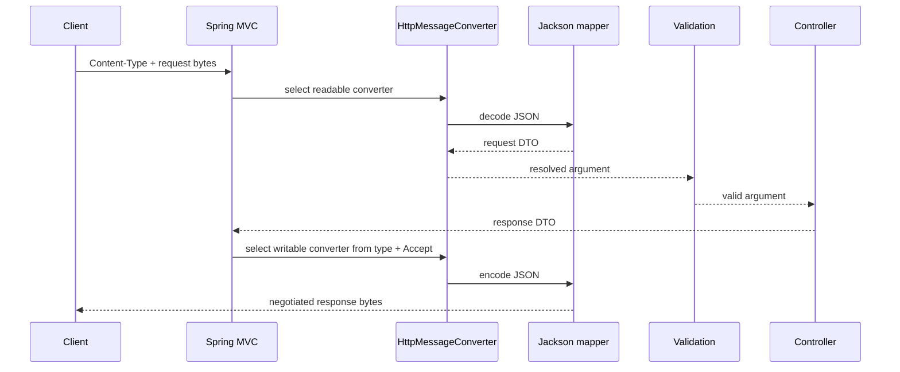

# Spring HTTP Message Conversion And Jackson

<DocLabels items={[
  {label: 'Advanced', tone: 'advanced'},
  {label: 'API contract', tone: 'production'},
  {label: 'Shopverse migration', tone: 'shopverse'},
]} />

Spring MVC uses `HttpMessageConverter` implementations to read request bodies
and write response bodies. Jackson is one JSON implementation behind that
abstraction; `DispatcherServlet` does not deserialize JSON by itself.

<DocCallout type="production" title="Serialization is still application work">
A controller can return successfully while JSON serialization later triggers a
lazy association, recursion, an unsupported type, or an oversized response.
Instrument and test the complete HTTP response, not only the controller method.
</DocCallout>

## Request And Response Pipeline



Request `Content-Type` describes the bytes the client sent. `Accept` describes
representations the client can receive. Controller `consumes` and `produces`
conditions participate in mapping and negotiation before or around converter
selection.

## Failure Taxonomy

| Failure | Boundary | Typical result |
|---|---|---|
| Unsupported request media type | mapping/converter selection | `415 Unsupported Media Type` |
| Malformed JSON or incompatible scalar | converter read | `400 Bad Request` |
| Structurally decoded but constraint-invalid DTO | validation | `400 Bad Request` with stable field errors |
| No acceptable response representation | negotiation/converter selection | `406 Not Acceptable` |
| Lazy loading, recursion, unsupported response value | converter write | server failure unless deliberately mapped |
| Failure after response commit | transport/streaming boundary | partial response or connection termination |

Do not collapse all of these into “validation failed.” Their owners, remediation,
and telemetry differ.

## DTO Contracts Before Mapper Settings

Use explicit request and response DTOs rather than persistence entities. DTOs
prevent lazy ORM proxies, bidirectional associations, internal columns, and
persistence refactors from becoming an accidental public schema.

Define and test:

- property names and required/optional semantics;
- unknown-field behavior;
- date, time, zone, currency, and decimal representation;
- enum evolution and unknown values;
- null versus absent behavior for updates;
- maximum collection, string, nesting, and request sizes;
- backward compatibility for additive changes.

Polymorphic deserialization of untrusted arbitrary types is a security boundary.
Prefer closed, explicit DTO hierarchies and allow-listed type handling.

## Spring Boot 4 And Jackson Generations

Spring Boot 4 prefers Jackson 3 and auto-configures a `tools.jackson.databind.json.JsonMapper`
when the Jackson 3 stack is present. Jackson 2 compatibility is deprecated but
available during migration. Spring Boot exposes a preference setting when both
generations exist, including the mapper used by Spring MVC converters.

Jackson 3 customization should target its builder or modules. Jackson 2
compatibility customization uses Jackson 2-specific builders and types. Replacing
the complete mapper can discard Boot defaults, discovered modules, and consistent
framework configuration.

```java
@Bean
JsonMapperBuilderCustomizer shopverseJsonCustomizer() {
    return builder -> {
        // Keep application-wide contract choices explicit and tested.
    };
}
```

## Shopverse Current And Proposed Migration Evidence

<DocCallout type="shopverse" title="Current: both generations require an explicit inventory">
Several Shopverse Kafka and outbox classes still import Jackson 2
`com.fasterxml.jackson.databind.ObjectMapper`. Under Spring Boot 4, that is a
compatibility path and must not be assumed to be the same mapper, modules, or
properties used by MVC's preferred Jackson 3 converter.
</DocCallout>

Before removing Jackson 2 support, inventory every injected mapper and every
manually constructed mapper. For each payload, capture a golden JSON example and
round-trip test dates, decimals, enums, unknown fields, and event type metadata.

<DocCallout type="production" title="Proposed: migrate by contract, not by import replacement">
Select one bounded payload family, record current bytes, configure the Jackson 3
equivalent, run compatibility tests, deploy with serialization-error metrics, and
retain a rollback path. A mechanical package rename is not evidence that wire
contracts remained compatible.
</DocCallout>

## Entity Serialization Failure Pattern

Returning an entity can access a lazy association after the service returns. If
the persistence context is still open, this can produce unexpected SQL or an N+1
query during serialization. If it is closed, serialization can fail instead.
Bidirectional graphs can also recurse or produce enormous bodies.

Evidence should include:

1. the mapped route and negotiated media type;
2. converter and mapper generation selected at runtime;
3. SQL captured after controller/service completion;
4. serialization exception type and whether the response was committed;
5. response size and object depth;
6. the DTO mapping and fetch plan that should replace entity exposure.

## Testing The Contract

- Use `@JsonTest` for mapper modules and exact JSON shape.
- Use `MockMvc` for content type, `Accept`, malformed JSON, validation, and
  response-converter behavior.
- Use a full application test when custom auto-configuration or the deployed
  mapper preference is part of the claim.
- Keep representative compatibility fixtures under version control.
- Assert that credentials and internal security objects cannot be serialized.

## Expandable Interview Check

<ExpandableAnswer title="Why can returning an entity cause SQL after the service method returns?">

The HTTP message converter serializes the returned object after controller
invocation. Accessing lazy state can issue SQL if a persistence context remains
available; otherwise it can fail with a lazy-loading error. Explicit DTO mapping
and use-case-specific fetching avoid both accidental outcomes.

</ExpandableAnswer>

## Official References

- [Spring MVC HTTP message conversion](https://docs.spring.io/spring-framework/reference/web/webmvc/mvc-config/message-converters.html)
- [Spring MVC annotated controller responses](https://docs.spring.io/spring-framework/reference/web/webmvc/mvc-controller/ann-methods/responsebody.html)
- [Spring Boot JSON support](https://docs.spring.io/spring-boot/4.0/reference/features/json.html)

## Recommended Next

<TopicCards items={[
  {title: 'Servlet and MVC lifecycle', href: '/spring/web/SERVLET-MVC-REQUEST-LIFECYCLE', description: 'See where argument and return-value conversion enters the request path.', icon: 'route', tags: ['MVC', 'Converters']},
  {title: 'REST testing', href: '/development/spring-rest/REST-TESTING', description: 'Test JSON contracts at controller-slice and live-server boundaries.', icon: 'experiment', tags: ['MockMvc', 'JSON']},
]} />
