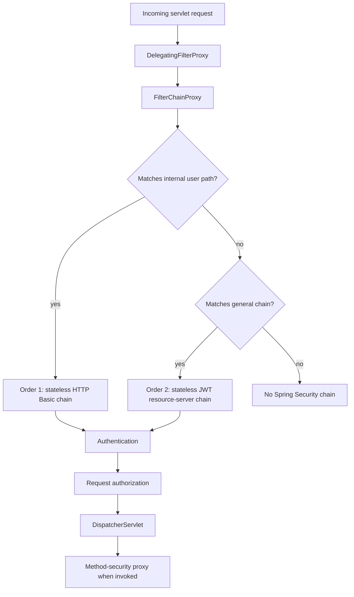
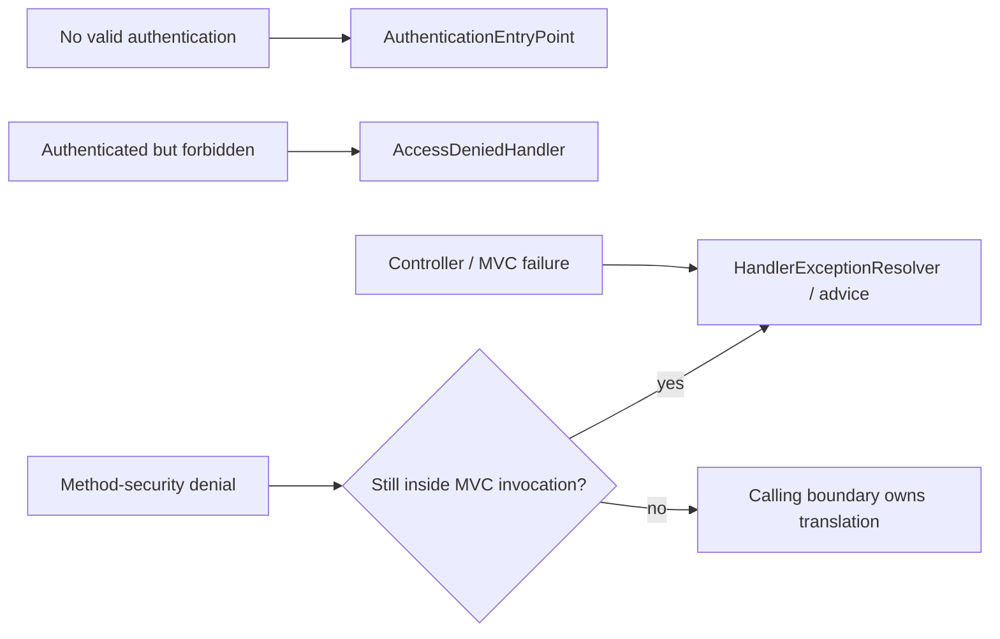

# Spring Security Request Runtime

<DocLabels items={[
  {label: 'Advanced', tone: 'advanced'},
  {label: 'Security boundary', tone: 'production'},
  {label: 'Shopverse current', tone: 'shopverse'},
]} />

Spring Security's servlet integration runs before `DispatcherServlet` through
`DelegatingFilterProxy` and `FilterChainProxy`. `FilterChainProxy` evaluates
configured `SecurityFilterChain` matchers in order and invokes the first matching
chain. It does not merge every matching chain.

<DocCallout type="mistake" title="Chain order is authorization behavior">
An overly broad high-priority matcher can shadow a later chain. Review matcher
scope, order, authentication mechanism, and fallback behavior together; checking
only endpoint rules is incomplete.
</DocCallout>

*Use the overview to place security before MVC. The decision diagram below zooms
in on the distinct problem of selecting one ordered security chain.*

## Chain Selection And Request Flow

Every selected chain contains its own ordered filters. Authentication constructs
or validates an `Authentication`; authorization evaluates the resulting identity
and authorities against request rules. Method security is a later proxy boundary,
not another servlet filter.

## Authentication Lifecycle

For bearer JWT requests, the resource-server filter resolves the token and
delegates authentication to the configured provider and decoder. Trust requires
cryptographic verification plus the configured issuer, audience, time-claim, and
algorithm policy. Decoded claims are not trusted merely because they are readable.

After successful authentication, the authenticated value is associated with a
`SecurityContext`. Spring Security manages persistence and clearing through its
filters. Work moved to another executor or asynchronous callback needs an explicit
context-propagation strategy; a request-thread `ThreadLocal` does not become safe
cross-thread context automatically.

## Authorization And Failure Translation

Authentication failures are commonly translated before MVC, so
`@RestControllerAdvice` is not a universal security error handler. Keep the body
shape, correlation ID, cache headers, and audit behavior consistent across the
security and MVC translators without leaking token or policy details.

## Shopverse Current Implementation

<DocCallout type="shopverse" title="Current: User Service has two ordered chains">
`user-service/.../security/SecurityConfig.java` declares an `@Order(1)` chain
for the internal user endpoint using stateless HTTP Basic. The `@Order(2)` chain
permits selected health and public routes, protects domain routes, and validates
bearer JWTs with a configured `JwtAuthenticationConverter`.
</DocCallout>

This is a useful real example because the internal matcher must remain narrower
than the general chain. A regression test should prove:

- the internal path selects Basic rather than JWT;
- normal API paths cannot authenticate through Basic;
- public routes are exactly the intended set;
- role and authority mappings have the expected prefix semantics;
- an unknown protected route is not accidentally permitted.

<DocCallout type="production" title="Proposed: make security outcomes observable without leaking credentials">
Record selected chain identity, normalized route, outcome, and bounded denial
reason in tests or low-cardinality telemetry. Never log bearer tokens, Basic
credentials, raw claims, or full authorization headers. Add explicit entry-point
and denied-handler contract tests so security errors match the public API policy.
</DocCallout>

## Architect Review Boundaries

| Boundary | Questions to answer | Evidence |
|---|---|---|
| Chain matching | Can a broad matcher shadow a narrower one? Is there a safe fallback? | matcher-order tests and startup configuration |
| Authentication | Which provider/decoder establishes trust? Which claims are mandatory? | decoder configuration and negative-token tests |
| Authorization | Is the rule URL-based, method-based, ownership-based, or combined? | request tests plus method invocation tests |
| Context lifecycle | Is identity cleared and propagated across approved async boundaries? | async tests, thread-local inspection, trace correlation |
| Session and CSRF | Is the client browser/session based or stateless bearer based? | session policy, cookie behavior, CSRF tests |
| CORS and proxies | Which origin and forwarded-header values are trusted? | deployed proxy config and browser preflight tests |
| Failure contract | Who creates `401`, `403`, and method-denial bodies? | entry-point, denied-handler, and advice tests |

Method security can be bypassed by self-invocation because the call does not pass
through the proxy. Ownership checks must use the authenticated principal and
server-side resource state; route authentication alone does not prove ownership.

## Incident Pattern: Unexpected 401 On An Internal Route

1. Reproduce with the exact path, method, headers, and proxy prefix.
2. Prove which `SecurityFilterChain` matcher selected the request.
3. Inspect whether credentials were resolved before checking provider or decoder
   behavior.
4. Separate authentication failure from an authenticated `403` authorization
   failure.
5. Correlate the denial with a trace or correlation ID without logging secrets.
6. Roll back a matcher/order change if it expanded or shadowed policy unexpectedly.

Changing endpoint annotations without proving chain selection can hide the real
cause.

## Expandable Interview Checks

<ExpandableAnswer title="Why might ControllerAdvice not handle an authentication failure?">

The failure can occur and be translated in the Spring Security filter chain
before `DispatcherServlet` enters the MVC exception-resolution boundary.

</ExpandableAnswer>

<ExpandableAnswer title="Can two matching SecurityFilterChain definitions both apply to one request?">

No. `FilterChainProxy` selects the first matching `SecurityFilterChain`. That
selected chain can contain many security filters, but later matching chains are
not merged into it.

</ExpandableAnswer>

## Official References

- [Spring Security servlet architecture](https://docs.spring.io/spring-security/reference/servlet/architecture.html)
- [Spring Security authentication architecture](https://docs.spring.io/spring-security/reference/servlet/authentication/architecture.html)
- [OAuth2 resource server JWT](https://docs.spring.io/spring-security/reference/servlet/oauth2/resource-server/jwt.html)
- [Method security](https://docs.spring.io/spring-security/reference/servlet/authorization/method-security.html)

## Recommended Next

<TopicCards items={[
  {title: 'Servlet and MVC lifecycle', href: '/spring/web/SERVLET-MVC-REQUEST-LIFECYCLE', description: 'Place the security filter chain inside the complete servlet request path.', icon: 'route', tags: ['Servlet', 'MVC']},
  {title: 'Message conversion', href: '/spring/web/HTTP-MESSAGE-CONVERSION-JACKSON', description: 'Trace protected request bodies and responses through negotiated conversion.', icon: 'code', tags: ['JSON', 'Contracts']},
]} />
