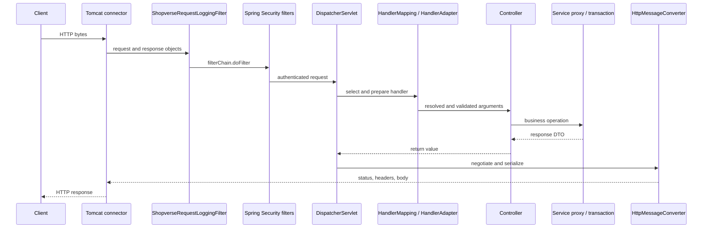

# Servlet And Spring MVC Request Lifecycle

<DocLabels items={[
  {label: 'Advanced', tone: 'advanced'},
  {label: 'Production runtime', tone: 'production'},
  {label: 'Shopverse current', tone: 'shopverse'},
]} />

Spring MVC is built on the Servlet API. The servlet container owns network-facing
request and response objects; Spring's `DispatcherServlet` adapts those objects
to controller methods. Controllers, services, and repositories are Spring beans,
not servlets.

<DocCallout type="tip" title="Name the boundary before debugging it">
An HTTP request can fail before MVC, during MVC argument resolution, inside the
business operation, while serializing the response, or after the response is
committed. The responsible extension point and observable evidence differ at
each boundary.
</DocCallout>

## The Canonical Request Path



The connector may queue work before the application filter chain begins. A
filter timer therefore measures only the portion of latency visible after
container admission; it does not automatically measure load-balancer wait,
accept backlog, or worker acquisition time.

## Container And Spring Responsibilities

| Layer | Owns | Does not own |
|---|---|---|
| Servlet container | connections, HTTP parsing, servlet lifecycle, dispatch types, request/response objects | controller selection or business transactions |
| Servlet filter chain | request-wide infrastructure that can wrap or stop servlet execution | handler method semantics |
| `DispatcherServlet` | the shared MVC dispatch algorithm | endpoint business logic |
| `HandlerMapping` | which handler matches the request | how that handler is invoked |
| `HandlerAdapter` | invoking that kind of handler | persistence workflow |
| Argument and return-value handlers | binding framework state to parameters and processing return types | domain invariants |
| `HttpMessageConverter` | reading and writing representations | choosing transaction boundaries |

Spring Boot normally creates a `ServletWebServerApplicationContext`, obtains a
`ServletWebServerFactory`, starts the embedded container, and registers the
`DispatcherServlet` and filters. This replaces manual `web.xml` setup; it does
not remove the Servlet API underneath.

## Filters, Interceptors, And Advice

A filter wraps servlet execution and can reject a request before MVC. An MVC
interceptor runs only after a handler has been mapped. Controller advice is an
MVC exception boundary, so it does not automatically translate an exception
thrown earlier by a security filter.

```text
filter before
  -> security filters
    -> DispatcherServlet
      -> interceptor preHandle
        -> controller
      -> interceptor postHandle / afterCompletion
filter after
```

Code after `filterChain.doFilter(...)` executes while the call stack unwinds.
Use `try/finally` or scoped MDC APIs so reused request threads do not retain
request data.

`OncePerRequestFilter` means once per configured dispatch, not necessarily once
for the entire logical HTTP exchange. `REQUEST`, `ASYNC`, and `ERROR` dispatches
need deliberate inclusion or exclusion. Async MVC can later invoke
`DispatcherServlet` again to complete a response.

## DispatcherServlet Under The Hood

The simplified dispatch algorithm is:

1. locate a matching handler through a `HandlerMapping`;
2. obtain a compatible `HandlerAdapter`;
3. resolve controller parameters and run binding or validation;
4. invoke the handler and its service collaborators;
5. process the return value;
6. negotiate a representation and write it through a message converter;
7. ask exception resolvers to translate failures from the MVC boundary.

A filter or another servlet can finish the response, a static-resource handler
can own the mapping, or no handler can match. Not every request reaches a
controller.

## Shopverse Current Implementation

<DocCallout type="shopverse" title="Current: request logging surrounds the downstream chain">
`shopverse-platform/shopverse-observability-starter` provides
`ShopverseRequestLoggingFilter`. It establishes a correlation ID, places it in
MDC, invokes the remaining chain, and records status and duration in a `finally`
block. The scoped MDC value is closed after the request, which is essential when
container threads are reused.
</DocCallout>

The implementation intentionally skips the actuator prefix and records bounded
metric tags: service, method, status, and outcome. The log currently uses the raw
request URI, so production review should ensure identifiers do not create
high-cardinality log indexing or expose sensitive path data.

<DocCallout type="production" title="Proposed: prove filter order and dispatch behavior">
Add a focused filter test that records entry and exit order around the security
chain, plus async and error-dispatch cases. Treat the order as configuration to
verify, not something inferred from class names. Correlate application duration
with connector thread, queue, and rejection metrics before blaming controller
code.
</DocCallout>

## Exceptions And Response Commitment

| Failure location | Typical owner |
|---|---|
| Authentication or authorization filter | Spring Security entry point or denied handler |
| Request-body decoding | MVC message-converter and exception-resolver path |
| Argument binding or validation | MVC exception resolvers and controller advice |
| Controller or service | service policy plus controller advice |
| Response serialization | MVC exception resolvers if the response is not committed |
| Container or escaped filter failure | servlet error handling or error dispatch |

Once bytes are flushed and a response is committed, changing its status or
headers may no longer be possible. Streaming endpoints must define what clients
observe when failure occurs after a partial body has been written.

## Concurrency And Request State

One servlet and singleton Spring bean instance can serve many requests
concurrently. Keep request data in local variables, immutable values, or scoped
state. Mutable controller or servlet fields are shared state.

Traditional MVC usually holds a request thread while application code blocks.
Async MVC releases the original container thread, performs work elsewhere, and
redispatches for completion. That transition requires explicit executor bounds,
timeouts, cancellation, MDC/security context propagation, and dispatch-aware
filters. See [Web Execution Models And Capacity](./WEB-EXECUTION-MODELS-CAPACITY.md).

## Evidence Checklist

- Confirm the mapped handler and selected security chain in debug logs or tests.
- Inspect connector active-thread, queue, rejection, and connection metrics.
- Record normalized route, status, duration, trace ID, and bounded error code.
- Test `REQUEST`, `ASYNC`, and `ERROR` behavior for custom filters.
- Verify whether the response was committed before an exception translator ran.
- Capture a thread dump when latency rises; do not infer blocking from CPU alone.

## Expandable Interview Checks

<ExpandableAnswer title="What is the difference between a filter and an interceptor?">

A filter is Servlet infrastructure and can wrap or stop dispatch before Spring
MVC. An interceptor is handler-aware MVC infrastructure and runs only after a
handler is mapped.

</ExpandableAnswer>

<ExpandableAnswer title="Is HttpServletRequest a servlet?">

No. It is the container-created request abstraction supplied to servlet and
filter code.

</ExpandableAnswer>

<ExpandableAnswer title="Is a Spring controller a servlet?">

No. It is a Spring bean invoked indirectly through `DispatcherServlet`.

</ExpandableAnswer>

<ExpandableAnswer title="How many DispatcherServlet instances are there?">

A typical Boot MVC application registers one mapped to `/`, but an application
can register multiple servlet instances with different mappings and contexts.

</ExpandableAnswer>

<ExpandableAnswer title="Does every request reach a controller?">

No. A filter can reject it, another servlet or static-resource handler can own
the mapping, no handler may match, or binding can fail before controller logic.

</ExpandableAnswer>

<ExpandableAnswer title="Does DispatcherServlet contain business logic?">

No. It coordinates MVC delegates. Business behavior belongs behind the
controller in application or domain services.

</ExpandableAnswer>

<ExpandableAnswer title="Is Spring Security inside DispatcherServlet?">

Servlet security normally runs in filters before MVC dispatch. Method security
runs later through Spring proxies when secured methods are invoked.

</ExpandableAnswer>

## Official References

- [Spring MVC `DispatcherServlet`](https://docs.spring.io/spring-framework/reference/web/webmvc/mvc-servlet.html)
- [Spring MVC filters](https://docs.spring.io/spring-framework/reference/web/webmvc/filters.html)
- [Spring MVC asynchronous requests](https://docs.spring.io/spring-framework/reference/web/webmvc/mvc-ann-async.html)
- [Jakarta Servlet specification](https://jakarta.ee/specifications/servlet/)

## Recommended Next

<TopicCards items={[
  {title: 'Security request runtime', href: '/spring/web/SECURITY-REQUEST-RUNTIME', description: 'Trace chain matching, authentication, authorization, and exception translation.', icon: 'security', tags: ['Filters', 'JWT']},
  {title: 'HTTP message conversion', href: '/spring/web/HTTP-MESSAGE-CONVERSION-JACKSON', description: 'Follow request decoding, content negotiation, and response serialization.', icon: 'route', tags: ['Jackson', 'DTOs']},
  {title: 'Execution models and capacity', href: '/spring/web/WEB-EXECUTION-MODELS-CAPACITY', description: 'Locate queues, thread transitions, deadlines, and saturation evidence.', icon: 'gauge', tags: ['MVC', 'WebFlux']},
]} />
