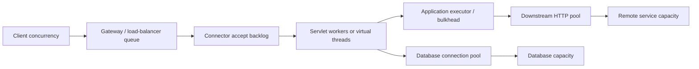
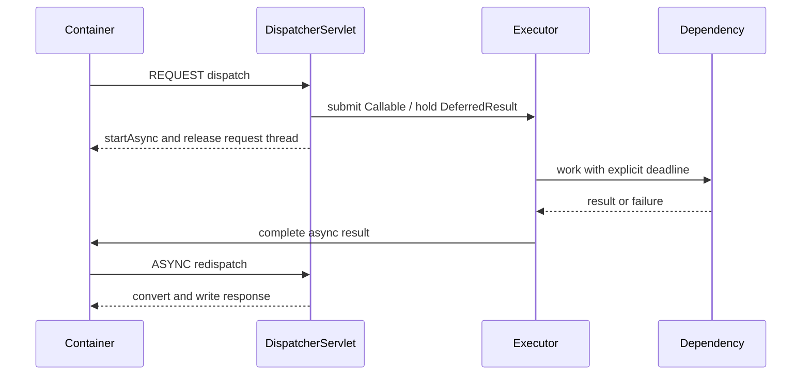

# Spring Web Execution Models And Capacity

<DocLabels items={[
  {label: 'Architect', tone: 'advanced'},
  {label: 'Capacity and SLOs', tone: 'production'},
  {label: 'Shopverse evidence', tone: 'shopverse'},
]} />

Choosing an execution model does not remove finite capacity. A request can wait
at the load balancer, connector backlog, request executor, dependency bulkhead,
HTTP connection pool, database connection pool, or downstream service. Optimize
only after locating the wait.

<DocCallout type="production" title="Controller timing is not end-to-end latency">
A timer started in an application filter cannot see earlier admission queues. A
fast controller trace can coexist with a slow user request when connector, proxy,
or dependency-pool waits fall outside the measured span.
</DocCallout>

## Capacity Map

Every queue needs an owner, maximum size, rejection behavior, deadline, metric,
and recovery policy. An unbounded queue converts overload into rising latency and
memory pressure.

## Compare The Execution Models

| Model | Request behavior | Good fit | Capacity trap |
|---|---|---|---|
| Traditional MVC | a servlet worker normally remains assigned while code blocks | imperative code and bounded concurrency | workers wait on slow dependencies |
| Async MVC | original worker exits; work completes elsewhere and redispatches | long polling, deferred responses, controlled async work | hidden unbounded executor or missing timeout |
| MVC with virtual threads | blocking code gets a cheap thread per task | high-concurrency blocking I/O with compatible libraries | database and HTTP pools remain finite |
| WebFlux | event-loop and reactive streams | end-to-end nonblocking composition and streaming | blocking JDBC/SDK work stalls event loops |

Do not choose `WebClient` or WebFlux only because it is newer. Do not choose
virtual threads as permission to remove bulkheads. Match the model to the call
graph, libraries, cancellation needs, and operational skills.

## Async MVC State Transition

Production async MVC requires a bounded `AsyncTaskExecutor`, explicit request
timeouts, cancellation behavior, context propagation, and filters configured for
the intended dispatch types. Framework defaults are not a capacity plan.

## Deadline And Cancellation Ownership

A request deadline should leave time for translation and response writing. For a
service making downstream calls, distinguish:

- connector or pool-acquisition timeout;
- TCP connect and TLS establishment timeout;
- response-header or read timeout;
- total operation deadline;
- queue/bulkhead wait limit;
- caller cancellation and server shutdown.

Retries consume the same total budget. Retry only selected transient failures
and operations safe to repeat. Backoff without a deadline can amplify an outage.

When the caller disconnects or a deadline expires, decide whether downstream work
is cancelled, allowed to complete, or converted into a durable background
operation. “Fire and forget” on a request executor is not lifecycle ownership.

## Streaming And Slow Clients

SSE is server-to-client HTTP streaming; WebSocket is bidirectional. Both require
authentication renewal, heartbeat, buffer limits, slow-client eviction,
reconnection/resume semantics, and ownership of undelivered data. A producer
faster than the socket can write needs backpressure or a bounded loss policy.

For ordinary large downloads, range support and object-storage delegation can be
more predictable than holding application workers and buffers.

## Shopverse Current And Proposed Evidence

<DocCallout type="shopverse" title="Current: request duration begins inside the servlet filter chain">
`ShopverseRequestLoggingFilter` records duration around `filterChain.doFilter`
and increments counters by service, method, status, and outcome. This is valuable
application evidence, but it does not expose connector backlog time, active
servlet workers, database-pool wait, or downstream pool acquisition by itself.
</DocCallout>

<DocCallout type="production" title="Proposed: join admission, application, and dependency signals">
Create one dashboard per service with request latency and rate, active and maximum
container workers, connector queue/rejections, executor queue/rejections, Hikari
active/pending connections, downstream pool pending acquisition, timeout counts,
and JVM CPU. Alert on sustained saturation and SLO burn, not thread count alone.
</DocCallout>

For a rollout from platform threads to virtual threads:

1. capture baseline throughput, latency percentiles, worker occupancy, pool waits,
   CPU, allocation, and pinned-thread evidence;
2. cap request admission and dependency concurrency independently;
3. load-test realistic blocking and timeout behavior;
4. canary one service with rollback-ready configuration;
5. compare SLO and dependency impact, not only request-thread count.

## Incident Walkthrough: Low CPU, Rising Latency

Low CPU does not prove insufficient compute. It often means threads are waiting.

1. Compare edge latency with application-filter and controller spans.
2. Inspect connector workers and queue/rejection metrics.
3. Capture a thread dump and group waits by dependency or monitor.
4. Inspect Hikari pending connections and downstream HTTP pool acquisition.
5. Check executor queue age, not only queue length.
6. Confirm timeout and retry multiplication across hops.
7. Contain overload with admission limits or feature degradation before raising
   every pool size.

Increasing servlet threads while the database pool is exhausted adds waiters and
memory without increasing database parallelism.

## Capacity Review Checklist

- Expected peak arrival rate and concurrency are documented.
- Each queue is bounded and exposes depth, wait, rejection, and age where useful.
- Dependency concurrency is limited independently from request concurrency.
- Deadlines decrease across hops and include acquisition time.
- Cancellation and shutdown behavior are tested under active requests.
- Streaming endpoints have a slow-consumer policy.
- Load tests include dependency latency and failure, not only happy-path stubs.
- The rollback trigger is an SLO or saturation signal defined before rollout.

## Expandable Interview Checks

<ExpandableAnswer title="Does async MVC make a blocking dependency nonblocking?">

No. It can release the original servlet worker, but the blocking call still
occupies whichever executor thread performs it. That executor and the dependency
must remain bounded and observable.

</ExpandableAnswer>

<ExpandableAnswer title="Do virtual threads make database access unlimited?">

No. Virtual threads reduce the cost of waiting threads; database connections,
transactions, locks, CPU, and downstream capacity remain finite.

</ExpandableAnswer>

## Official References

- [Spring MVC asynchronous requests](https://docs.spring.io/spring-framework/reference/web/webmvc/mvc-ann-async.html)
- [Spring WebFlux](https://docs.spring.io/spring-framework/reference/web/webflux.html)
- [Spring Boot graceful shutdown](https://docs.spring.io/spring-boot/reference/web/graceful-shutdown.html)
- [Spring Boot metrics](https://docs.spring.io/spring-boot/reference/actuator/metrics.html)

## Recommended Next

<TopicCards items={[
  {title: 'Servlet and MVC lifecycle', href: '/spring/web/SERVLET-MVC-REQUEST-LIFECYCLE', description: 'Trace the synchronous and async dispatch boundaries in detail.', icon: 'route', tags: ['Dispatch', 'Filters']},
  {title: 'Security request runtime', href: '/spring/web/SECURITY-REQUEST-RUNTIME', description: 'Review context propagation and security failure ownership.', icon: 'security', tags: ['Context', 'Authorization']},
]} />
