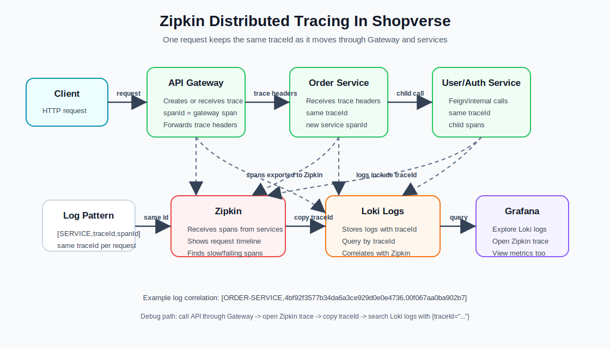

# Shopverse Observability POC

This folder contains the local observability stack for the Shopverse microservices POC. It helps us answer three operational questions:

- Are the services healthy and receiving traffic?
- What happened inside each service during a request?
- Can we connect logs, metrics, and traces for the same request?

The stack includes:

- Prometheus scrapes Spring Boot Actuator metrics from each service.
- Loki stores centralized service logs.
- Promtail ships Docker container logs and local service log files to Loki.
- Grafana includes Prometheus, Loki, and Zipkin datasources plus a starter dashboard.
- Zipkin is included so trace IDs in logs can be correlated with traces.

## Observability Flow


The diagram shows how the POC collects and uses observability data:

- Services write logs to `/app/logs/*.log` and Docker stdout.
- Promtail collects those logs, extracts labels, and sends them to Loki.
- Loki stores centralized logs and makes them searchable from Grafana.
- Services expose metrics through `/actuator/prometheus`.
- Prometheus scrapes and stores those metrics.
- Grafana queries Loki for logs and Prometheus for metrics.
- Services send tracing spans to Zipkin, and the same `traceId` appears in logs for correlation.

## Zipkin Tracing Flow



Zipkin stores distributed traces. A trace represents one request journey, and spans represent individual operations inside that journey.

In Shopverse, a typical traced request looks like:

```text
Client
  -> API Gateway span
  -> Order Service span
  -> optional Auth/User/Payment/Inventory Service spans
  -> Zipkin
```

The important IDs are:

- `traceId`: shared by all services involved in the same request.
- `spanId`: unique to one operation inside that request.

The log pattern includes both IDs:

```text
[ORDER-SERVICE,<traceId>,<spanId>]
```

That means you can open Zipkin, copy a `traceId`, then search centralized logs in Grafana Loki:

```logql
{traceId="paste-trace-id-here"}
```

## Aggregated Logs For One Trace ID

Use this when you want to see every log line produced by all services for one request.

### Option 1: Start From Zipkin

1. Generate traffic through the API Gateway:

   ```powershell
   curl.exe http://localhost:8080/api/v1/orders/public/health
   ```

2. Open Zipkin:

   ```text
   http://localhost:9411
   ```

3. Search recent traces and open the request.

4. Copy the trace ID from Zipkin.

5. Open Grafana:

   ```text
   http://localhost:3000
   ```

6. Go to **Explore**.

7. Select the **Loki** datasource.

8. Search by trace ID:

   ```logql
   {traceId="paste-trace-id-here"}
   ```

This shows aggregated logs from every service that logged with the same `traceId`, such as API Gateway, Order Service, Payment Service, Inventory Service, User Service, and Auth Service.

### Option 2: Start From Logs

If you do not have a trace ID yet, find a recent service log first:

```logql
{application="ORDER-SERVICE"} |= "Health check requested"
```

Copy the `traceId` label from the log row in Grafana, then run:

```logql
{traceId="paste-trace-id-here"}
```

### Useful Trace Log Queries

All logs for one trace:

```logql
{traceId="paste-trace-id-here"}
```

All error logs for one trace:

```logql
{traceId="paste-trace-id-here", level="ERROR"}
```

All logs for one trace from one service:

```logql
{traceId="paste-trace-id-here", application="ORDER-SERVICE"}
```

Search within one trace:

```logql
{traceId="paste-trace-id-here"} |= "User lookup"
```

If the query returns nothing:

- Confirm the request was made after Promtail and Loki were running.
- Confirm the selected Grafana time range includes the request time.
- Confirm the log line has a real trace ID instead of an empty value.
- Generate traffic through the API Gateway so trace context flows across services.
- Check Zipkin at `http://localhost:9411` to confirm a trace was created.

## How It Works

```text
Spring Boot services
  -> logs to console and /app/logs/*.log
  -> exposes /actuator/prometheus
  -> sends tracing spans to Zipkin

Promtail
  -> reads service log files and Docker container logs
  -> extracts labels like application, level, traceId, spanId
  -> pushes logs to Loki

Prometheus
  -> scrapes /actuator/prometheus from each service
  -> stores metrics time series

Loki
  -> stores centralized logs
  -> keeps labels for filtering and correlation

Grafana
  -> queries Prometheus for metrics
  -> queries Loki for logs
  -> queries Zipkin for traces
```

## Core Tools

### Loki

Loki is the centralized log storage system. Promtail sends service logs to Loki, and Loki stores those logs with labels such as:

```text
application
level
traceId
spanId
job
container
```

Unlike Elasticsearch-style systems, Loki is designed to index labels instead of indexing the full log text. This keeps the setup lighter for a POC while still making logs easy to search from Grafana.

Example Loki query:

```logql
{application="USER-SERVICE"}
```

### Prometheus

Prometheus is the metrics database and scraper. It periodically calls each service's:

```text
/actuator/prometheus
```

Spring Boot Actuator and Micrometer expose metrics in Prometheus format. Prometheus stores these as time-series data, such as HTTP request counts, request duration, JVM memory, CPU usage, and custom counters.

Example Prometheus query:

```promql
sum by (application) (rate(http_server_requests_seconds_count[1m]))
```

### Grafana

Grafana is the dashboard and exploration UI. It does not collect logs or metrics by itself. Instead, it connects to datasources:

- Loki for logs
- Prometheus for metrics
- Zipkin for traces

In this POC, Grafana is where we check dashboards, search aggregated logs, inspect metrics, and correlate a log `traceId` with a Zipkin trace.

## Start The Stack

From the root `shopverse` folder, start the full POC stack:

```powershell
docker compose up -d
```

You can also start only the standalone observability stack from this folder:

```powershell
docker compose up -d
```

Open:

- Grafana: http://localhost:3000
- Prometheus: http://localhost:9090
- Loki: http://localhost:3100
- Zipkin: http://localhost:9411

Grafana login:

- Username: `admin`
- Password: `admin`

## Service-Side Logging Config

Shared logging config is managed through the centralized config folder:

```text
../cloud-configs/application.yml
```

Important configuration:

```yaml
logging:
  include-application-name: false
  file:
    name: ${LOG_FILE:logs/${spring.application.name}.log}
  pattern:
    correlation: "[${spring.application.name:},%X{traceId:-},%X{spanId:-}] "
```

This makes every service write logs to a file and include correlation data in the log line:

```text
[USER-SERVICE,<traceId>,<spanId>]
```

Example log shape:

```text
2026-05-26T14:38:09.317+05:30 INFO [ORDER-SERVICE,abc123,def456] ... Health check requested for order service
```

The `traceId` and `spanId` values come from Micrometer tracing. They allow us to search logs for one request and connect those logs to Zipkin traces.

## Application Logs Added In Services

The services use Lombok SLF4J with `@Slf4j`.

Examples:

```java
@Slf4j
public class UserController {
    // log.info(...), log.warn(...)
}
```

Logs were added around useful business and request events, for example:

- user creation, update, password change, password reset, and deletion
- user lookup and validation failures
- authentication start, success, and failure
- order health check, catalog lookup, order creation, and order deletion
- payment and inventory health checks
- request start/completion with method, path, status, and duration

Request logging filters were added in services such as user, order, and auth service. These filters log:

```text
method
path
status
durationMs
```

They skip `/actuator/prometheus` so Prometheus scraping does not create noisy logs.

The same filters also increment a custom Micrometer counter:

```text
shopverse.service.requests.logged
```

Labels on this metric include:

```text
service
method
status
outcome
```

## Docker Logging Setup

In the root `docker-compose.yml`, each service receives a `LOG_FILE` environment variable:

```yaml
LOG_FILE: /app/logs/user-service.log
LOG_FILE: /app/logs/order-service.log
LOG_FILE: /app/logs/payment-service.log
LOG_FILE: /app/logs/inventory-service.log
LOG_FILE: /app/logs/auth-service.log
LOG_FILE: /app/logs/api-gateway.log
```

Each service also mounts a Docker volume at `/app/logs`:

```yaml
volumes:
  - user-service-logs:/app/logs
```

This keeps logs outside the application container filesystem. If a service container is recreated, its log volume can still exist unless the Docker volume is removed.

## Promtail Log Collection

Promtail is configured in:

```text
promtail.yml
```

It collects logs from three places:

```text
/service-logs/*/*.log
/workspace/*/logs/*.log
Docker container stdout/stderr logs
```

Promtail uses regex pipeline stages to parse Spring Boot log lines and extract labels:

```text
level
application
traceId
spanId
container
compose_service
stream
```

Those labels make logs easy to query in Grafana.

Example:

```logql
{application="USER-SERVICE"}
```

or:

```logql
{traceId="paste-trace-id-here"}
```

## Loki Log Storage

Loki is configured in:

```text
loki.yml
```

For this POC, Loki stores data on the local filesystem inside the Docker volume:

```text
loki-data:/loki
```

Retention is enabled:

```yaml
limits_config:
  retention_period: 168h
```

That means logs are kept for about 7 days.

This POC does not currently use JSON logs. The services produce standard Spring Boot text logs with a correlation pattern, and Promtail parses those logs using regex. JSON logs can be added later if we want stronger structured logging.

## Metrics Collection

Each Spring service exposes metrics at:

```text
/actuator/prometheus
```

Prometheus scrapes these service targets from inside the Docker network:

- API Gateway: `8080`
- Auth Service: `8081`
- User Service: `8082`
- Order Service: `8083`
- Payment Service: `8084`
- Inventory Service: `8086`
- Discovery Server: `8761`
- Config Server: `8888`

Micrometer produces JVM, HTTP, process, and custom application metrics. Prometheus scrapes those metrics and Grafana displays them.

Useful metric examples:

```promql
up
```

```promql
http_server_requests_seconds_count
```

```promql
jvm_memory_used_bytes
```

```promql
shopverse_service_requests_logged_total
```

## Grafana Datasources

Grafana datasources are provisioned from:

```text
grafana/provisioning/datasources/datasources.yml
```

Configured datasources:

- `Prometheus`: metrics
- `Loki`: centralized logs
- `Zipkin`: distributed traces

Grafana is the main UI for checking aggregated logs and metrics.

## Useful Grafana Queries

Recent logs:

```logql
{job=~"shopverse-local-files|shopverse-service-volume-files|docker-containers"}
```

Logs for one service:

```logql
{application="ORDER-SERVICE"}
{application="PAYMENT-SERVICE"}
{application="INVENTORY-SERVICE"}
```

Logs for one trace:

```logql
{traceId="paste-trace-id-here"}
```

HTTP request rate:

```promql
sum by (application) (rate(http_server_requests_seconds_count[1m]))
```

Service scrape health:

```promql
up{job="shopverse-services"}
```

Custom request log counter:

```promql
sum by (service, outcome) (increase(shopverse_service_requests_logged_total[5m]))
```

Logs with errors:

```logql
{job=~"shopverse-local-files|shopverse-service-volume-files|docker-containers"} |= "ERROR"
```

Logs for auth failures:

```logql
{application="AUTH-SERVICE"} |= "Authentication failed"
```

## Checking The Flow

Generate traffic:

```powershell
curl.exe http://localhost:8080/api/v1/orders/public/health
curl.exe http://localhost:8080/api/v1/payments/public/health
curl.exe http://localhost:8080/api/v1/inventory/public/health
```

Open Grafana:

```text
http://localhost:3000
```

Check logs:

1. Go to Explore.
2. Select the Loki datasource.
3. Run:

```logql
{application="ORDER-SERVICE"}
{application="PAYMENT-SERVICE"}
{application="INVENTORY-SERVICE"}
```

Check metrics:

1. Go to Explore.
2. Select the Prometheus datasource.
3. Run:

```promql
sum by (application) (rate(http_server_requests_seconds_count[1m]))
```

Check traces:

1. Open Zipkin at `http://localhost:9411`.
2. Search for recent traces.
3. Copy a trace ID.
4. In Grafana Loki, search:

```logql
{traceId="paste-trace-id-here"}
```

This connects one request across traces and logs.

## Common Troubleshooting

If logs do not appear in Grafana:

- Check Promtail is running: `docker compose ps promtail`
- Check Promtail logs: `docker logs shopverse-promtail`
- Check Loki is running: `docker compose ps loki`
- Confirm service logs exist in the mounted volumes.
- Generate new traffic after the stack is up.

If metrics do not appear:

- Open Prometheus: `http://localhost:9090`
- Go to Status, then Targets.
- Confirm service targets are `UP`.
- Check a service endpoint directly, for example:

```text
http://localhost:8082/actuator/prometheus
```

If trace IDs are empty in logs:

- Confirm tracing is enabled in centralized config.
- Confirm the service has Micrometer tracing/Zipkin dependencies.
- Generate traffic through the API Gateway so trace context can flow across services.
