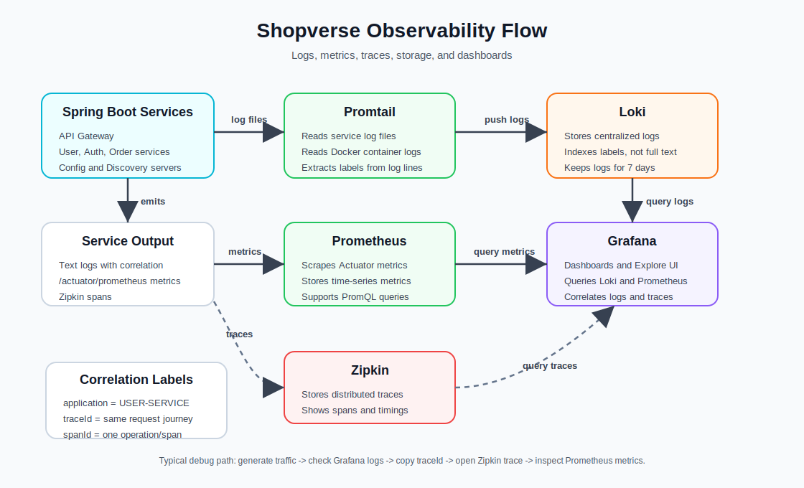

# Shopverse Observability

This file documents deployment files and operational commands. Canonical
concept guides are indexed under [docs/observability](../docs/README.md),
including dedicated [Prometheus](../docs/observability/PROMETHEUS.md),
[Loki](../docs/observability/LOKI.md),
[Promtail](../docs/observability/PROMTAIL.md),
[Grafana](../docs/observability/GRAFANA.md), structured logging, and tracing
documentation.

Promtail is still used by this POC, but it reached upstream end of life on
March 2, 2026. Use the Promtail guide for the implemented flow and the planned
Grafana Alloy migration direction.

Shopverse uses three complementary signals:

- **Logs:** Spring Boot structured JSON -> Promtail -> Loki -> Grafana.
- **Metrics:** Actuator and Micrometer -> Prometheus -> Grafana.
- **Traces:** Micrometer Tracing/Brave bridge -> Zipkin -> Grafana or Zipkin UI.

Grafana is the visualization and query UI. It does not collect or persist telemetry itself.

## Alerts, SLOs, And Operational Links

Prometheus loads `prometheus-rules.yml`. It records:

- five-minute HTTP availability
- five-minute p95 latency by application
- checkout failure rate

Provisioned alerts detect a service down for two minutes, availability below
99%, p95 latency above one second, outbox publication failures, and new Kafka
DLT events.

```promql
shopverse:http_requests:availability_5m
shopverse:http_requests:p95_seconds_5m
sum(increase(shopverse_outbox_publish_total{outcome="failed"}[5m]))
sum by (service) (increase(shopverse_kafka_dlt_events_total[10m]))
```

Grafana Loki derived fields make JSON `traceId` values clickable into Zipkin.
`correlationId` values link back to a Loki Explore query across all services.
The commerce dashboard also provides direct Explore links for logs and traces.



## Structured JSON Logging

Services use Lombok `@Slf4j` and Spring Boot's `StructuredLogEncoder` with the Logstash JSON format. Console and rolling file output contain machine-readable fields:

```json
{
  "@timestamp": "2026-06-11T02:52:30.918+05:30",
  "level": "INFO",
  "application": "ORDER-SERVICE",
  "traceId": "6a1e660de4db49fe47911954296ecce5",
  "spanId": "1ee04f11149f6bee",
  "correlationId": "checkout-demo-101",
  "message": "Order persisted and ready for inventory reservation",
  "orderNumber": "ORD-A1B2C3D4"
}
```

Business fields are added without string concatenation:

```java
log.atInfo()
        .addKeyValue("orderNumber", order.getOrderNumber())
        .addKeyValue("correlationId", correlationId)
        .log("Order persisted and ready for inventory reservation");
```

Shared format selection is in `cloud-configs/application.yml`. Each service has `logback-spring.xml` for:

- JSON console output.
- JSON application rolling files.
- Separate health-check rolling files.
- Seven application-log history files, 10 MB per segment, and a 256 MB total cap.

The encoder and centralized fields are configured as follows:

```xml
<encoder class="org.springframework.boot.logging.logback.StructuredLogEncoder">
    <format>${STRUCTURED_FORMAT}</format>
</encoder>
```

```yaml
logging:
  structured:
    format:
      console: logstash
      file: logstash
    json:
      add:
        application: ${spring.application.name}
        environment: ${APP_ENVIRONMENT:local}
```

## Correlation And Trace Propagation

`traceId` and `spanId` describe technical execution. Micrometer creates them and propagates W3C trace headers over instrumented HTTP, Feign, and Kafka operations.

`correlationId` describes one business operation. Request filters:

1. Accept `X-Correlation-Id` or generate a UUID.
2. Put it in SLF4J MDC.
3. Return it as `X-Correlation-Id`.
4. Propagate it through the Order Feign interceptor.
5. Store it in every SAGA Kafka payload.
6. Restore it into MDC in each Kafka listener.

HTTP filter pattern:

```java
String correlationId = Optional
        .ofNullable(request.getHeader("X-Correlation-Id"))
        .filter(value -> !value.isBlank())
        .orElseGet(() -> UUID.randomUUID().toString());

response.setHeader("X-Correlation-Id", correlationId);
try (MDC.MDCCloseable ignored =
             MDC.putCloseable("correlationId", correlationId)) {
    filterChain.doFilter(request, response);
}
```

Feign propagation:

```java
RequestInterceptor correlationInterceptor() {
    return template -> template.header(
            "X-Correlation-Id",
            MDC.get("correlationId")
    );
}
```

Kafka listeners restore the event value before business logging:

```java
CorrelationContext.run(
        event.correlationId(),
        () -> handleInventoryReserved(event)
);
```

Use a trace ID to inspect one execution path. Use a correlation ID to inspect a business flow that can cross asynchronous retries and multiple traces.

### How Zipkin Tracing Works Internally

The resolved Spring Boot 4 runtime uses:

```text
micrometer-observation
micrometer-tracing
micrometer-tracing-bridge-brave
brave-context-slf4j
zipkin-reporter-brave
spring-boot-zipkin
```

Spring Boot auto-configuration connects the infrastructure without custom
tracing `@Bean` methods:

```text
ObservationRegistry
  -> Micrometer Tracer backed by Brave
  -> W3C trace-context propagation
  -> HTTP, Feign, and Kafka observation instrumentation
  -> Zipkin span reporter
  -> POST /api/v2/spans
```

For incoming HTTP, instrumentation extracts `traceparent` or starts a trace.
It creates a server span and puts `traceId` and `spanId` in MDC. Instrumented
outgoing calls inject the current context:

```http
traceparent: 00-<traceId>-<parentSpanId>-01
X-Correlation-Id: <business-correlation-id>
```

The receiving service creates a child span under the same trace. Completed
spans are exported to the configured Zipkin endpoint:

```yaml
management:
  tracing:
    sampling:
      probability: 1.0
    export:
      zipkin:
        endpoint: http://zipkin:9411/api/v2/spans
```

Kafka producer/listener observation is enabled centrally. Kafka trace headers
carry technical context; the event `correlationId` preserves business identity
through delays, retries, and compensation.

## Collection And Storage

Promtail reads:

```text
/service-logs/*/*.log
/workspace/*/logs/*.log
Infrastructure container stdout/stderr
```

Why multiple sources are collected:

- Named service volumes preserve rolling application and health files when a
  container is recreated.
- Workspace files cover services run directly from an IDE or Gradle.
- Docker stdout/stderr captures infrastructure startup failures.

Application containers are dropped from the Docker discovery job because their
JSON events are already collected from named log volumes. This avoids duplicate
application ingestion while retaining MySQL, Kafka, Loki, Promtail, Prometheus,
Grafana, and Zipkin container output.

Promtail parses and exports JSON:

```yaml
pipeline_stages:
  - json:
      expressions:
        timestamp: "@timestamp"
        level: level
        application: application
        traceId: traceId
        spanId: spanId
        correlationId: correlationId
        message: message
  - labels:
      level:
      application:
```

Only stable low-cardinality values such as `application` and `level` become
Loki labels. Trace and correlation IDs remain JSON fields because indexing
every unique ID as a label would create harmful cardinality.

Promtail sends batches to `/loki/api/v1/push`. Loki stores compressed chunks
and TSDB indexes under `/loki` in the `loki-data` volume. POC retention is seven
days. Service log volumes survive container recreation unless explicitly
removed.

Prometheus scrapes `/actuator/prometheus`. Micrometer exposes HTTP, JVM, process, Kafka, cache, Resilience4j, and custom request metrics.

Prometheus does not derive metrics from Loki logs in this POC. Grafana queries
the independent stores:

```text
Grafana -> Loki       for LogQL and logs
Grafana -> Prometheus for PromQL and time series
Grafana -> Zipkin     for traces and spans
```

### Logging Level Policy

Shopverse intentionally does not log entry and exit for every Java method.
That produces noise and can expose sensitive data.

- `DEBUG`: detailed read, cache, and decision diagnostics.
- `INFO`: request boundaries and successful business transitions.
- `WARN`: rejected operations, compensation, or degraded fallback.
- `ERROR`: unexpected failures requiring investigation, with stack traces.

Passwords, bearer tokens, authorization headers, and private keys are never
logged.

## Start And Open

```powershell
docker compose up -d
docker compose ps
```

- Grafana: `http://localhost:3000`
- Prometheus: `http://localhost:9090`
- Loki: `http://localhost:3100`
- Zipkin: `http://localhost:9411`

Grafana defaults are `admin` / the password configured in `.env`.

## Loki Queries

Run these in Grafana Explore with the Loki datasource.

All application logs:

```logql
{application=~".+", log_type!="health"} | json
```

One service:

```logql
{application="ORDER-SERVICE", log_type!="health"} | json
```

Health logs:

```logql
{log_type="health"} | json
```

One trace ID:

```logql
{application=~".+"} | json | traceId="6a1e660de4db49fe47911954296ecce5"
```

One trace in Order Service:

```logql
{application="ORDER-SERVICE"} | json | traceId="6a1e660de4db49fe47911954296ecce5"
```

One SAGA correlation ID:

```logql
{application=~"ORDER-SERVICE|INVENTORY-SERVICE|PAYMENT-SERVICE"}
| json
| correlationId="checkout-demo-101"
```

One order number:

```logql
{application=~"ORDER-SERVICE|INVENTORY-SERVICE|PAYMENT-SERVICE"}
| json
| orderNumber="ORD-A1B2C3D4"
```

Errors:

```logql
{application=~".+", level="ERROR"} | json
```

SAGA messages:

```logql
{application=~"ORDER-SERVICE|INVENTORY-SERVICE|PAYMENT-SERVICE"}
| json
| message=~".*(saga|Inventory reserved|Payment processed).*"
```

If no result appears, widen Grafana's time range, generate traffic after Promtail is ready, and inspect `docker compose logs promtail loki`.

## Prometheus Queries

Run these in Grafana Explore with the Prometheus datasource.

Service availability:

```promql
up{job="shopverse-services"}
```

Down services:

```promql
up{job="shopverse-services"} == 0
```

Request rate:

```promql
sum by (application) (rate(http_server_requests_seconds_count[5m]))
```

Requests by route and status:

```promql
sum by (application, method, uri, status) (
  rate(http_server_requests_seconds_count[5m])
)
```

Average latency:

```promql
sum by (application) (rate(http_server_requests_seconds_sum[5m]))
/
sum by (application) (rate(http_server_requests_seconds_count[5m]))
```

95th percentile latency:

```promql
histogram_quantile(
  0.95,
  sum by (application, le) (rate(http_server_requests_seconds_bucket[5m]))
)
```

5xx percentage:

```promql
100 *
sum by (application) (rate(http_server_requests_seconds_count{status=~"5.."}[5m]))
/
sum by (application) (rate(http_server_requests_seconds_count[5m]))
```

Custom logged-request counter:

```promql
sum by (service, outcome) (
  increase(shopverse_service_requests_logged_total[5m])
)
```

Rate-limiter calls:

```promql
sum by (application, name, kind) (
  rate(resilience4j_ratelimiter_calls_total[5m])
)
```

Bulkhead capacity:

```promql
resilience4j_bulkhead_available_concurrent_calls
```

JVM heap usage:

```promql
100 *
sum by (application) (jvm_memory_used_bytes{area="heap"})
/
sum by (application) (jvm_memory_max_bytes{area="heap"})
```

Kafka producer rate, when exported:

```promql
sum by (application, client_id) (
  rate(kafka_producer_record_send_total[5m])
)
```

## End-To-End Check

Send checkout with an explicit business correlation ID:

```powershell
curl.exe -X POST http://localhost:8080/api/v1/orders/checkout `
  -H "Authorization: Bearer <token>" `
  -H "Content-Type: application/json" `
  -H "X-Correlation-Id: checkout-demo-101" `
  -d '{\"items\":[{\"productId\":101,\"quantity\":1}]}'
```

Then:

1. Search `checkout-demo-101` in Loki using the correlation query above.
2. Copy a `traceId` from one JSON log and search it in Loki.
3. Open the same trace in Zipkin.
4. Check HTTP and SAGA-related metrics in Prometheus/Grafana.

## Useful Docker Checks

```powershell
docker compose logs -f order-service inventory-service payment-service
docker compose logs --tail 200 promtail loki prometheus grafana zipkin
docker compose exec order-service curl -fsS http://localhost:8083/actuator/prometheus
docker volume ls
```

Do not use `docker compose down -v` when logs or databases must be preserved; `-v` removes named volumes.
