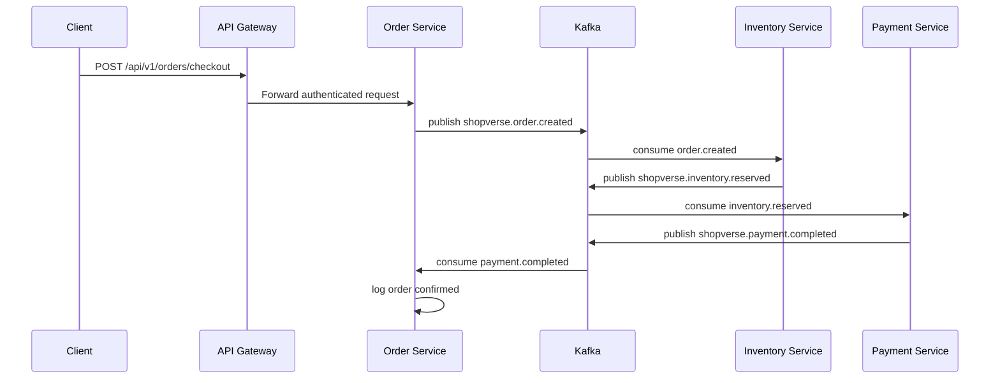
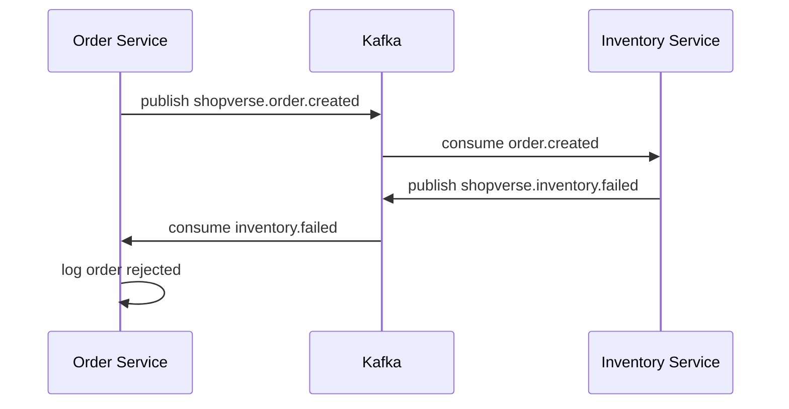
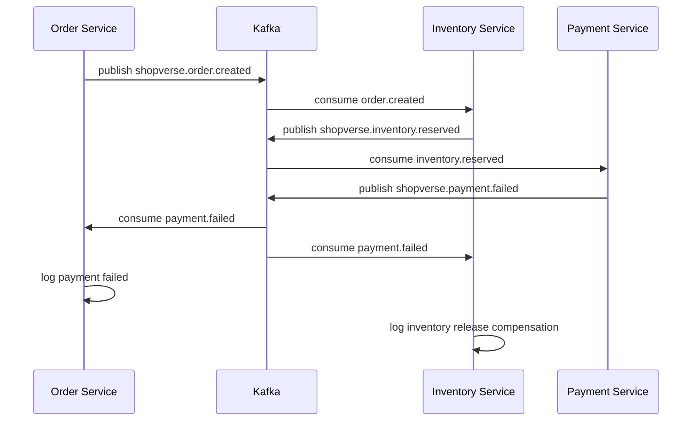
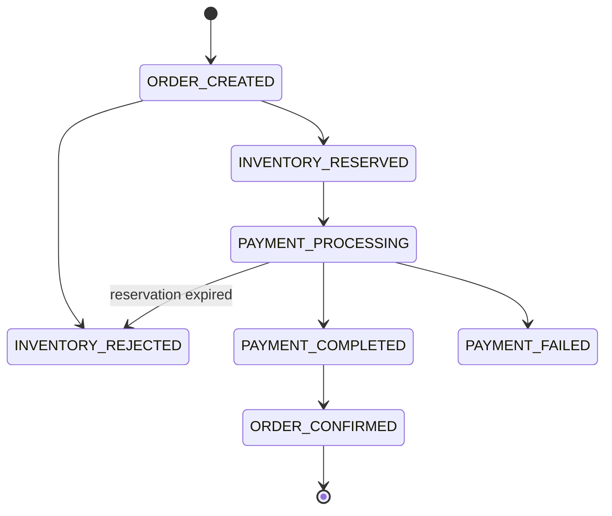

# Shopverse Choreography SAGA

## Transactional Outbox

Order, Inventory, and Payment no longer publish directly from their domain
transactions:

```text
BEGIN DATABASE TRANSACTION
  update domain aggregate
  append timeline/audit state
  insert outbox_events row
COMMIT

scheduled dispatcher
  lock one PENDING row
  publish to Kafka and wait for broker acknowledgement
  mark PUBLISHED
```

If domain work, event serialization, or outbox insertion fails, the complete
database transaction rolls back. If Kafka is unavailable, the committed
business state and pending outbox row remain durable and publication is
retried. Because a crash can occur after Kafka accepts a record but before the
row is marked published, delivery remains at-least-once and consumers must
remain idempotent.

Incoming listener transactions roll back on exceptions. Spring Kafka retries
three times, then Order, Inventory, and Payment persist DLT records. Admin
replay is audited and queued through the outbox rather than sent directly.

This document explains the simple SAGA pattern used in the Shopverse POC between:

- Order Service
- Inventory Service
- Payment Service
- Kafka

The implementation is intentionally small. It demonstrates the concept without adding a database-backed workflow engine, orchestration service, or complex retry framework.

## What Pattern We Use

Shopverse uses a choreography SAGA.

That means there is no central orchestrator telling each service what to do. Instead:

1. One service publishes an event.
2. Another service listens for that event.
3. That service performs its local action.
4. It publishes the next event.
5. Other services react to the new event.

Kafka is the event broker that connects the services.

## Why Kafka Is Used

Kafka lets services communicate through events instead of direct HTTP calls.

For this POC:

- Order Service does not directly call Inventory Service.
- Inventory Service does not directly call Payment Service.
- Payment Service does not directly call Order Service.

Each service only knows the Kafka topics it publishes to or consumes from.

This makes the services loosely coupled and shows how event-driven microservices can coordinate a business flow.

## Trigger API

The checkout SAGA starts from Order Service.

Through API Gateway:

```powershell
curl.exe -X POST http://localhost:8080/api/v1/orders/checkout `
  -H "Authorization: Bearer <token>"
```

Directly to Order Service:

```powershell
curl.exe -X POST http://localhost:8083/api/v1/orders/checkout `
  -H "Authorization: Bearer <token>"
```

This endpoint is authenticated. It requires the customer/user role accepted by Order Service or `ROLE_ADMIN`.

```text
POST /api/v1/orders/** -> customer/user role or ROLE_ADMIN
```

Customer checkout accepts `ROLE_CUSTOMER`, and administrative operations accept `ROLE_ADMIN`, matching the roles issued in Shopverse JWTs.

## Success Flow



## Failure And Compensation Flow

Inventory failure:



Payment failure:



In this POC, compensation is logged instead of updating a database. In a production system, Inventory Service would release reserved stock in its own database.

## Kafka Topics

| Topic | Published by | Consumed by | Meaning |
| --- | --- | --- | --- |
| `shopverse.order.created` | Order Service | Inventory Service | A checkout/order was created and inventory should be reserved. |
| `shopverse.inventory.reserved` | Inventory Service | Payment Service | Inventory is available and payment can be attempted. |
| `shopverse.inventory.failed` | Inventory Service | Order Service | Inventory was not available; order should be rejected. |
| `shopverse.payment.completed` | Payment Service | Order Service | Payment succeeded; order can be confirmed. |
| `shopverse.payment.failed` | Payment Service | Order Service, Inventory Service | Payment failed; order should fail and inventory reservation should be released. |

Topic names are centralized in:

```text
cloud-configs/application.yml
```

## Data Flow

## Current Persistent State Flow



Every transition is stored in `order_timeline_events` and incremented as a
Micrometer metric. The timeline is queryable through:

```http
GET /api/v1/orders/{id}/timeline
```

## Failure Simulation APIs

The POC exposes controlled admin APIs instead of hiding failure rules in code:

```http
POST /api/v1/payments/admin/simulation?mode=SUCCESS
POST /api/v1/payments/admin/simulation?mode=DECLINE
POST /api/v1/payments/admin/simulation?mode=TIMEOUT
```

Insufficient stock can be simulated by setting a product quantity to zero
through the Inventory admin API. Duplicate HTTP delivery is simulated by
reusing `Idempotency-Key`; duplicate Kafka delivery is safe because reservation
and payment tables have unique order numbers.

For timeout testing, wait for the reservation TTL to observe automatic
compensation, or reconcile before expiry:

```http
POST /api/v1/payments/admin/orders/{orderNumber}/reconcile
```

The Grafana `Shopverse Commerce Operations` dashboard shows SAGA transitions,
payment outcomes, inventory conflicts, and expired reservations.

## Concurrency And Locking Decision

Shopverse uses three durable invariants:

1. Unique `orders.idempotency_key` prevents duplicate checkout creation.
2. Unique reservation/payment order numbers make event consumers idempotent.
3. `InventoryItem.@Version` prevents two transactions from reserving the last
   unit.

No Redis distributed lock is used. A cache lock can expire while a transaction
is still running and cannot replace the database constraint. If Shopverse later
assigns a scarce external resource, the assignment table should still have a
unique database constraint; a short-lived distributed lock may only reduce
contention.

## Dead Letter And Replay

Order, Inventory, and Payment listeners retry three times using Spring Kafka
retry topics. Exhausted records enter a DLT handler and are persisted with
payload, source topic, retry count, failure reason, replay count, last replay
actor, and replay timestamps:

```http
GET  /api/v1/orders/admin/dead-letters
POST /api/v1/orders/admin/dead-letters/{id}/replay

GET  /api/v1/inventory/admin/dead-letters
POST /api/v1/inventory/admin/dead-letters/{id}/replay

GET  /api/v1/payments/admin/dead-letters
POST /api/v1/payments/admin/dead-letters/{id}/replay
```

All endpoints require `ROLE_ADMIN`. Replay inserts a new transactional outbox
row and updates the audit fields in the same transaction.

### 1. Order Service Publishes `order.created`

When `/api/v1/orders/checkout` is called, Order Service validates the request, resolves authoritative product data from Inventory Service through Feign, persists the order in MySQL, and publishes:

```json
{
  "orderId": 3,
  "orderNumber": "ORD-1003",
  "correlationId": "checkout-demo-101",
  "customerUsername": "current-user",
  "productId": 101,
  "quantity": 1,
  "amount": 2499.00
}
```

Log shape:

```text
Choreography saga started orderNumber=ORD-1003 topic=shopverse.order.created payload=...
```

### 2. Inventory Service Consumes `order.created`

Inventory Service reads the event and transactionally reserves persisted stock. A unique reservation per order makes redelivery idempotent, and `@Version` optimistic locking prevents silent lost updates during concurrent reservation attempts.

On success, it publishes:

```json
{
  "orderId": 3,
  "orderNumber": "ORD-1003",
  "productId": 101,
  "quantity": 1,
  "amount": 2499.00
}
```

Log shape:

```text
Choreography saga inventory reserved orderNumber=ORD-1003 topic=shopverse.inventory.reserved payload=...
```

On failure, it publishes:

```json
{
  "orderId": 3,
  "orderNumber": "ORD-1003",
  "reason": "Inventory not available for product 103"
}
```

### 3. Payment Service Consumes `inventory.reserved`

Payment Service reads the inventory reservation event and checks a simple demo rule:

```text
if amount > 10000.00 -> payment fails
otherwise -> payment succeeds
```

On success, it publishes:

```json
{
  "orderId": 3,
  "orderNumber": "ORD-1003",
  "paymentReference": "PAY-ORD-1003",
  "amount": 2499.00
}
```

Log shape:

```text
Choreography saga payment completed orderNumber=ORD-1003 topic=shopverse.payment.completed payload=...
```

On failure, it publishes:

```json
{
  "orderId": 3,
  "orderNumber": "ORD-1003",
  "reason": "Demo payment limit exceeded"
}
```

### 4. Order Service Consumes Final Events

Order Service listens for:

```text
shopverse.inventory.failed
shopverse.payment.completed
shopverse.payment.failed
```

It logs the final state:

```text
Choreography saga completed orderNumber=ORD-1003 paymentReference=PAY-ORD-1003 amount=2499.00 nextAction=MARK_ORDER_CONFIRMED
```

or:

```text
Choreography saga cancelled orderNumber=ORD-1003 reason=... nextAction=MARK_ORDER_REJECTED
```

or:

```text
Choreography saga cancelled orderNumber=ORD-1003 reason=... nextAction=MARK_ORDER_PAYMENT_FAILED
```

### 5. Inventory Service Compensates On Payment Failure

Inventory Service also listens for:

```text
shopverse.payment.failed
```

It logs the compensation step:

```text
Choreography saga compensation released inventory orderNumber=ORD-1003 reason=Demo payment limit exceeded
```

## Where The Code Lives

| Service | Package |
| --- | --- |
| Order Service | `order-service/src/main/java/io/shopverse/order/saga` |
| Inventory Service | `inventory-service/src/main/java/io/shopverse/inventory_service/saga` |
| Payment Service | `payment-service/src/main/java/io/shopverse/payment_service/saga` |

## Sample Code Snippets

These snippets are shortened versions of the actual code. They show the important idea without all imports and error handling.

### Checkout Starts The SAGA

Order Service starts the flow from the authenticated checkout endpoint:

```java
@PostMapping("/checkout")
public ResponseEntity<OrderResponse> checkout(
        @Valid @RequestBody CheckoutRequest request,
        Authentication authentication
) {
    log.info("Checkout requested for current user; starting choreography saga");
    String correlationId = MDC.get(CorrelationConstants.MDC_KEY);
    OrderResponse order = orderService.checkout(
            request,
            authentication.getName(),
            correlationId
    );
    orderSagaPublisher.publishOrderCreated(order, correlationId);

    return ResponseEntity
            .status(HttpStatus.CREATED)
            .body(order);
}
```

### Order Publishes `order.created`

Order Service converts the persisted order to an event and publishes it to Kafka:

```java
public CompletableFuture<Void> publishOrderCreated(
        OrderResponse order,
        String correlationId
) {
    OrderCreatedEvent event = new OrderCreatedEvent(
            order.id(),
            order.orderNumber(),
            correlationId,
            order.customerUsername(),
            order.items().getFirst().productId(),
            order.items().getFirst().quantity(),
            order.totalAmount()
    );

    String payload = objectMapper.writeValueAsString(event);
    return kafkaTemplate.send(topics.orderCreated(), order.orderNumber(), payload)
            .thenApply(result -> null);

    log.info("Choreography saga started orderNumber={} topic={} payload={}",
            order.orderNumber(), orderCreatedTopic, payload);
}
```

### Inventory Consumes `order.created`

Inventory Service listens for the order event and decides whether stock can be reserved:

```java
@KafkaListener(
        topics = "${shopverse.kafka.topics.order-created}",
        groupId = "${spring.application.name}"
)
public void onOrderCreated(String payload) {
    OrderCreatedEvent event = objectMapper.readValue(payload, OrderCreatedEvent.class);

    log.info("Choreography saga inventory step started orderNumber={} productId={} quantity={}",
            event.orderNumber(), event.productId(), event.quantity());

    if (event.productId() == 103L || event.quantity() > 5) {
        publishInventoryFailed(event, "Inventory not available for product " + event.productId());
        return;
    }

    InventoryReservedEvent reservedEvent = new InventoryReservedEvent(
            event.orderId(),
            event.orderNumber(),
            event.productId(),
            event.quantity(),
            event.amount()
    );

    kafkaTemplate.send(inventoryReservedTopic, event.orderNumber(),
            objectMapper.writeValueAsString(reservedEvent));
}
```

### Payment Consumes `inventory.reserved`

Payment Service listens for inventory reservation and publishes payment success or failure:

```java
private static final BigDecimal DEMO_PAYMENT_LIMIT = new BigDecimal("10000.00");

@KafkaListener(
        topics = "${shopverse.kafka.topics.inventory-reserved}",
        groupId = "${spring.application.name}"
)
public void onInventoryReserved(String payload) {
    InventoryReservedEvent event = objectMapper.readValue(payload, InventoryReservedEvent.class);

    log.info("Choreography saga payment step started orderNumber={} amount={}",
            event.orderNumber(), event.amount());

    if (event.amount().compareTo(DEMO_PAYMENT_LIMIT) > 0) {
        publishPaymentFailed(event, "Demo payment limit exceeded");
        return;
    }

    PaymentCompletedEvent completedEvent = new PaymentCompletedEvent(
            event.orderId(),
            event.orderNumber(),
            "PAY-" + event.orderNumber(),
            event.amount()
    );

    kafkaTemplate.send(paymentCompletedTopic, event.orderNumber(),
            objectMapper.writeValueAsString(completedEvent));
}
```

### Order Consumes Final Outcome

Order Service listens for final events and logs the order status transition:

```java
@KafkaListener(
        topics = "${shopverse.kafka.topics.payment-completed}",
        groupId = "${spring.application.name}"
)
public void onPaymentCompleted(String payload) {
    PaymentCompletedEvent event = objectMapper.readValue(payload, PaymentCompletedEvent.class);

    log.info("Choreography saga completed orderNumber={} paymentReference={} amount={} nextAction=MARK_ORDER_CONFIRMED",
            event.orderNumber(), event.paymentReference(), event.amount());
}
```

It also listens to failure topics:

```java
@KafkaListener(
        topics = "${shopverse.kafka.topics.inventory-failed}",
        groupId = "${spring.application.name}"
)
public void onInventoryFailed(String payload) {
    InventoryFailedEvent event = objectMapper.readValue(payload, InventoryFailedEvent.class);

    log.warn("Choreography saga cancelled orderNumber={} reason={} nextAction=MARK_ORDER_REJECTED",
            event.orderNumber(), event.reason());
}
```

### Inventory Compensation On Payment Failure

Inventory Service reacts to payment failure and logs the compensation:

```java
@KafkaListener(
        topics = "${shopverse.kafka.topics.payment-failed}",
        groupId = "${spring.application.name}"
)
public void onPaymentFailed(String payload) {
    PaymentFailedEvent event = objectMapper.readValue(payload, PaymentFailedEvent.class);

    log.warn("Choreography saga compensation released inventory orderNumber={} reason={}",
            event.orderNumber(), event.reason());
}
```

### Kafka Topic Configuration

Topic names are stored in centralized config:

```yaml
shopverse:
  kafka:
    topics:
      order-created: ${ORDER_CREATED_TOPIC:shopverse.order.created}
      inventory-reserved: ${INVENTORY_RESERVED_TOPIC:shopverse.inventory.reserved}
      inventory-failed: ${INVENTORY_FAILED_TOPIC:shopverse.inventory.failed}
      payment-completed: ${PAYMENT_COMPLETED_TOPIC:shopverse.payment.completed}
      payment-failed: ${PAYMENT_FAILED_TOPIC:shopverse.payment.failed}
```

Kafka bootstrap config is also centralized:

```yaml
spring:
  kafka:
    bootstrap-servers: ${KAFKA_BOOTSTRAP_SERVERS:localhost:9092}
```

## How To Test

Start the stack:

```powershell
docker compose up -d --build
```

Login and copy the JWT token:

```powershell
Invoke-RestMethod -Method Post `
  -Uri http://localhost:8080/auth/login `
  -Body (@{username='admin'; password='Admin@123'} | ConvertTo-Json) `
  -ContentType 'application/json'
```

Trigger checkout:

```powershell
curl.exe -X POST http://localhost:8080/api/v1/orders/checkout `
  -H "Authorization: Bearer <token>"
```

Follow logs:

```powershell
docker compose logs -f order-service inventory-service payment-service kafka
```

Expected success logs:

```text
Choreography saga started
Choreography saga inventory step started
Choreography saga inventory reserved
Choreography saga payment step started
Choreography saga payment completed
Choreography saga completed
```

## Grafana Loki Query

Open Grafana:

```text
http://localhost:3000
```

Use Loki Explore:

```logql
{application=~"ORDER-SERVICE|INVENTORY-SERVICE|PAYMENT-SERVICE"} |= "Choreography saga"
```

## Current POC Limitations

This SAGA is intentionally simple:

- No order database is updated.
- No inventory database is updated.
- No payment provider is called.
- No dead-letter topics are configured.
- No retry topic strategy is configured.
- Compensation is logged instead of persisted.

Those are good future improvements, but leaving them out keeps this POC easy to understand.
